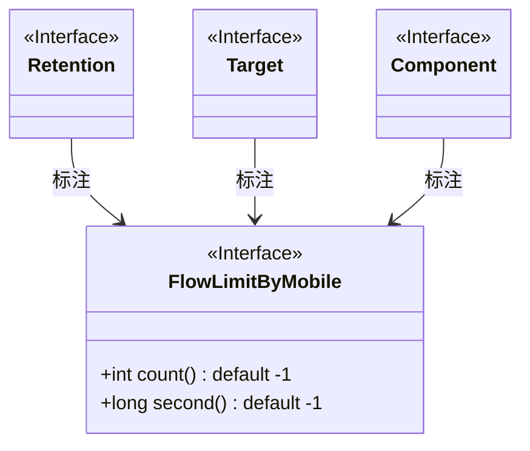
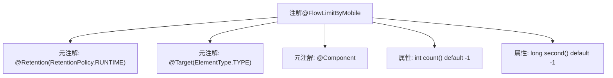

# 基础信息

|      |      |
|------|------|
| 名称 | FlowLimitByMobile |
| 编码语言 | .java |
| 代码路径 | WeFe/common/java/common-web/src/main/java/com/welab/wefe/common/web/api/base/FlowLimitByMobile.java |
| 包名 | com.welab.wefe.common.web.api.base |
| 依赖项 | ['org.springframework.stereotype.Component', 'java.lang.annotation.ElementType', 'java.lang.annotation.Retention', 'java.lang.annotation.RetentionPolicy', 'java.lang.annotation.Target'] |
| 概述说明 | FlowLimitByMobile注解用于移动端限流，可设置次数（默认无限制）和时间（秒，默认无限制），运行时保留，作用于类。 |

# 说明

这是一个名为FlowLimitByMobile的Java注解，用于限制基于移动设备的访问频率。注解保留策略为运行时，目标为类级别，并标记为Spring组件。它包含两个参数：count表示限制次数（默认-1表示无限制），second表示持续时间（单位秒，默认-1表示无限制）。该注解适用于需要对移动端请求进行流量控制的场景。

# 类列表 Class Summary

| 名称   | 类型  | 说明 |
|-------|------|-------------|
| FlowLimitByMobile | annotation | FlowLimitByMobile注解用于移动端限流，可设置限流次数（默认无限制）和时间间隔（默认无限制），运行时保留，作用于类级别。 |

## 类 FlowLimitByMobile

|      |      |
|------|------|
| 访问范围 | @Retention(RetentionPolicy.RUNTIME);@Target(ElementType.TYPE);@Component;public |
| 类型 | annotation |
| 名称 | FlowLimitByMobile |
| 说明 | FlowLimitByMobile注解用于移动端限流，可设置限流次数（默认无限制）和时间间隔（默认无限制），运行时保留，作用于类级别。 |

### UML类图

这段代码定义了一个名为`FlowLimitByMobile`的注解接口，用于限制移动端请求的频率。该注解包含两个可配置参数：`count`表示限制次数（默认-1表示无限制），`second`表示时间窗口长度（单位秒，默认-1表示无限制）。注解被`@Retention`、`@Target`和`@Component`三个元注解修饰，分别指定其保留策略为运行时、目标类型为类/接口/枚举，并标记为Spring组件。该设计常用于移动端API的流量控制场景。

### 内部方法调用关系图

该流程图描述了`@FlowLimitByMobile`注解的结构，它是一个用于方法调用限流的自定义注解。包含两个元注解（`@Retention`和`@Target`）标记其运行时保留策略和作用于类/接口的特性，同时继承`@Component`使其可被Spring扫描。定义了两个属性：`count`表示限制次数（默认-1无限制），`second`表示时间窗口（默认-1无限制），共同实现基于移动端的流量控制功能。

### 字段列表 Field List

| 名称  | 类型  | 说明 |
|-------|-------|------|
| count | int | 默认返回-1的计数方法。 |
| second | long | 方法second默认值为-1，表示长整型参数。 |

### 方法列表

| 名称  | 类型  | 说明 |
|-------|-------|------|

