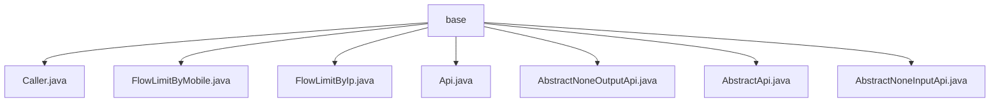

# 基础信息

|      |      |
|------|------|
| 名称 | base |
| 编码语言 | .java |
| 代码路径 | WeFe/common/java/common-web/src/main/java/com/welab/wefe/common/web/api/base |
| 包名 | docs.common.java.common-web.src.main.java.com.welab.wefe.common.web.api.base |
| 概述说明 | Caller枚举定义三种调用者身份。FlowLimitByMobile和FlowLimitByIp注解分别限制移动端和IP访问频率。Api注解标记接口类并配置访问控制。AbstractApi抽象类提供API通用框架，其子类AbstractNoneOutputApi和AbstractNoneInputApi分别处理无输出和无输入的API请求。 |

# 说明

## 概述  
该模块是Web API基础框架，提供身份标识、流量控制和请求处理的核心能力。通过Caller枚举区分调用者身份（Board/Member/Customer），FlowLimitByMobile和FlowLimitByIp注解实现设备/IP级限流（类似令牌桶算法），Api注解定义接口元数据（如路径/权限）。抽象类AbstractApi及其子类（AbstractNoneOutputApi/AbstractNoneInputApi）构建请求处理管道，支持并发控制、参数校验和统一响应封装。关键数据结构包括ApiResult泛型包装体和NoneApiInput/Output空参占位符。依赖Spring组件模型和并发工具类（如ConcurrentHashMap）。

## 主要业务场景  
适用于多角色系统API开发，例如董事会后台接口需标注Caller.Board身份，移动端登录接口通过@FlowLimitByMobile(count=5,second=60)限制每分钟5次请求。典型流程为：@Api标记的接口类继承AbstractNoneInputApi实现无参查询（如获取系统时间），或继承AbstractNoneOutputApi处理带参操作（如删除记录）。框架自动处理签名验证（allowAccessWithSign）、SM2加密（sm2Verify）和异常代理（ON_API_EXCEPTION_FUNCTION），开发者只需专注业务逻辑。

### 包内部结构视图

该流程图展示了WeFe项目中common-web模块下base包的层级结构。base包作为根节点，直接包含7个Java类文件，包括Caller、FlowLimitByMobile等流量限制相关类，以及AbstractApi等抽象基类。所有类文件均位于同一层级，没有嵌套子目录，体现了该包作为API基础功能集合的定位。

# 文件列表

| 名称   | 类型  | 说明 |
|-------|------|-------------|
| [Caller.java](Caller.md) | file | 枚举Caller定义三种调用者类型：Board（董事会）、Member（联邦成员）、Customer（服务客户）。 |
| [FlowLimitByMobile.java](FlowLimitByMobile.md) | file | FlowLimitByMobile注解用于移动端限流，可设置次数（默认无限制）和时间（秒，默认无限制），运行时保留，作用于类。 |
| [FlowLimitByIp.java](FlowLimitByIp.md) | file | 自定义注解FlowLimitByIp用于IP限流，可设置次数（默认不限）和时间（秒，默认不限），运行时保留，作用于类。 |
| [Api.java](Api.md) | file | 定义API接口的注解，包含路径、名称、描述、登录要求、签名访问、SM2验证、调用方、日志级别、日志采样周期和转发匹配等配置项。 |
| [AbstractNoneOutputApi.java](AbstractNoneOutputApi.md) | file | 抽象类AbstractNoneOutputApi继承AbstractApi，定义无输出API模板，要求子类实现handler方法处理输入并返回结果，覆盖父类handle方法直接调用handler。 |
| [AbstractApi.java](AbstractApi.md) | file | 抽象API基类，支持并发控制、参数校验、异常处理和文件上传，提供统一执行入口和结果封装。 |
| [AbstractNoneInputApi.java](AbstractNoneInputApi.md) | file | 抽象类AbstractNoneInputApi继承AbstractApi，定义无输入参数的API处理接口，通过handle方法返回结果，可能抛出StatusCodeWithException异常。 |

