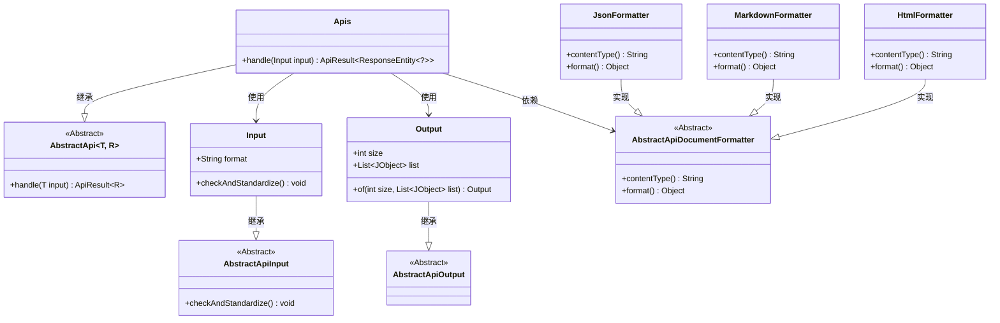

# 基础信息

|      |      |
|------|------|
| 名称 | Apis |
| 编码语言 | .java |
| 代码路径 | WeFe/common/java/common-web/src/main/java/com/welab/wefe/common/web/api/dev/Apis.java |
| 包名 | com.welab.wefe.common.web.api.dev |
| 依赖项 | ['com.welab.wefe.common.exception.StatusCodeWithException', 'com.welab.wefe.common.util.JObject', 'com.welab.wefe.common.web.api.base.AbstractApi', 'com.welab.wefe.common.web.api.base.Api', 'com.welab.wefe.common.web.api_document.AbstractApiDocumentFormatter', 'com.welab.wefe.common.web.api_document.HtmlFormatter', 'com.welab.wefe.common.web.api_document.JsonFormatter', 'com.welab.wefe.common.web.api_document.MarkdownFormatter', 'com.welab.wefe.common.web.dto.AbstractApiInput', 'com.welab.wefe.common.web.dto.AbstractApiOutput', 'com.welab.wefe.common.web.dto.ApiResult', 'org.springframework.http.ResponseEntity', 'java.io.IOException', 'java.util.List'] |
| 概述说明 | Java类Apis定义API接口，支持JSON、Markdown和HTML格式输出，包含输入输出参数校验逻辑。 |

# 说明

这是一个名为Apis的API类，用于获取API列表，无需登录即可访问。它继承自AbstractApi，输入类型为Input，输出类型为ResponseEntity。处理逻辑根据输入参数format选择不同的格式化器（json、markdown或默认html），生成对应格式的响应。Output类包含size和list两个字段，用于返回API列表数据。Input类包含format字段，并在检查方法中处理空值情况。

# 类列表 Class Summary

| 名称   | 类型  | 说明 |
|-------|------|-------------|
| Apis | class | Apis类用于获取API列表，支持JSON、Markdown和HTML格式输出，包含输入参数检查和标准化处理。 |

## 类 Apis

|      |      |
|------|------|
| 访问范围 | @Api(path = "apis", name = "获取 api 列表", login = false);public |
| 类型 | class |
| 名称 | Apis |
| 说明 | Apis类用于获取API列表，支持JSON、Markdown和HTML格式输出，包含输入参数检查和标准化处理。 |

### UML类图

该代码实现了一个API处理类Apis，继承自泛型抽象类AbstractApi，用于根据输入格式(JSON/Markdown/HTML)动态选择格式化器生成响应。包含嵌套类Input(处理输入参数校验)和Output(定义输出数据结构)，通过工厂模式创建不同格式的文档格式化器(JsonFormatter/MarkdownFormatter/HtmlFormatter)。整体采用模板方法模式，核心处理逻辑在handle方法中实现格式判断和响应构建。

### 内部方法调用关系图

```mermaid
graph TD
    A["类Apis"]
    B["注解: @Api"]
    C["父类: AbstractApi<Input, ResponseEntity<?>>"]
    D["方法: handle(Input input)"]
    E["局部变量: AbstractApiDocumentFormatter formatter"]
    F["switch判断input.format"]
    G["case 'json': new JsonFormatter()"]
    H["case 'markdown': new MarkdownFormatter()"]
    I["default: new HtmlFormatter()"]
    J["构建ResponseEntity"]
    K["设置content-type头"]
    L["调用formatter.format()"]
    M["返回success(response)"]
    N["嵌套类Output"]
    O["属性: int size"]
    P["属性: List<JObject> list"]
    Q["静态方法: of(int size, List<JObject> list)"]
    R["嵌套类Input"]
    S["属性: String format"]
    T["方法: checkAndStandardize()"]

    A --> B
    A --> C
    A --> D
    D --> E
    D --> F
    F --> G
    F --> H
    F --> I
    D --> J
    J --> K
    J --> L
    D --> M
    A --> N
    N --> O
    N --> P
    N --> Q
    A --> R
    R --> S
    R --> T
```

这段代码流程图展示了Apis类的完整结构，它是一个继承自AbstractApi的API处理类，主要功能是根据输入格式(json/markdown/html)生成不同格式的API文档响应。类包含两个嵌套类：Input用于处理输入参数校验，Output用于定义响应数据结构。核心处理逻辑在handle方法中，通过switch选择文档格式化器，构建包含适当Content-Type头的HTTP响应。整个流程清晰展现了从输入处理、格式选择到响应生成的全过程。

### 字段列表 Field List

| 名称  | 类型  | 说明 |
|-------|-------|------|

### 方法列表

| 名称  | 类型  | 说明 |
|-------|-------|------|
| handle | ApiResult<ResponseEntity<?>> | 该方法根据输入格式选择对应的格式化工具（JSON、Markdown或默认HTML），生成响应并设置内容类型头，最后返回成功结果。 |

