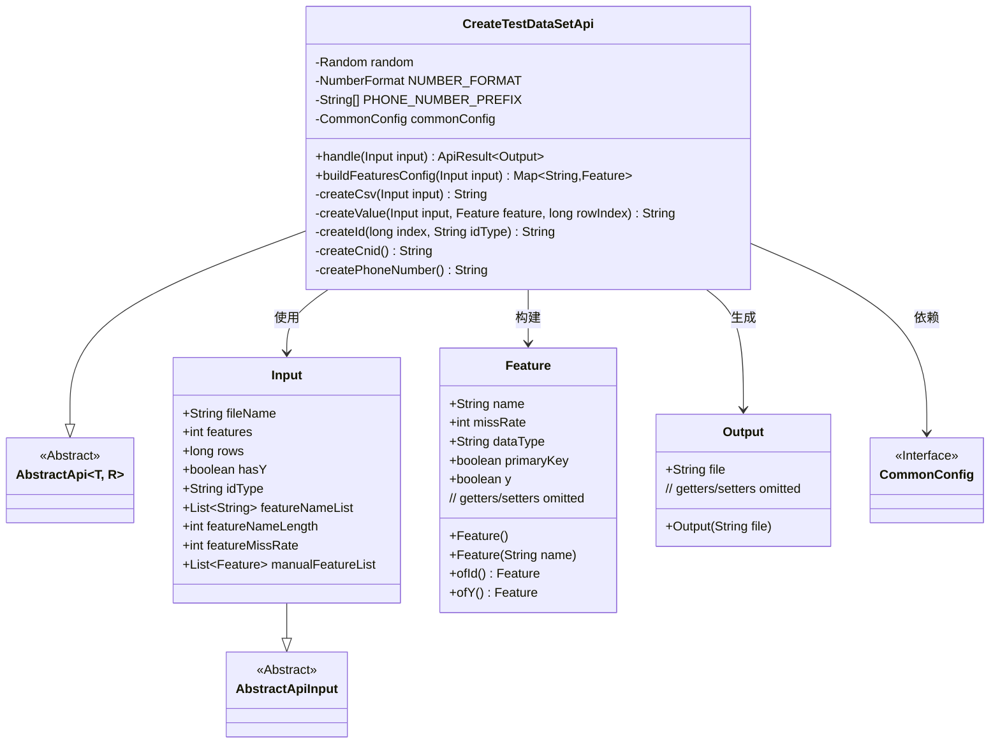
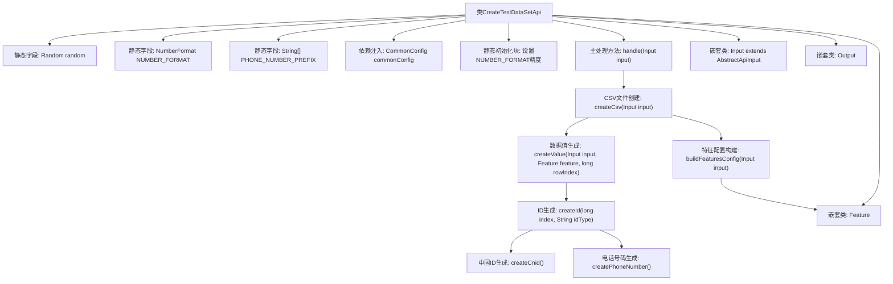
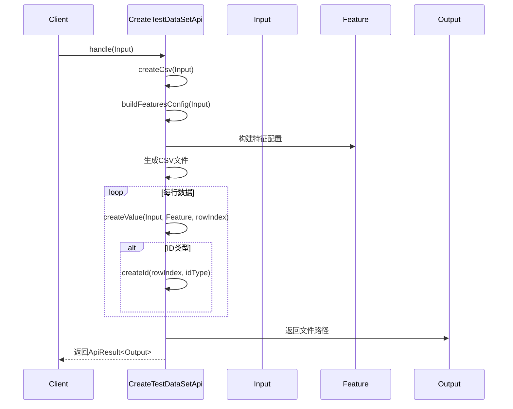

# 基础信息

|      |      |
|------|------|
| 名称 | CreateTestDataSetApi |
| 编码语言 | .java |
| 代码路径 | WeFe/common/java/common-web/src/main/java/com/welab/wefe/common/web/api/dev/CreateTestDataSetApi.java |
| 包名 | com.welab.wefe.common.web.api.dev |
| 依赖项 | ['com.welab.wefe.common.StatusCode', 'com.welab.wefe.common.exception.StatusCodeWithException', 'com.welab.wefe.common.fieldvalidate.annotation.Check', 'com.welab.wefe.common.util.DateUtil', 'com.welab.wefe.common.util.OS', 'com.welab.wefe.common.util.RandomUtil', 'com.welab.wefe.common.util.StringUtil', 'com.welab.wefe.common.web.api.base.AbstractApi', 'com.welab.wefe.common.web.api.base.Api', 'com.welab.wefe.common.web.config.CommonConfig', 'com.welab.wefe.common.web.dto.AbstractApiInput', 'com.welab.wefe.common.web.dto.ApiResult', 'org.apache.commons.io.FileUtils', 'org.springframework.beans.factory.annotation.Autowired', 'java.io.File', 'java.io.FileOutputStream', 'java.io.IOException', 'java.nio.file.Path', 'java.nio.file.Paths', 'java.text.NumberFormat', 'java.util', 'java.util.stream.Collectors'] |
| 概述说明 | 该API用于生成测试数据集，支持自定义特征、数据行数、缺失率等参数，输出为CSV文件。包含ID生成、数据类型处理及缺失值模拟功能。 |

# 说明

该API类用于生成测试数据集，支持自定义特征数量、行数、缺失率及ID类型等参数。通过输入配置构建特征映射，生成包含随机数据的CSV文件，文件路径根据操作系统自动选择。支持多种数据类型如整型、日期、性别等，并可配置缺失值。生成的CSV包含标题行和数据行，数据根据特征配置动态生成。输出为文件绝对路径。

# 类列表 Class Summary

| 名称   | 类型  | 说明 |
|-------|------|-------------|
| CreateTestDataSetApi | class | 创建测试数据集的API，支持生成CSV文件，包含自定义特征、缺失率控制及多种ID类型（自增、身份证、手机号）。输入参数包括文件名、特征数、行数等，输出为文件路径。 |

## 类 CreateTestDataSetApi

|      |      |
|------|------|
| 访问范围 | @Api(path = "test/create_data_set", name = "generate data set for testing");public |
| 类型 | class |
| 名称 | CreateTestDataSetApi |
| 说明 | 创建测试数据集的API，支持生成CSV文件，包含自定义特征、缺失率控制及多种ID类型（自增、身份证、手机号）。输入参数包括文件名、特征数、行数等，输出为文件路径。 |

### UML类图

这段代码是一个用于生成测试数据集的API类，继承自抽象类AbstractApi，主要功能是根据输入参数生成CSV格式的测试数据文件。类图中展示了CreateTestDataSetApi与输入输出类的关系，以及内部使用的Feature特征配置类。该API能处理多种数据类型，支持自定义特征配置，并考虑了数据缺失率等实际场景需求，最终将生成的文件路径通过Output返回。

### 内部方法调用关系图

这段代码实现了一个测试数据集生成API，主要功能是根据输入参数动态生成CSV格式的测试数据。流程图展示了类的结构关系，包含静态字段、核心方法和嵌套类；时序图描述了从API调用到数据生成的完整过程。系统支持多种数据类型生成、缺失率控制、自定义特征配置，并能根据操作系统自动选择文件存储位置，最后返回生成的文件路径。

### 字段列表 Field List

| 名称  | 类型  | 说明 |
|-------|-------|------|
| random = new Random() | Random | 定义静态不可变随机数生成器实例。 |
| commonConfig | CommonConfig | 代码片段使用@Autowired自动注入CommonConfig实例。 |
| PHONE_NUMBER_PREFIX = {"139", "138", "137", "136", "135", "134", "159", "158", "157", "150", "151", "152", "188", "187", "182", "183", "184", "178", "130", "131", "132", "156", "155", "186", "185", "176", "133", "153", "189", "180", "181", "177"} | String[] | 定义了一个包含中国常见手机号前缀的静态字符串数组。 |
| NUMBER_FORMAT = NumberFormat.getInstance() | NumberFormat | 定义静态常量NUMBER_FORMAT，使用NumberFormat的默认实例。 |

### 方法列表

| 名称  | 类型  | 说明 |
|-------|-------|------|
| createCsv | String | 生成CSV文件方法：根据输入参数动态生成文件名，存储到指定目录，先删除已存在文件，再写入表头和数据行，每万行打印进度，返回文件绝对路径。 |
| handle | ApiResult<Output> | 方法处理输入生成CSV文件，成功返回文件路径，失败抛出系统错误异常。 |
| createId | String | 方法根据idType生成不同ID：auto_increment返回索引，cnid调用createCnid，phone_number调用createPhoneNumber，其他返回空字符串。 |
| createValue | String | 该方法根据输入参数生成不同类型的随机值：主键返回ID，布尔值返回1/0，按概率返回空值，其他类型返回对应随机值（数字、性别、日期等）。 |
| createPhoneNumber | String | 生成随机电话号码：从预设前缀中随机选择，后接8位随机数字，共11位。 |
| buildFeaturesConfig | Map<String, Feature> | 构建特征配置映射，包含输入特征、ID特征、可选Y特征、手动特征列表及随机生成特征，确保总数达标。 |
| createCnid | String | 生成18位随机数字字符串的方法。 |

