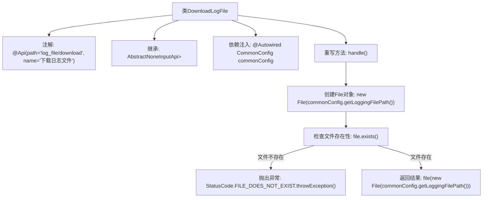

# 基础信息

|      |      |
|------|------|
| 名称 | DownloadLogFile |
| 编码语言 | .java |
| 代码路径 | WeFe/common/java/common-web/src/main/java/com/welab/wefe/common/web/api/dev/DownloadLogFile.java |
| 包名 | com.welab.wefe.common.web.api.dev |
| 依赖项 | ['com.welab.wefe.common.StatusCode', 'com.welab.wefe.common.exception.StatusCodeWithException', 'com.welab.wefe.common.web.api.base.AbstractNoneInputApi', 'com.welab.wefe.common.web.api.base.Api', 'com.welab.wefe.common.web.config.CommonConfig', 'com.welab.wefe.common.web.dto.ApiResult', 'org.springframework.beans.factory.annotation.Autowired', 'org.springframework.http.ResponseEntity', 'java.io.File'] |
| 概述说明 | 这是一个用于下载日志文件的API类，检查文件是否存在后返回文件内容。路径为"log_file/download"。 |

# 说明

这是一个名为DownloadLogFile的API类，用于处理日志文件下载请求。该类继承自AbstractNoneInputApi，返回类型为ResponseEntity。通过@Api注解定义了API路径为"log_file/download"和名称为"下载日志文件"。类中注入了CommonConfig配置对象，用于获取日志文件路径。在handle方法中，首先检查日志文件是否存在，若不存在则抛出文件不存在的异常；若存在则调用file方法返回文件内容。整个过程不接收输入参数，仅处理文件下载逻辑。

# 类列表 Class Summary

| 名称   | 类型  | 说明 |
|-------|------|-------------|
| DownloadLogFile | class | 这是一个用于下载日志文件的API类，检查文件是否存在后返回文件内容，若不存在则抛出异常。 |


## 类 DownloadLogFile

|      |      |
|------|------|
| 访问范围 | @Api(path = "log_file/download", name = "下载日志文件");public |
| 类型 | class |
| 名称 | DownloadLogFile |
| 说明 | 这是一个用于下载日志文件的API类，检查文件是否存在后返回文件内容，若不存在则抛出异常。 |


### UML类图

```mermaid
classDiagram
    class DownloadLogFile {
        -CommonConfig commonConfig
        +handle() ApiResult~ResponseEntity~?~
    }
    class AbstractNoneInputApi~R~ {
        <<Abstract>>
        #handle() ApiResult~R~
    }
    class CommonConfig {
        +getLoggingFilePath() String
    }
    class StatusCodeWithException {
        <<Exception>>
    }
    class ApiResult~T~ {
        +file(File) ApiResult~T~
    }
    class ResponseEntity {
    }
    class StatusCode {
        <<Enum>>
        +FILE_DOES_NOT_EXIST
    }

    DownloadLogFile --|> AbstractNoneInputApi~ResponseEntity~?~ : 继承
    DownloadLogFile --> CommonConfig : 依赖
    DownloadLogFile ..> StatusCodeWithException : 抛出异常
    DownloadLogFile ..> StatusCode : 使用枚举
    AbstractNoneInputApi ..> ApiResult : 返回
    DownloadLogFile ..> ResponseEntity : 泛型参数
```

这段代码展示了一个日志文件下载API的实现类`DownloadLogFile`，它继承自抽象类`AbstractNoneInputApi`，通过泛型指定返回类型为`ResponseEntity<?>`。类中注入了`CommonConfig`配置类获取日志文件路径，并处理文件不存在异常。流程图清晰地呈现了类之间的继承、依赖关系以及异常处理机制，体现了Spring Boot中API层的典型设计模式。


### 内部方法调用关系图



该流程图展示了DownloadLogFile类的核心逻辑结构。类通过@Api注解定义接口路径，继承抽象父类并注入CommonConfig配置。主要流程在handle()方法中实现：首先检查日志文件是否存在，若不存在则抛出带状态码的异常，存在则返回文件响应。流程清晰体现了文件校验和异常处理的业务逻辑。

### 字段列表 Field List

| 名称  | 类型  | 说明 |
|-------|-------|------|
| commonConfig | CommonConfig | 使用@Autowired自动注入CommonConfig实例。 |

### 方法列表

| 名称  | 类型  | 说明 |
|-------|-------|------|
| handle | ApiResult<ResponseEntity<?>> | 处理日志文件请求，检查文件是否存在，不存在则抛出异常，存在则返回文件内容。 |


