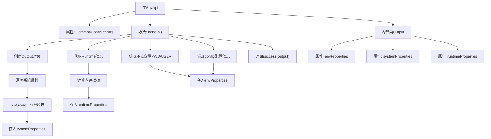

# 基础信息

|      |      |
|------|------|
| 名称 | EnvApi |
| 编码语言 | .java |
| 代码路径 | WeFe/common/java/common-web/src/main/java/com/welab/wefe/common/web/api/dev/EnvApi.java |
| 包名 | com.welab.wefe.common.web.api.dev |
| 依赖项 | ['com.welab.wefe.common.InformationSize', 'com.welab.wefe.common.exception.StatusCodeWithException', 'com.welab.wefe.common.fieldvalidate.annotation.Check', 'com.welab.wefe.common.web.api.base.AbstractNoneInputApi', 'com.welab.wefe.common.web.api.base.Api', 'com.welab.wefe.common.web.config.CommonConfig', 'com.welab.wefe.common.web.dto.ApiResult', 'com.welab.wefe.common.wefe.enums.env.EnvBranch', 'org.springframework.beans.factory.annotation.Autowired', 'java.lang.management.ManagementFactory', 'java.util.LinkedHashMap', 'java.util.Map', 'java.util.TreeMap'] |
| 概述说明 | EnvApi类用于获取环境变量、系统属性和运行时信息，包括JVM内存、线程数等，并返回格式化输出结果。 |

# 说明

EnvApi是一个用于获取环境变量和系统信息的API类，继承自AbstractNoneInputApi。它通过handle方法收集三类信息：系统属性（以java或os开头的属性）、运行时信息（如线程数、内存使用情况等）以及环境变量（如PWD、USER等）。此外，还包含CommonConfig配置中的环境名称、分支和是否为演示环境的标志。输出结果分为envProperties、systemProperties和runtimeProperties三个映射，分别存储不同类型的信息。所有信息均以键值对形式返回。

# 类列表 Class Summary

| 名称   | 类型  | 说明 |
|-------|------|-------------|
| EnvApi | class | EnvApi类提供环境变量接口，收集系统属性、运行时内存和线程信息，以及配置的环境名称和分支，返回包含三类信息的Output对象。 |


## 类 EnvApi

|      |      |
|------|------|
| 访问范围 | @Api(path = "env", name = "环境变量");public |
| 类型 | class |
| 名称 | EnvApi |
| 说明 | EnvApi类提供环境变量接口，收集系统属性、运行时内存和线程信息，以及配置的环境名称和分支，返回包含三类信息的Output对象。 |


### UML类图

```mermaid
classDiagram
    class AbstractNoneInputApi~T~ {
        <<Abstract>>
        #ApiResult~T~ handle() throws StatusCodeWithException
        +ApiResult~T~ success(T data)
    }

    class EnvApi {
        -CommonConfig config
        +EnvApi()
        #ApiResult~Output~ handle() throws StatusCodeWithException
    }

    class EnvApi$Output {
        +LinkedHashMap~String,String~ envProperties
        +TreeMap~String,String~ systemProperties
        +LinkedHashMap~String,String~ runtimeProperties
    }

    class CommonConfig {
        +EnvName getEnvName()
        +EnvBranch getEnvBranch()
    }

    class InformationSize {
        <<Utility>>
        +String fromByte(long bytes)
    }

    AbstractNoneInputApi~T~ <|-- EnvApi
    EnvApi *-- EnvApi$Output
    EnvApi --> CommonConfig : 依赖
    EnvApi ..> InformationSize : 调用
```

该代码展示了一个环境变量查询API的实现，EnvApi继承自抽象类AbstractNoneInputApi，通过handle()方法收集系统属性、运行时信息和环境变量。Output内部类使用三种Map结构存储不同类型的环境数据，CommonConfig提供环境配置信息，InformationSize是字节转换工具类。类图清晰地展示了继承关系、组合关系和工具类调用关系。


### 内部方法调用关系图



这段代码是EnvApi类的实现，主要功能是收集和返回系统环境信息。流程从handle方法开始，先创建Output对象，然后分三部分收集数据：系统属性(java/os前缀)、运行时内存信息(线程数、内存使用等)和环境变量(PWD/USER)。最后添加配置中心的envName和envBranch信息，将所有数据封装到Output对象中返回。内部类Output使用三种Map结构分别存储不同类型的环境数据，并通过@Check注解标记字段用途。

### 字段列表 Field List

| 名称  | 类型  | 说明 |
|-------|-------|------|
| config | CommonConfig | 自动注入CommonConfig配置类实例。 |

### 方法列表

| 名称  | 类型  | 说明 |
|-------|-------|------|
| handle | ApiResult<Output> | 该方法收集系统属性、运行时信息和环境变量，包括Java和OS属性、JVM内存状态、线程数、处理器数量及特定环境变量，最后返回封装结果。 |


