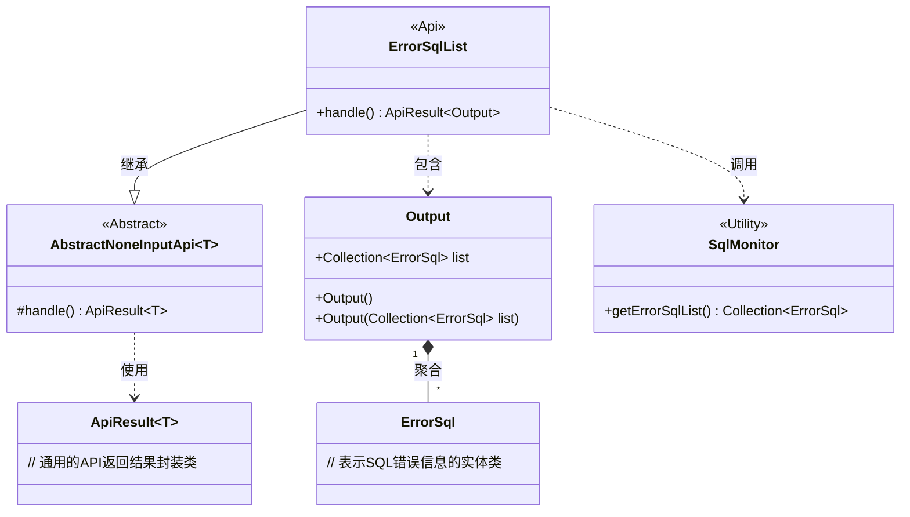
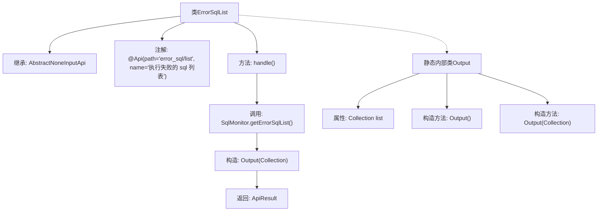

# 基础信息

|      |      |
|------|------|
| 名称 | ErrorSqlList |
| 编码语言 | .java |
| 代码路径 | WeFe/common/java/common-web/src/main/java/com/welab/wefe/common/web/api/dev/ErrorSqlList.java |
| 包名 | com.welab.wefe.common.web.api.dev |
| 依赖项 | ['com.welab.wefe.common.data.mysql.sql_monitor.ErrorSql', 'com.welab.wefe.common.data.mysql.sql_monitor.SqlMonitor', 'com.welab.wefe.common.exception.StatusCodeWithException', 'com.welab.wefe.common.web.api.base.AbstractNoneInputApi', 'com.welab.wefe.common.web.api.base.Api', 'com.welab.wefe.common.web.dto.ApiResult', 'java.util.Collection'] |
| 概述说明 | 定义获取失败SQL列表的API类ErrorSqlList，无输入参数，返回包含ErrorSql集合的输出结果。处理逻辑调用SqlMonitor获取数据并封装为ApiResult返回。 |

# 说明

该代码定义了一个名为ErrorSqlList的API类，用于获取执行失败的SQL列表。API路径为"error_sql/list"，继承自AbstractNoneInputApi基类，输出类型为内部类Output。处理逻辑通过handle方法实现，调用SqlMonitor.getErrorSqlList()获取错误SQL集合并封装为Output对象返回。Output类包含一个Collection<ErrorSql>类型的list字段，提供无参和有参构造函数。该API不接收输入参数，直接返回错误SQL列表。

# 类列表 Class Summary

| 名称   | 类型  | 说明 |
|-------|------|-------------|
| ErrorSqlList | class | 这是一个API类，路径为"error_sql/list"，用于获取执行失败的SQL列表。它继承自AbstractNoneInputApi，返回包含错误SQL集合的输出结果。处理逻辑直接调用SqlMonitor.getErrorSqlList()获取数据。 |

## 类 ErrorSqlList

|      |      |
|------|------|
| 访问范围 | @Api(path = "error_sql/list", name = "执行失败的 sql 列表");public |
| 类型 | class |
| 名称 | ErrorSqlList |
| 说明 | 这是一个API类，路径为"error_sql/list"，用于获取执行失败的SQL列表。它继承自AbstractNoneInputApi，返回包含错误SQL集合的输出结果。处理逻辑直接调用SqlMonitor.getErrorSqlList()获取数据。 |

### UML类图

类图描述：该图展示了ErrorSqlList类的结构及其关联关系。ErrorSqlList继承自泛型类AbstractNoneInputApi<Output>，包含一个嵌套类Output用于封装错误SQL列表。Output类与ErrorSql是聚合关系，通过SqlMonitor工具类获取数据。整体实现了获取失败SQL列表的API功能，遵循了面向对象的设计原则。

### 内部方法调用关系图

这段代码流程图展示了ErrorSqlList类的结构及其内部关系。该类继承自AbstractNoneInputApi，通过@Api注解定义API路径和名称，核心方法handle()调用SqlMonitor获取错误SQL列表并封装到Output内部类中返回。Output作为静态内部类包含两个构造方法和一个集合属性，用于存储错误SQL数据。整体流程清晰展现了从请求处理到数据返回的完整链路。

### 字段列表 Field List

| 名称  | 类型  | 说明 |
|-------|-------|------|

### 方法列表

| 名称  | 类型  | 说明 |
|-------|-------|------|
| handle | ApiResult<Output> | Java方法重写，返回包含错误SQL列表的ApiResult成功结果。 |

