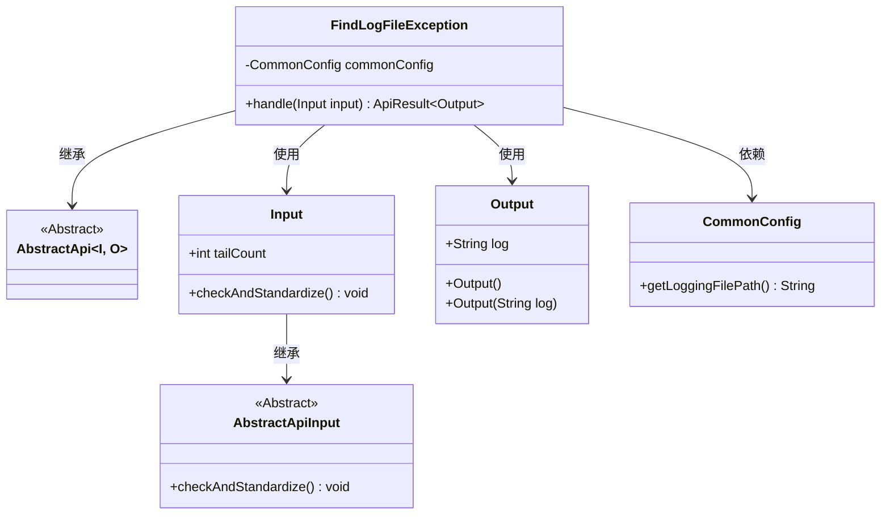
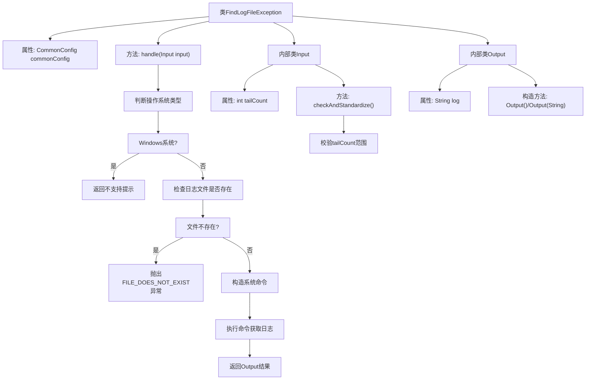

# 基础信息

|      |      |
|------|------|
| 名称 | FindLogFileException |
| 编码语言 | .java |
| 代码路径 | WeFe/common/java/common-web/src/main/java/com/welab/wefe/common/web/api/dev/FindLogFileException.java |
| 包名 | com.welab.wefe.common.web.api.dev |
| 依赖项 | ['com.welab.wefe.common.StatusCode', 'com.welab.wefe.common.exception.StatusCodeWithException', 'com.welab.wefe.common.fieldvalidate.annotation.Check', 'com.welab.wefe.common.util.OS', 'com.welab.wefe.common.web.api.base.AbstractApi', 'com.welab.wefe.common.web.api.base.Api', 'com.welab.wefe.common.web.config.CommonConfig', 'com.welab.wefe.common.web.dto.AbstractApiInput', 'com.welab.wefe.common.web.dto.ApiResult', 'org.springframework.beans.factory.annotation.Autowired', 'java.io.File'] |
| 概述说明 | 搜索日志文件异常API，不支持Windows系统，检查文件存在后执行命令提取异常堆栈，限制返回行数100-1000。 |

# 说明

该API类用于搜索日志文件中的异常堆栈块，路径为"log_file/find_exception"。它继承自AbstractApi，接受Input参数并返回Output结果。在Windows系统上直接返回不支持提示，非Windows系统则执行grep命令查找异常堆栈。Input类包含tailCount参数，限制返回日志行数在1-1000之间，默认100。Output类包含日志内容字符串。执行前会检查日志文件是否存在，不存在则抛出异常。

# 类列表 Class Summary

| 名称   | 类型  | 说明 |
|-------|------|-------------|
| FindLogFileException | class | 该API用于搜索日志文件中的异常堆栈块，不支持Windows系统。输入参数限制日志行返回数在1-1000之间，默认100。输出包含匹配的日志内容。 |

## 类 FindLogFileException

|      |      |
|------|------|
| 访问范围 | @Api(path = "log_file/find_exception", name = "搜索日志文件中的异常堆栈块");public |
| 类型 | class |
| 名称 | FindLogFileException |
| 说明 | 该API用于搜索日志文件中的异常堆栈块，不支持Windows系统。输入参数限制日志行返回数在1-1000之间，默认100。输出包含匹配的日志内容。 |

### UML类图

类图描述：该图展示了日志异常搜索功能的类结构。FindLogFileException继承自泛型抽象类AbstractApi，处理Input和Output数据类型。Input继承AbstractApiInput并包含日志行数校验逻辑，Output封装日志内容。CommonConfig提供日志文件路径配置，通过依赖注入使用。整体实现了跨平台日志异常提取功能，但明确排除了Windows系统支持。

### 内部方法调用关系图

流程图描述了日志异常搜索API的处理流程：首先检测操作系统类型，Windows直接返回不支持；非Windows系统检查日志文件是否存在，不存在则抛出异常；存在则构造系统命令执行日志搜索，最后返回结果。内部类Input负责参数校验，Output封装返回数据。整个过程包含操作系统判断、文件检查、命令构造和执行等关键步骤。

### 字段列表 Field List

| 名称  | 类型  | 说明 |
|-------|-------|------|
| commonConfig | CommonConfig | 自动注入CommonConfig配置类实例。 |

### 方法列表

| 名称  | 类型  | 说明 |
|-------|-------|------|
| handle | ApiResult<Output> | Java方法处理日志查询，Windows系统返回不支持提示，非Windows系统执行grep/tail命令获取日志最后N行，文件不存在时报错。 |

