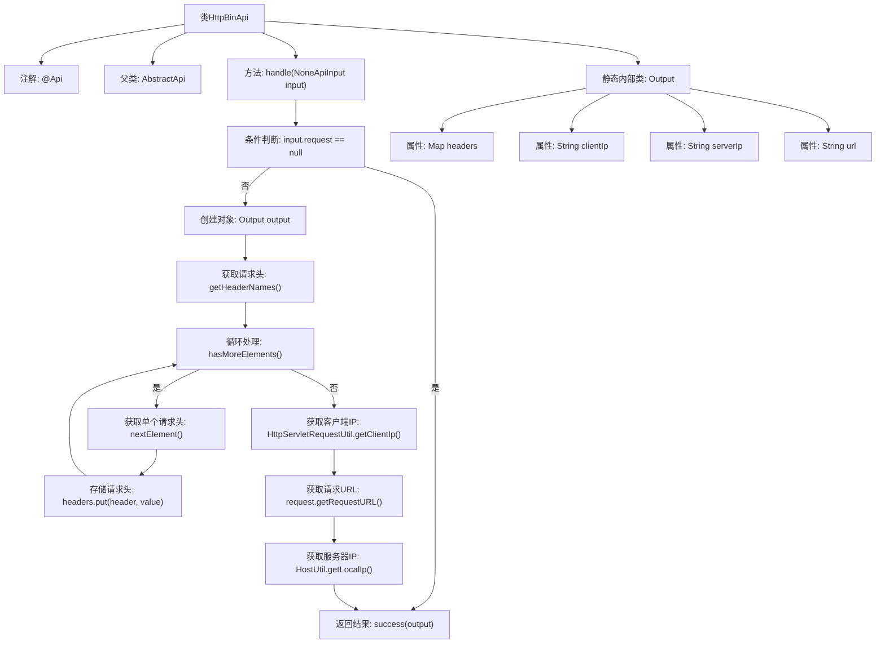

# 基础信息

|      |      |
|------|------|
| 名称 | HttpBinApi |
| 编码语言 | .java |
| 代码路径 | WeFe/common/java/common-web/src/main/java/com/welab/wefe/common/web/api/dev/HttpBinApi.java |
| 包名 | com.welab.wefe.common.web.api.dev |
| 依赖项 | ['com.welab.wefe.common.exception.StatusCodeWithException', 'com.welab.wefe.common.util.HostUtil', 'com.welab.wefe.common.web.api.base.AbstractApi', 'com.welab.wefe.common.web.api.base.Api', 'com.welab.wefe.common.web.dto.ApiResult', 'com.welab.wefe.common.web.dto.NoneApiInput', 'com.welab.wefe.common.web.util.HttpServletRequestUtil', 'java.util.Enumeration', 'java.util.HashMap', 'java.util.Map'] |
| 概述说明 | HttpBinApi类用于查看HTTP请求信息，包括请求头、客户端IP、服务器IP和URL，无需登录即可访问。 |

# 说明

HttpBinApi类是一个无需登录的API接口，用于查看HTTP请求对象。它继承自AbstractApi，输入为NoneApiInput，输出为包含请求头、客户端IP、服务器IP和URL的自定义Output类。处理逻辑包括检查请求对象非空后，提取请求头信息、获取客户端IP、请求URL和服务器IP，最后封装成Output对象返回。若请求对象为空则返回空结果。

# 类列表 Class Summary

| 名称   | 类型  | 说明 |
|-------|------|-------------|
| HttpBinApi | class | HttpBinApi类是一个无需登录的API，用于获取HTTP请求的头部信息、客户端IP、服务器IP和请求URL，返回包含这些数据的Output对象。 |


## 类 HttpBinApi

|      |      |
|------|------|
| 访问范围 | @Api(path = "http_bin", name = "查看 http 请求对象", login = false);public |
| 类型 | class |
| 名称 | HttpBinApi |
| 说明 | HttpBinApi类是一个无需登录的API，用于获取HTTP请求的头部信息、客户端IP、服务器IP和请求URL，返回包含这些数据的Output对象。 |


### UML类图

```mermaid
classDiagram
    class AbstractApi~T, R~ {
        <<Abstract>>
        +handle(T input) ApiResult~R~
    }

    class NoneApiInput {
        +HttpServletRequest request
    }

    class HttpBinApi {
        +handle(NoneApiInput input) ApiResult~Output~
    }

    class HttpBinApi$Output {
        +Map~String, String~ headers
        +String clientIp
        +String serverIp
        +String url
    }

    class HttpServletRequestUtil {
        <<Utility>>
        +getClientIp(HttpServletRequest request) String
    }

    class HostUtil {
        <<Utility>>
        +getLocalIp() String
    }

    AbstractApi <|-- HttpBinApi
    HttpBinApi --> NoneApiInput : 使用
    HttpBinApi --> HttpBinApi$Output : 生成
    HttpBinApi --> HttpServletRequestUtil : 调用
    HttpBinApi --> HostUtil : 调用
```

这段代码定义了一个HttpBinApi类，继承自AbstractApi泛型类，用于处理HTTP请求信息。主要功能是收集请求头、客户端IP、URL和服务器IP等信息，封装到Output内部类中返回。代码通过HttpServletRequestUtil和HostUtil工具类获取客户端IP和本地IP，体现了清晰的职责分离。类图展示了继承关系、依赖关系和内部类的结构，Output类作为数据载体包含请求的各类信息。


### 内部方法调用关系图



该流程图展示了HttpBinApi类的完整处理流程。首先检查请求对象是否存在，若不存在直接返回成功；否则创建Output对象并依次处理请求头信息、获取客户端IP、请求URL和服务器IP，最后封装结果返回。静态内部类Output定义了存储响应数据的结构，包含请求头集合、客户端IP、服务器IP和URL四个字段。整个流程清晰展现了HTTP请求信息的采集和封装过程。

### 字段列表 Field List

| 名称  | 类型  | 说明 |
|-------|-------|------|

### 方法列表

| 名称  | 类型  | 说明 |
|-------|-------|------|
| handle | ApiResult<Output> | 处理API请求，收集请求头、客户端IP、URL和服务器IP，返回成功结果。若请求为空，直接返回成功。 |


