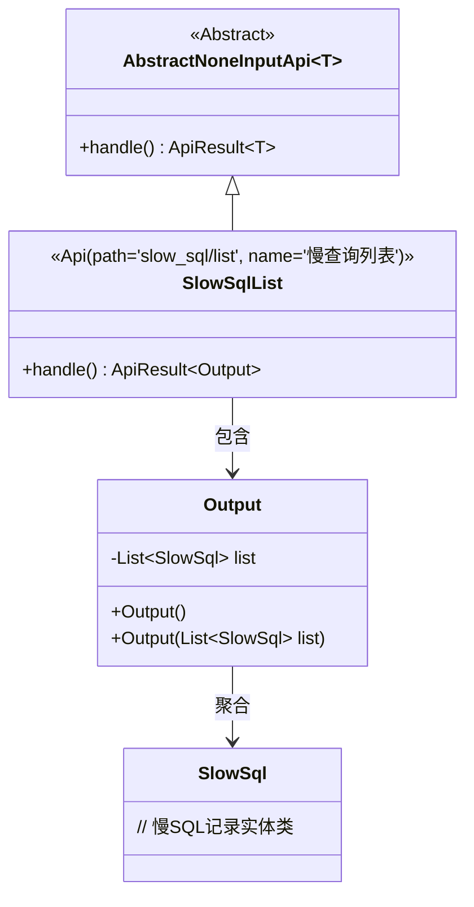
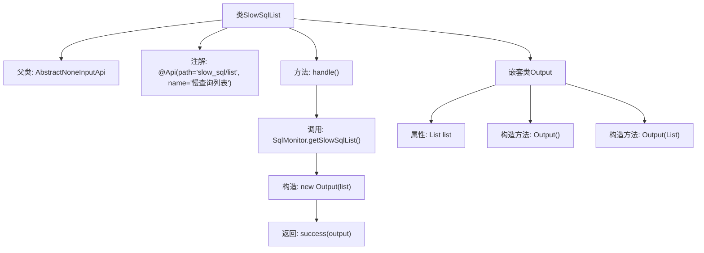

# 基础信息

|      |      |
|------|------|
| 名称 | SlowSqlList |
| 编码语言 | .java |
| 代码路径 | WeFe/common/java/common-web/src/main/java/com/welab/wefe/common/web/api/dev/SlowSqlList.java |
| 包名 | com.welab.wefe.common.web.api.dev |
| 依赖项 | ['com.welab.wefe.common.data.mysql.sql_monitor.SlowSql', 'com.welab.wefe.common.data.mysql.sql_monitor.SqlMonitor', 'com.welab.wefe.common.exception.StatusCodeWithException', 'com.welab.wefe.common.web.api.base.AbstractNoneInputApi', 'com.welab.wefe.common.web.api.base.Api', 'com.welab.wefe.common.web.dto.ApiResult', 'java.util.List'] |
| 概述说明 | 这是一个慢查询列表API类，路径为"slow_sql/list"，无输入参数，返回包含慢SQL列表的输出结果。处理逻辑是获取并返回慢SQL列表。 |

# 说明

这是一个名为"慢查询列表"的API类，路径为"slow_sql/list"。它继承自AbstractNoneInputApi基类，泛型指定为内部类Output。该API不接收输入参数，处理逻辑是调用SqlMonitor.getSlowSqlList()方法获取慢SQL列表，并将其封装到Output对象中返回。Output是一个静态内部类，包含一个List<SlowSql>类型的list字段，提供无参和有参两种构造方法。API执行成功时返回包含Output对象的ApiResult。

# 类列表 Class Summary

| 名称   | 类型  | 说明 |
|-------|------|-------------|
| SlowSqlList | class | 这是一个获取慢查询列表的API类，路径为"slow_sql/list"，返回包含SlowSql列表的输出结果。 |

## 类 SlowSqlList

|      |      |
|------|------|
| 访问范围 | @Api(path = "slow_sql/list", name = "慢查询列表");public |
| 类型 | class |
| 名称 | SlowSqlList |
| 说明 | 这是一个获取慢查询列表的API类，路径为"slow_sql/list"，返回包含SlowSql列表的输出结果。 |

### UML类图

这段代码展示了一个处理慢SQL查询列表的API实现结构。SlowSqlList类继承自泛型抽象类AbstractNoneInputApi，指定输出类型为内部类Output。Output类封装了SlowSql对象列表，通过handle()方法获取监控数据并返回成功结果。类图清晰地体现了继承关系、包含关系以及泛型参数的使用，整体设计符合单一职责原则，通过分层结构实现了慢SQL查询的功能封装。

### 内部方法调用关系图

该流程图展示了SlowSqlList类的结构及其处理流程。类继承自AbstractNoneInputApi，包含handle()方法用于获取慢SQL列表并返回封装结果。嵌套类Output用于存储查询结果，包含两个构造方法和一个列表属性。主要流程是通过SqlMonitor获取数据后构造Output对象并返回成功结果。

### 字段列表 Field List

| 名称  | 类型  | 说明 |
|-------|-------|------|

### 方法列表

| 名称  | 类型  | 说明 |
|-------|-------|------|
| handle | ApiResult<Output> | Java方法重写，返回包含慢SQL列表的ApiResult成功结果。 |

