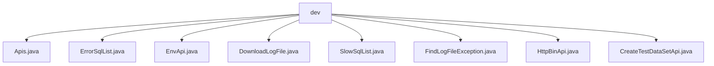

# 基础信息

|      |      |
|------|------|
| 名称 | dev |
| 编码语言 | .java |
| 代码路径 | WeFe/common/java/common-web/src/main/java/com/welab/wefe/common/web/api/dev |
| 包名 | docs.common.java.common-web.src.main.java.com.welab.wefe.common.web.api.dev |
| 概述说明 | Apis类获取API列表，支持json、markdown或html格式。ErrorSqlList返回错误SQL列表。EnvApi提供系统环境信息。DownloadLogFile处理日志下载。SlowSqlList返回慢SQL列表。FindLogFileException搜索日志异常。HttpBinApi查看HTTP请求信息。CreateTestDataSetApi生成测试数据集。 |

# 说明

## 概述  
该模块是开发辅助API集合，核心职责是提供系统监控、日志管理和测试数据生成等功能。接口规范遵循统一模式，均继承AbstractApi或AbstractNoneInputApi基类，输出多为ResponseEntity或自定义Output类。关键数据结构包括ErrorSql、SlowSql等监控实体类，以及包含日志内容、环境变量等信息的映射结构。外部依赖包括CommonConfig配置管理、SqlMonitor监控服务和系统文件操作等。例如EnvApi聚合系统属性，DownloadLogFile处理文件下载。

## 主要业务场景  
模块主要服务于开发调试场景，类似运维控制台功能。包含三类典型应用：系统状态监控（如EnvApi收集环境信息）、SQL性能分析（如ErrorSqlList获取失败SQL）、日志管理（如FindLogFileException搜索异常堆栈）。API交互模式分为无参查询（如SlowSqlList）和参数驱动（如Apis支持多格式输出）。集成案例包括测试数据生成（CreateTestDataSetApi）和HTTP请求诊断（HttpBinApi）。例如通过组合这些API可实现完整的开发调试工具链。

### 包内部结构视图

该流程图展示了WeFe项目中common-web模块下dev目录的API文件结构。dev作为父节点，包含8个直接子文件节点，涵盖日志下载、SQL监控、测试数据创建等功能类文件。所有文件均位于同一层级，无嵌套子目录，体现了开发环境相关API的集中管理方式。

# 文件列表

| 名称   | 类型  | 说明 |
|-------|------|-------------|
| [Apis.java](Apis.md) | file | Java类Apis定义API接口，支持JSON、Markdown和HTML格式输出，包含输入输出参数校验逻辑。 |
| [ErrorSqlList.java](ErrorSqlList.md) | file | 定义获取失败SQL列表的API类ErrorSqlList，无输入参数，返回包含ErrorSql集合的输出结果。处理逻辑调用SqlMonitor获取数据并封装为ApiResult返回。 |
| [EnvApi.java](EnvApi.md) | file | EnvApi类用于获取环境变量、系统属性和运行时信息，包括JVM内存、线程数等，并返回格式化输出结果。 |
| [DownloadLogFile.java](DownloadLogFile.md) | file | 这是一个用于下载日志文件的API类，检查文件是否存在后返回文件内容。路径为"log_file/download"。 |
| [SlowSqlList.java](SlowSqlList.md) | file | 这是一个慢查询列表API类，路径为"slow_sql/list"，无输入参数，返回包含慢SQL列表的输出结果。处理逻辑是获取并返回慢SQL列表。 |
| [FindLogFileException.java](FindLogFileException.md) | file | 搜索日志文件异常API，不支持Windows系统，检查文件存在后执行命令提取异常堆栈，限制返回行数100-1000。 |
| [HttpBinApi.java](HttpBinApi.md) | file | HttpBinApi类用于查看HTTP请求信息，包括请求头、客户端IP、服务器IP和URL，无需登录即可访问。 |
| [CreateTestDataSetApi.java](CreateTestDataSetApi.md) | file | 该API用于生成测试数据集，支持自定义特征、数据行数、缺失率等参数，输出为CSV文件。包含ID生成、数据类型处理及缺失值模拟功能。 |

