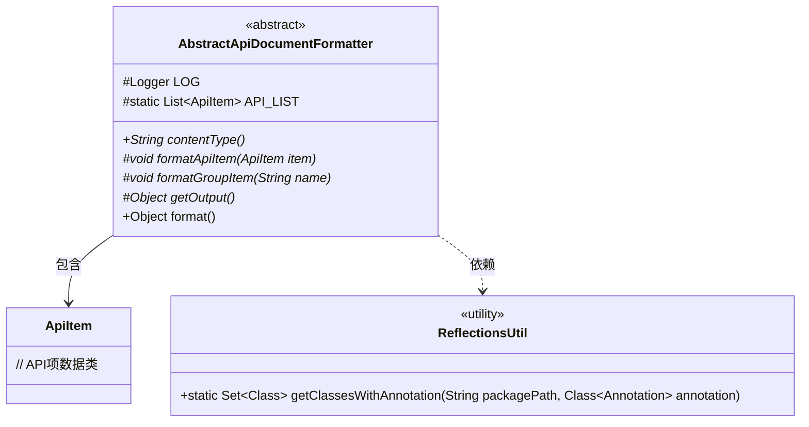
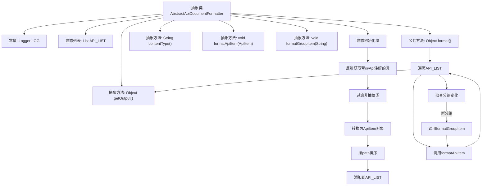

# 基础信息

|      |      |
|------|------|
| 名称 | AbstractApiDocumentFormatter |
| 编码语言 | .java |
| 代码路径 | WeFe/common/java/common-web/src/main/java/com/welab/wefe/common/web/api_document/AbstractApiDocumentFormatter.java |
| 包名 | com.welab.wefe.common.web.api_document |
| 依赖项 | ['com.welab.wefe.common.util.ReflectionsUtil', 'com.welab.wefe.common.web.Launcher', 'com.welab.wefe.common.web.api.base.Api', 'com.welab.wefe.common.web.api_document.model.ApiItem', 'org.slf4j.Logger', 'org.slf4j.LoggerFactory', 'java.lang.reflect.Modifier', 'java.util.ArrayList', 'java.util.Comparator', 'java.util.List'] |
| 概述说明 | 抽象类AbstractApiDocumentFormatter用于格式化API文档，包含静态API列表初始化、抽象格式化方法和输出方法。通过反射获取带Api注解的类，过滤并排序后处理。 |

# 说明

这是一个名为AbstractApiDocumentFormatter的抽象类，用于格式化API文档。类中包含一个静态初始化块，通过反射工具扫描指定包路径下带有Api注解的非抽象类，生成ApiItem对象并按路径排序存入静态列表API_LIST。类提供了contentType抽象方法声明返回内容类型，formatApiItem和formatGroupItem抽象方法分别用于格式化单个API项和分组项，getOutput抽象方法获取最终输出。format方法遍历API列表，按分组调用相应格式化方法并返回输出结果。类中还包含一个受保护的日志记录器实例。

# 类列表 Class Summary

| 名称   | 类型  | 说明 |
|-------|------|-------------|
| AbstractApiDocumentFormatter | class | 抽象类AbstractApiDocumentFormatter用于格式化API文档，包含静态API列表初始化、抽象格式化方法和输出方法。 |

## 类 AbstractApiDocumentFormatter

|      |      |
|------|------|
| 访问范围 | public abstract |
| 类型 | class |
| 名称 | AbstractApiDocumentFormatter |
| 说明 | 抽象类AbstractApiDocumentFormatter用于格式化API文档，包含静态API列表初始化、抽象格式化方法和输出方法。 |

### UML类图

类图描述：该图展示了一个抽象API文档格式化器(AbstractApiDocumentFormatter)的核心结构，它通过静态初始化块使用ReflectionsUtil工具类扫描带有@Api注解的类来填充API_LIST集合。抽象类定义了内容类型(contentType)、格式化API项(formatApiItem)、格式化分组(formatGroupItem)和获取输出(getOutput)等抽象方法，并通过format()方法实现遍历处理API项的核心流程。ApiItem类作为数据载体存储API元信息。

### 内部方法调用关系图

该流程图展示了抽象API文档格式化器的核心结构和工作流程。静态初始化块通过反射机制扫描指定包路径下所有带@Api注解的非抽象类，将其转换为ApiItem对象并排序存储。format()方法遍历API列表时动态检测分组变化，分别调用分组格式化和API项格式化方法，最后通过getOutput()返回结果。整个流程实现了API文档的自动化收集和结构化输出功能。

### 字段列表 Field List

| 名称  | 类型  | 说明 |
|-------|-------|------|
| API_LIST = new ArrayList<>() | List<ApiItem> | 声明一个受保护的静态常量API列表，初始化为空ArrayList。 |
| LOG = LoggerFactory.getLogger(this.getClass()) | Logger | 定义当前类的日志记录器实例LOG，使用LoggerFactory获取类名作为标识。 |

### 方法列表

| 名称  | 类型  | 说明 |
|-------|-------|------|
| formatGroupItem | void | 抽象方法formatGroupItem，参数为字符串name，用于格式化分组项。 |
| contentType | String | 抽象方法，返回字符串类型的内容类型。 |
| formatApiItem | void | 抽象方法，用于格式化ApiItem对象。 |
| getOutput | Object | 抽象方法，返回Object类型输出结果。 |
| format | Object | 该方法遍历API列表，按分组格式化输出。遇到新分组时调用formatGroupItem处理组名，然后对每个API项调用formatApiItem处理，最后返回结果。 |

