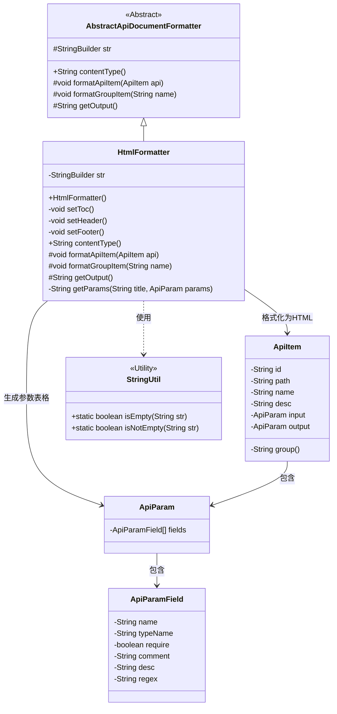
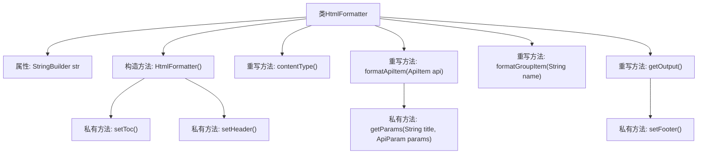

# 基础信息

|      |      |
|------|------|
| 名称 | HtmlFormatter |
| 编码语言 | .java |
| 代码路径 | WeFe/common/java/common-web/src/main/java/com/welab/wefe/common/web/api_document/HtmlFormatter.java |
| 包名 | com.welab.wefe.common.web.api_document |
| 依赖项 | ['com.welab.wefe.common.util.StringUtil', 'com.welab.wefe.common.web.api_document.model.ApiItem', 'com.welab.wefe.common.web.api_document.model.ApiParam', 'com.welab.wefe.common.web.api_document.model.ApiParamField'] |
| 概述说明 | HtmlFormatter类继承AbstractApiDocumentFormatter，用于生成HTML格式的API文档。包含目录、API项分组展示、参数表格及交互功能，支持点击展开/折叠。输出为text/html类型。 |

# 说明

HtmlFormatter类继承AbstractApiDocumentFormatter，用于生成HTML格式的API文档。初始化时设置HTML头部和目录，目录以有序列表形式展示API列表项，包含链接和名称。每个API项以div包裹，显示路径、名称和描述，参数和响应信息通过表格展示，包含名称、类型、必填等字段。支持按分组折叠API项，点击API名称可展开参数详情。页面包含返回顶部按钮，使用jQuery实现交互功能。HTML结构完整，包含DOCTYPE声明、字符集设置、响应式视口及内联CSS样式。

# 类列表 Class Summary

| 名称   | 类型  | 说明 |
|-------|------|-------------|
| HtmlFormatter | class | HtmlFormatter类继承AbstractApiDocumentFormatter，用于生成HTML格式的API文档。包含目录、API项、参数表格，支持分组折叠和参数显示隐藏，使用jQuery实现交互功能。 |

## 类 HtmlFormatter

|      |      |
|------|------|
| 访问范围 | public |
| 类型 | class |
| 名称 | HtmlFormatter |
| 说明 | HtmlFormatter类继承AbstractApiDocumentFormatter，用于生成HTML格式的API文档。包含目录、API项、参数表格，支持分组折叠和参数显示隐藏，使用jQuery实现交互功能。 |

### UML类图

类图描述：该图展示了HtmlFormatter继承自AbstractApiDocumentFormatter，用于将API文档格式化为HTML。HtmlFormatter通过StringBuilder构建HTML内容，包含设置目录(setToc)、页眉(setHeader)、页脚(setFooter)等方法，并依赖ApiItem、ApiParam等类获取API信息，使用StringUtil进行字符串判断。整体实现了API文档的HTML格式化功能。

### 内部方法调用关系图

这段代码流程图展示了HtmlFormatter类的完整结构，该类继承自AbstractApiDocumentFormatter，主要用于生成HTML格式的API文档。核心流程从构造函数开始，依次调用setHeader()和setToc()初始化文档结构，通过formatApiItem()和formatGroupItem()动态生成API内容区块，最后通过getOutput()输出完整HTML文档。私有方法getParams()负责生成参数表格，setHeader()和setFooter()分别处理HTML文档的头部和尾部结构。整个流程体现了清晰的HTML文档构建逻辑和模块化设计。

### 字段列表 Field List

| 名称  | 类型  | 说明 |
|-------|-------|------|
| str = new StringBuilder(2048) | StringBuilder | 创建StringBuilder对象，初始容量2048字符。 |

### 方法列表

| 名称  | 类型  | 说明 |
|-------|-------|------|
| setHeader | void | 方法setHeader生成HTML文档头部，包含DOCTYPE声明、UTF-8编码、视口设置、标题API Documentation及样式定义，样式包括居中标题、红色分组标题、带边框的API项、参数表格和返回顶部按钮。 |
| getOutput | String | 重写getOutput方法，先调用setFooter，再返回str的字符串形式。 |
| formatApiItem | void | 该方法格式化API条目，生成包含分组、ID、路径、名称和描述的HTML结构，并添加输入输出参数。 |
| setFooter | void | 方法setFooter添加页脚HTML，包含返回顶部链接、引入jQuery库及控制元素显示/隐藏的脚本。 |
| getParams | String | 生成HTML表格展示API参数，包括名称、类型、必填、注释、描述和正则。若无参数返回空字符串。 |
| setToc | void | 该方法生成API目录列表，遍历API_LIST中的每个ApiItem，将其路径和名称（如有）格式化为带链接的列表项，并包裹在有序列表标签中。 |
| formatGroupItem | void | 该方法用于格式化分组项，将名称包装在带有类名和值的h2标签中。 |
| contentType | String | Java方法返回HTML内容类型。 |

