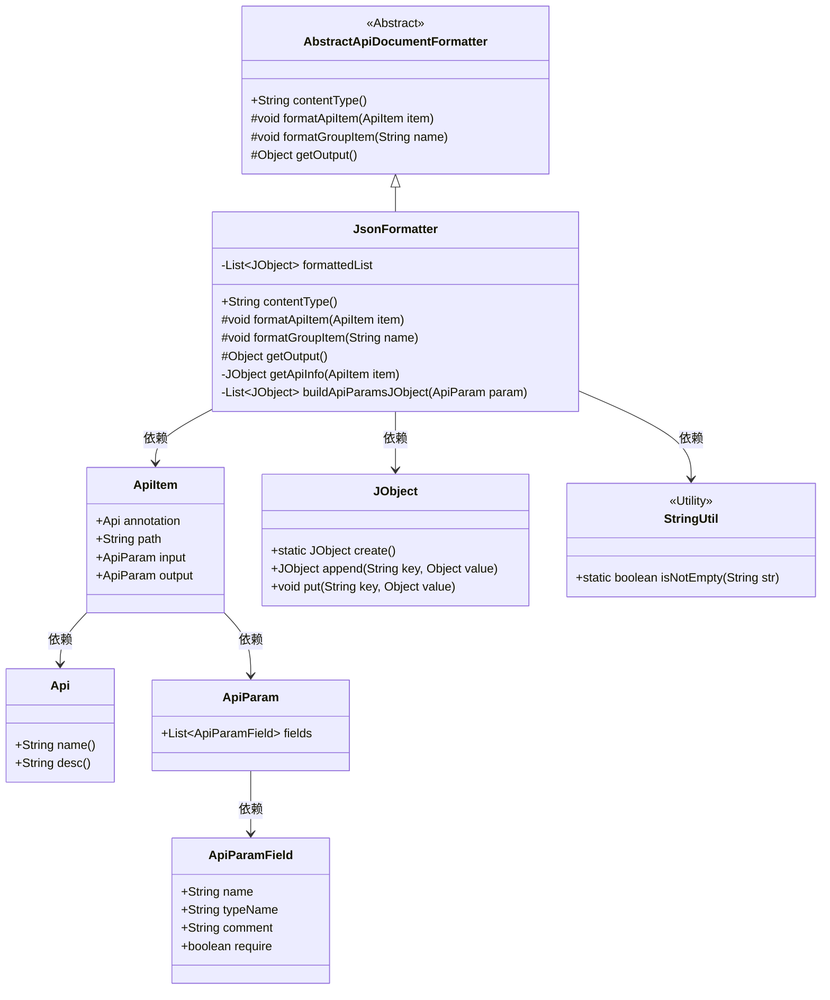
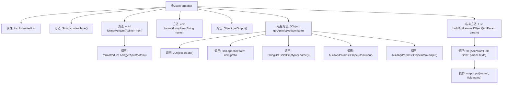

# 基础信息

|      |      |
|------|------|
| 名称 | JsonFormatter |
| 编码语言 | .java |
| 代码路径 | WeFe/common/java/common-web/src/main/java/com/welab/wefe/common/web/api_document/JsonFormatter.java |
| 包名 | com.welab.wefe.common.web.api_document |
| 依赖项 | ['com.welab.wefe.common.util.JObject', 'com.welab.wefe.common.util.StringUtil', 'com.welab.wefe.common.web.api.base.Api', 'com.welab.wefe.common.web.api_document.model.ApiItem', 'com.welab.wefe.common.web.api_document.model.ApiParam', 'com.welab.wefe.common.web.api_document.model.ApiParamField', 'java.util.ArrayList', 'java.util.List'] |
| 概述说明 | JsonFormatter类继承AbstractApiDocumentFormatter，将API信息格式化为JSON，包含路径、名称、描述及输入输出参数。 |

# 说明

JsonFormatter类继承AbstractApiDocumentFormatter，用于格式化API文档为JSON。它维护一个formattedList存储格式化后的API信息。contentType方法返回application/json。formatApiItem方法将API项转换为JObject并加入列表，包含路径、名称、描述、输入输出参数。输入输出参数由buildApiParamsJObject方法处理，生成包含名称、类型、注释和必填字段的列表。formatGroupItem方法为空实现。getOutput返回格式化后的列表。

# 类列表 Class Summary

| 名称   | 类型  | 说明 |
|-------|------|-------------|
| JsonFormatter | class | JsonFormatter类继承AbstractApiDocumentFormatter，将API信息格式化为JSON，包含路径、名称、描述及输入输出参数。 |

## 类 JsonFormatter

|      |      |
|------|------|
| 访问范围 | public |
| 类型 | class |
| 名称 | JsonFormatter |
| 说明 | JsonFormatter类继承AbstractApiDocumentFormatter，将API信息格式化为JSON，包含路径、名称、描述及输入输出参数。 |

### UML类图

类图描述：该图展示了JSON格式化工具JsonFormatter的类结构，它继承自抽象类AbstractApiDocumentFormatter，实现了API文档的JSON格式转换功能。核心类JsonFormatter通过组合方式使用ApiItem、JObject等辅助类，其中ApiItem包含API元数据，JObject提供JSON构建能力，StringUtil提供字符串工具方法。整个设计实现了将API信息转换为结构化JSON数据的功能，支持路径、名称、描述等属性的动态生成。

### 内部方法调用关系图

该流程图展示了JsonFormatter类的完整结构，重点描述了JSON文档生成的核心流程。类继承自AbstractApiDocumentFormatter，通过formatApiItem方法收集API信息，使用getApiInfo构建JSON对象结构，并通过buildApiParamsJObject方法递归处理输入输出参数。流程清晰展现了从API原始数据到格式化JSON的转换过程，包括条件判断、循环处理和对象构建等关键步骤。

### 字段列表 Field List

| 名称  | 类型  | 说明 |
|-------|-------|------|
| formattedList = new ArrayList<>() | List<JObject> | 创建名为formattedList的ArrayList，用于存储JObject类型对象。 |

### 方法列表

| 名称  | 类型  | 说明 |
|-------|-------|------|
| getOutput | Object | 重写getOutput方法，返回formattedList对象。 |
| formatGroupItem | void | 重写方法formatGroupItem，参数为name，无具体实现。 |
| contentType | String | 方法返回内容类型为JSON格式。 |
| formatApiItem | void | 覆盖方法formatApiItem，将ApiItem信息处理后加入formattedList。 |
| getApiInfo | JObject | 方法getApiInfo接收ApiItem参数，返回包含API路径、名称、描述、输入输出参数的JSON对象。 |
| buildApiParamsJObject | List<JObject> | 方法将ApiParam转换为JObject列表，包含字段名、类型、注释和必填属性。若参数为空返回null。 |

