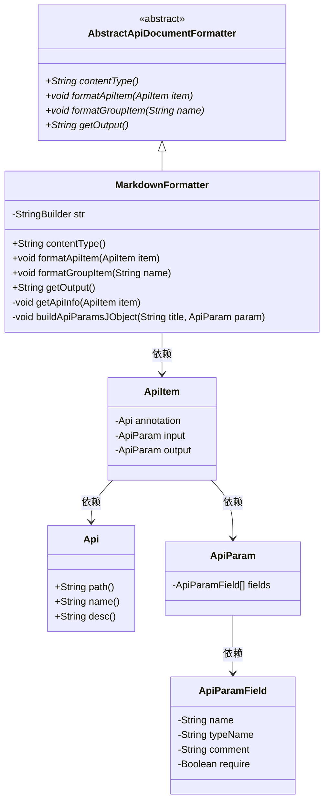
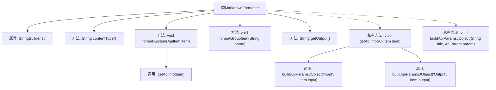

# 基础信息

|      |      |
|------|------|
| 名称 | MarkdownFormatter |
| 编码语言 | .java |
| 代码路径 | WeFe/common/java/common-web/src/main/java/com/welab/wefe/common/web/api_document/MarkdownFormatter.java |
| 包名 | com.welab.wefe.common.web.api_document |
| 依赖项 | ['com.welab.wefe.common.util.StringUtil', 'com.welab.wefe.common.web.api.base.Api', 'com.welab.wefe.common.web.api_document.model.ApiItem', 'com.welab.wefe.common.web.api_document.model.ApiParam', 'com.welab.wefe.common.web.api_document.model.ApiParamField'] |
| 概述说明 | MarkdownFormatter类继承AbstractApiDocumentFormatter，用于生成Markdown格式的API文档。包含格式化API项、组项方法，输出内容类型为text/markdown。通过getApiInfo构建API标题、描述、输入输出参数表格。 |

# 说明

MarkdownFormatter类继承自AbstractApiDocumentFormatter，用于生成Markdown格式的API文档。它通过StringBuilder构建输出内容，contentType方法返回text/markdown。核心方法getApiInfo处理单个API项，生成包含路径、名称、描述的二级标题，并调用buildApiParamsJObject方法分别生成输入输出参数的Markdown表格，表格包含字段名、类型、注释和必填项。格式使用##标题、**加粗**和|表格|分隔符，通过System.lineSeparator换行。

# 类列表 Class Summary

| 名称   | 类型  | 说明 |
|-------|------|-------------|
| MarkdownFormatter | class | MarkdownFormatter类继承AbstractApiDocumentFormatter，用于生成Markdown格式的API文档。包含格式化API项、组项的方法，通过getApiInfo构建API标题、描述、输入输出参数表格，输出为Markdown文本。 |

## 类 MarkdownFormatter

|      |      |
|------|------|
| 访问范围 | public |
| 类型 | class |
| 名称 | MarkdownFormatter |
| 说明 | MarkdownFormatter类继承AbstractApiDocumentFormatter，用于生成Markdown格式的API文档。包含格式化API项、组项的方法，通过getApiInfo构建API标题、描述、输入输出参数表格，输出为Markdown文本。 |

### UML类图

这段代码描述了一个Markdown文档生成器，继承自抽象类AbstractApiDocumentFormatter，用于将API文档转换为Markdown格式。核心功能包括：通过getApiInfo方法生成API标题和描述，通过buildApiParamsJObject方法生成参数表格。类结构清晰展示了从抽象基类到具体实现类的继承关系，以及与ApiItem、Api、ApiParam等数据模型的依赖关系，实现了API文档的格式化输出功能。

### 内部方法调用关系图

这段代码展示了一个MarkdownFormatter类，继承自AbstractApiDocumentFormatter，用于将API文档格式化为Markdown格式。主要功能包括获取API内容类型、格式化API条目、分组条目以及生成输出。核心私有方法getApiInfo用于构建API标题和描述，buildApiParamsJObject用于生成输入输出参数的Markdown表格。流程图中清晰地展示了类结构和方法调用关系，体现了从格式化入口到最终输出的完整处理链条。

### 字段列表 Field List

| 名称  | 类型  | 说明 |
|-------|-------|------|
| str = new StringBuilder(1024) | StringBuilder | 创建StringBuilder对象，初始容量1024字符。 |

### 方法列表

| 名称  | 类型  | 说明 |
|-------|-------|------|
| contentType | String | 该方法返回内容类型为"text/markdown"。 |
| formatGroupItem | void | 覆盖方法formatGroupItem，接收name参数，无具体实现。 |
| getOutput | String | 重写getOutput方法，返回str的字符串形式。 |
| formatApiItem | void | 覆盖方法formatApiItem，调用getApiInfo处理ApiItem对象。 |
| getApiInfo | void | 方法getApiInfo处理API信息，拼接标题、简介、输入输出参数，并格式化输出。 |
| buildApiParamsJObject | void | 该方法用于构建API参数的Markdown表格格式字符串。检查参数非空后，添加标题和表格头（name、type、comment、require），然后遍历参数字段列表，逐行填充字段信息。空require显示为空字符串。 |

