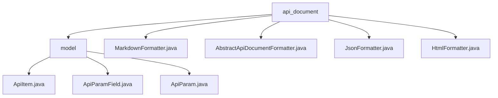

# 基础信息

|      |      |
|------|------|
| 名称 | api_document |
| 编码语言 | .java |
| 代码路径 | WeFe/common/java/common-web/src/main/java/com/welab/wefe/common/web/api_document |
| 包名 | docs.common.java.common-web.src.main.java.com.welab.wefe.common.web.api_document |
| 概述说明 | 该模块通过反射和注解自动生成API文档，支持JSON、Markdown和HTML格式。核心包括ApiItem三级模型，处理泛型、校验规则和字段过滤，类似Swagger但代码优先。 |

# 说明

## 概述  
该模块实现多格式API文档生成系统，通过反射解析注解元数据并转换为结构化模型。采用注解驱动规范，例如Check/JSONField控制字段规则，支持泛型识别和命名转换。核心数据结构为ApiItem-ApiParam-ApiParamField三级嵌套模型，依赖Java反射和Jackson序列化库。实现案例包含正则校验提取和NoneApiInput特殊处理，类似Swagger但采用代码优先模式。

## 主要业务场景  
典型流程为反射解析→构建ApiItem树→生成文档，支持分组管理和动态字段过滤。交互模式结合注解配置与运行时解析，例如Check注解驱动校验规则生成。输出格式涵盖Markdown/JSON/HTML，Markdown采用表格展示参数，HTML支持折叠交互。集成案例包含驼峰转下划线标准化和必填项校验，适用于RESTful接口文档自动化生成。

### 包内部结构视图

该流程图展示了WeFe项目中API文档模块的层级结构。顶层节点api_document包含model子目录和多个格式化工具类文件(Markdown/JSON/HTML等)，model目录下则包含三个描述API结构的核心模型类文件(ApiItem/ApiParam等)。整个结构清晰地反映了API文档生成功能的代码组织方式。

# 文件列表

| 名称   | 类型  | 说明 |
|-------|------|-------------|
| [MarkdownFormatter.java](MarkdownFormatter.md) | file | MarkdownFormatter类继承AbstractApiDocumentFormatter，用于生成Markdown格式的API文档。包含格式化API项、组项方法，输出内容类型为text/markdown。通过getApiInfo构建API标题、描述、输入输出参数表格。 |
| [AbstractApiDocumentFormatter.java](AbstractApiDocumentFormatter.md) | file | 抽象类AbstractApiDocumentFormatter用于格式化API文档，包含静态API列表初始化、抽象格式化方法和输出方法。通过反射获取带Api注解的类，过滤并排序后处理。 |
| [JsonFormatter.java](JsonFormatter.md) | file | JsonFormatter类继承AbstractApiDocumentFormatter，将API信息格式化为JSON，包含路径、名称、描述及输入输出参数。 |
| [HtmlFormatter.java](HtmlFormatter.md) | file | HtmlFormatter类继承AbstractApiDocumentFormatter，用于生成HTML格式的API文档。包含目录、API项分组展示、参数表格及交互功能，支持点击展开/折叠。输出为text/html类型。 |
| [model](model/_module.md) | package | ApiItem封装API信息，含注解路径等，解析输入输出类型。ApiParamField描述参数字段属性，自动转换字段名并校验。ApiParam封装参数信息，反射处理字段生成ApiParamField列表。 |

