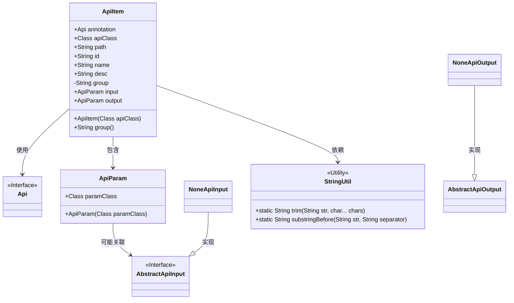
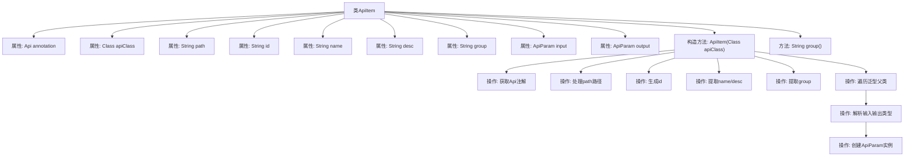

# 基础信息

|      |      |
|------|------|
| 名称 | ApiItem |
| 编码语言 | .java |
| 代码路径 | WeFe/common/java/common-web/src/main/java/com/welab/wefe/common/web/api_document/model/ApiItem.java |
| 包名 | com.welab.wefe.common.web.api_document.model |
| 依赖项 | ['com.welab.wefe.common.util.StringUtil', 'com.welab.wefe.common.web.api.base.Api', 'com.welab.wefe.common.web.dto.AbstractApiInput', 'com.welab.wefe.common.web.dto.NoneApiInput', 'com.welab.wefe.common.web.dto.NoneApiOutput', 'sun.reflect.generics.reflectiveObjects.ParameterizedTypeImpl', 'sun.reflect.generics.reflectiveObjects.TypeVariableImpl', 'java.lang.reflect.ParameterizedType', 'java.lang.reflect.Type'] |
| 概述说明 | ApiItem类封装API信息，包含路径、ID、名称、描述、分组及输入输出参数，通过注解和泛型解析初始化。 |

# 说明

ApiItem类用于封装API信息，包含注解、路径、ID、名称、描述、分组及输入输出参数。构造函数通过反射获取API类注解，处理路径格式并提取分组。通过泛型解析获取输入输出类型，若为NoneApiInput或NoneApiOutput则置空，否则创建对应ApiParam实例。提供group方法返回分组信息。

# 类列表 Class Summary

| 名称   | 类型  | 说明 |
|-------|------|-------------|
| ApiItem | class | ApiItem类封装API信息，包括路径、ID、名称、描述、分组及输入输出参数，通过注解和泛型类型解析初始化。 |

## 类 ApiItem

|      |      |
|------|------|
| 访问范围 | public |
| 类型 | class |
| 名称 | ApiItem |
| 说明 | ApiItem类封装API信息，包括路径、ID、名称、描述、分组及输入输出参数，通过注解和泛型类型解析初始化。 |

### UML类图

类图描述：ApiItem类封装了API的元数据信息，包括注解、路径、ID、名称、描述等，并通过ApiParam类处理输入输出参数。它依赖StringUtil工具类进行字符串处理，并与Api接口关联。ApiParam可能关联到AbstractApiInput抽象接口，NoneApiInput和NoneApiOutput是其具体实现类。该结构主要用于API的元数据管理和参数处理。

### 内部方法调用关系图

该流程图展示了ApiItem类的结构和主要处理逻辑。类通过构造函数初始化时，会依次处理API路径、生成唯一ID、提取描述信息，并通过反射机制解析泛型父类来确定输入输出参数类型。特别关注路径标准化处理和泛型类型安全检查，最后根据类型创建对应的ApiParam对象或设为null。group()方法提供分组信息的只读访问。

### 字段列表 Field List

| 名称  | 类型  | 说明 |
|-------|-------|------|
| group | String | 声明一个不可变的字符串类型成员变量group。 |
| desc | String | 类中定义的公共字符串类型成员变量desc。 |
| name | String | 声明一个公共字符串变量name。 |
| path | String | 公共字符串变量path |
| annotation | Api | 公共API注解。 |
| output | ApiParam | 定义了一个名为output的ApiParam类型公共变量。 |
| apiClass | Class<?> | 声明一个公共的Class类型变量apiClass，用于存储类对象。 |
| input | ApiParam | API参数输入对象。 |
| id | String | 公开字符串类型变量id。 |

### 方法列表

| 名称  | 类型  | 说明 |
|-------|-------|------|
| group | String | 获取group属性的方法。 |

