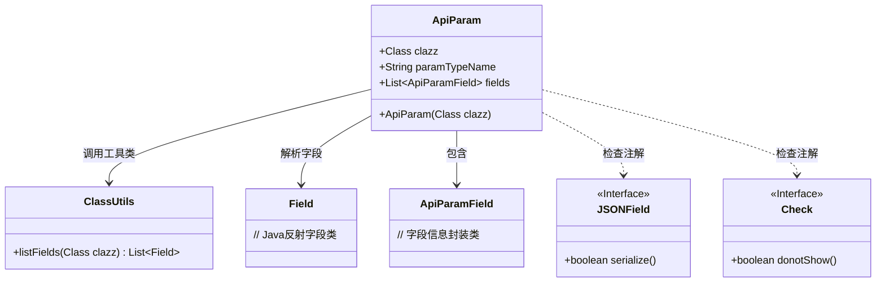
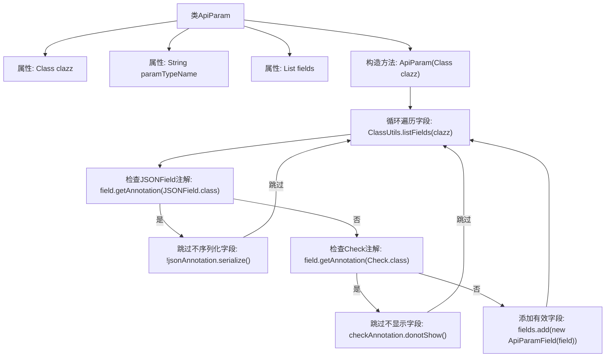

# 基础信息

|      |      |
|------|------|
| 名称 | ApiParam |
| 编码语言 | .java |
| 代码路径 | WeFe/common/java/common-web/src/main/java/com/welab/wefe/common/web/api_document/model/ApiParam.java |
| 包名 | com.welab.wefe.common.web.api_document.model |
| 依赖项 | ['com.alibaba.fastjson.annotation.JSONField', 'com.welab.wefe.common.fieldvalidate.annotation.Check', 'com.welab.wefe.common.util.ClassUtils', 'java.lang.reflect.Field', 'java.util.ArrayList', 'java.util.List'] |
| 概述说明 | ApiParam类用于封装API参数信息，包含参数类型、名称及字段列表，通过注解过滤不显示的字段。 |

# 说明

ApiParam类用于封装API参数信息，包含三个成员变量：clazz表示参数类型，paramTypeName存储类名，fields存储参数字段列表。构造函数接收一个Class对象，初始化clazz和paramTypeName。通过反射遍历类的所有字段，跳过带有JSONField注解且serialize为false的字段，以及带有Check注解且donotShow为true的字段。其余字段被封装为ApiParamField对象并添加到fields列表中。

# 类列表 Class Summary

| 名称   | 类型  | 说明 |
|-------|------|-------------|
| ApiParam | class | ApiParam类定义API参数结构，包含类型、名称和字段列表。构造函数根据类信息初始化，跳过不显示的字段，添加有效字段到列表。 |

## 类 ApiParam

|      |      |
|------|------|
| 访问范围 | public |
| 类型 | class |
| 名称 | ApiParam |
| 说明 | ApiParam类定义API参数结构，包含类型、名称和字段列表。构造函数根据类信息初始化，跳过不显示的字段，添加有效字段到列表。 |

### UML类图

这段代码定义了一个`ApiParam`类，用于封装API参数的元数据信息。它通过反射读取类字段，并根据`JSONField`和`Check`注解过滤不需要展示的字段，最终将有效字段封装为`ApiParamField`对象列表。类图展示了`ApiParam`与工具类、注解接口和字段类之间的依赖关系，体现了参数解析的核心逻辑。

### 内部方法调用关系图

流程图描述了ApiParam类的构造过程：初始化类属性后，遍历输入类的所有字段，通过检查JSONField和Check注解过滤掉不需要处理的字段，最后将有效字段封装为ApiParamField对象存入列表。该流程实现了基于注解的字段筛选机制，确保只有符合条件（可序列化且非隐藏）的字段会被处理。

### 字段列表 Field List

| 名称  | 类型  | 说明 |
|-------|-------|------|
| paramTypeName | String | 类中定义的字符串类型公共成员变量paramTypeName。 |
| clazz | Class<?> | 声明一个Class类型的公共变量clazz，用于存储类对象引用。 |
| fields = new ArrayList<>() | List<ApiParamField> | 定义了一个名为fields的公共列表变量，用于存储ApiParamField对象，初始化为空ArrayList。 |

### 方法列表

| 名称  | 类型  | 说明 |
|-------|-------|------|

