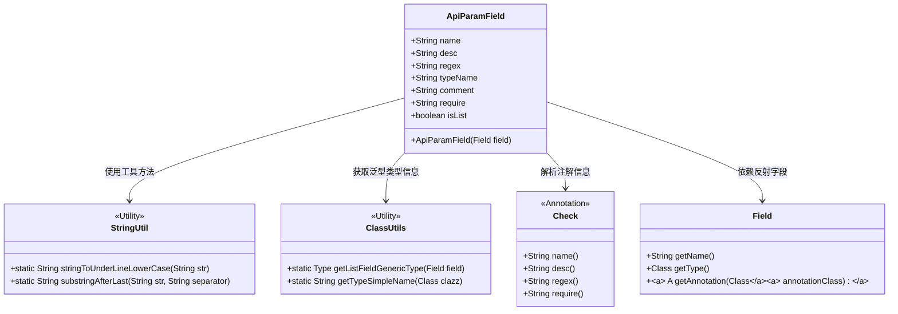
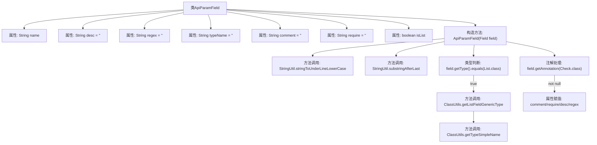

# 基础信息

|      |      |
|------|------|
| 名称 | ApiParamField |
| 编码语言 | .java |
| 代码路径 | WeFe/common/java/common-web/src/main/java/com/welab/wefe/common/web/api_document/model/ApiParamField.java |
| 包名 | com.welab.wefe.common.web.api_document.model |
| 依赖项 | ['com.welab.wefe.common.fieldvalidate.annotation.Check', 'com.welab.wefe.common.util.ClassUtils', 'com.welab.wefe.common.util.StringUtil', 'java.lang.reflect.Field', 'java.lang.reflect.Type', 'java.util.List'] |
| 概述说明 | ApiParamField类用于封装API参数字段信息，包括名称、描述、正则校验、类型、注释、是否必填及是否为列表。通过Field对象和Check注解初始化字段属性。 |

# 说明

ApiParamField类用于描述API参数字段属性，包含字段名称、描述、正则校验规则、类型名称、注释、是否必填及是否为列表类型等属性。构造函数通过反射解析字段信息，自动转换字段名为下划线格式，识别基础类型或泛型列表类型。若字段标注了Check注解，则从中提取校验相关属性值填充到对应字段中。

# 类列表 Class Summary

| 名称   | 类型  | 说明 |
|-------|------|-------------|
| ApiParamField | class | ApiParamField类定义API参数字段属性，包括名称、描述、正则、类型等。构造函数处理字段名、类型（含泛型列表）及Check注解信息。 |

## 类 ApiParamField

|      |      |
|------|------|
| 访问范围 | public |
| 类型 | class |
| 名称 | ApiParamField |
| 说明 | ApiParamField类定义API参数字段属性，包括名称、描述、正则、类型等。构造函数处理字段名、类型（含泛型列表）及Check注解信息。 |

### UML类图

类图描述：ApiParamField类用于封装API参数的元数据信息，通过反射解析字段的注解和类型特征。它依赖StringUtil和ClassUtils工具类处理字符串和泛型类型，通过Check注解获取校验规则，并基于Java反射Field对象获取字段属性。核心功能包括自动转换字段命名风格、识别List泛型类型、提取注解定义的校验规则等，为API文档生成提供结构化数据支持。

### 内部方法调用关系图

这段流程图展示了ApiParamField类的结构和构造方法的主要处理逻辑。类包含7个字符串属性和1个布尔属性，构造方法接收Field参数后执行以下流程：首先转换字段名为下划线格式，获取基础类型名；然后判断是否为List类型，若是则处理泛型参数；最后检查是否存在Check注解，若有则提取注解属性值。整个流程体现了对Java反射和注解处理的完整操作链。

### 字段列表 Field List

| 名称  | 类型  | 说明 |
|-------|-------|------|
| comment = "" | String | 定义了一个公开的字符串变量comment，初始值为空字符串。 |
| typeName = "" | String | 定义了一个公开的字符串变量typeName，初始值为空字符串。 |
| regex = "" | String | 定义了一个名为regex的公共字符串变量，初始值为空。 |
| name | String | 公开字符串变量name。 |
| desc = "" | String | 空字符串变量desc，类型为String。 |
| require = "" | String | 空字符串变量声明 |
| isList | boolean | 布尔变量isList表示是否为列表类型。 |

### 方法列表

| 名称  | 类型  | 说明 |
|-------|-------|------|

