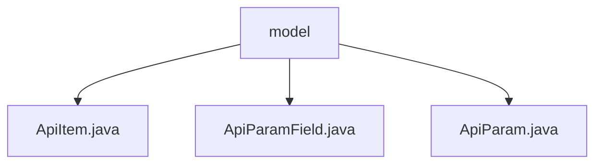

# 基础信息

|      |      |
|------|------|
| 名称 | model |
| 编码语言 | .java |
| 代码路径 | WeFe/common/java/common-web/src/main/java/com/welab/wefe/common/web/api_document/model |
| 包名 | docs.common.java.common-web.src.main.java.com.welab.wefe.common.web.api_document.model |
| 概述说明 | ApiItem封装API信息，含注解路径等，解析输入输出类型。ApiParamField描述参数字段属性，自动转换字段名并校验。ApiParam封装参数信息，反射处理字段生成ApiParamField列表。 |

# 说明

## 概述  
该模块核心职责是构建API文档生成系统，通过反射机制自动解析API元数据并结构化存储。接口规范统一采用注解驱动方式，例如通过Check/JSONField等注解控制字段可见性，支持泛型类型识别和下划线命名转换。关键数据结构包括ApiItem(API主体信息)、ApiParam(参数容器)和ApiParamField(字段详情)，形成三级嵌套模型。依赖Java反射机制和JSONField等注解，例如需配合Jackson库实现序列化控制。实现案例包含NoneApiInput特殊类型处理和正则校验规则提取。

## 主要业务场景  
典型应用为自动化API文档生成，类似Swagger但采用代码优先模式。业务流程包括：反射解析API类→构建ApiItem树→递归处理参数类型→生成文档结构。交互模式表现为注解配置与运行时解析结合，例如Check注解驱动字段校验规则生成。功能完整性体现在支持分组管理、泛型列表识别和动态字段过滤，例如跳过donotShow字段。API类型涵盖常规RESTful接口，集成案例包含正则校验和驼峰转下划线等标准化处理。

### 包内部结构视图

该流程图展示了WeFe项目中API文档模型模块的层级结构。根节点为"model"文件夹，包含三个Java文件：ApiItem.java、ApiParamField.java和ApiParam.java。这些文件共同构成了API文档的数据模型部分，用于定义API项及其参数结构。整个结构简洁明了，体现了良好的模块化设计。

# 文件列表

| 名称   | 类型  | 说明 |
|-------|------|-------------|
| [ApiItem.java](ApiItem.md) | file | ApiItem类封装API信息，包含路径、ID、名称、描述、分组及输入输出参数，通过注解和泛型解析初始化。 |
| [ApiParamField.java](ApiParamField.md) | file | ApiParamField类用于封装API参数字段信息，包括名称、描述、正则校验、类型、注释、是否必填及是否为列表。通过Field对象和Check注解初始化字段属性。 |
| [ApiParam.java](ApiParam.md) | file | ApiParam类用于封装API参数信息，包含参数类型、名称及字段列表，通过注解过滤不显示的字段。 |

