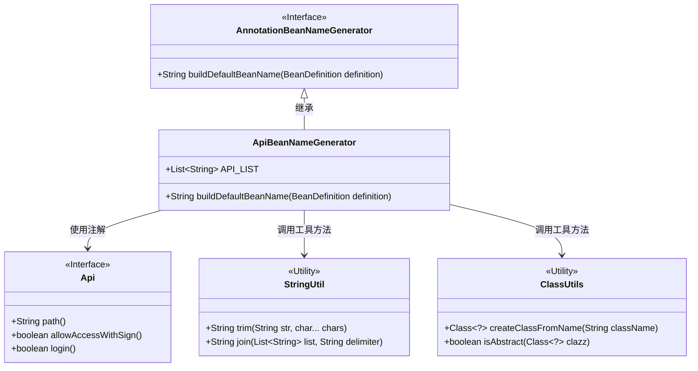
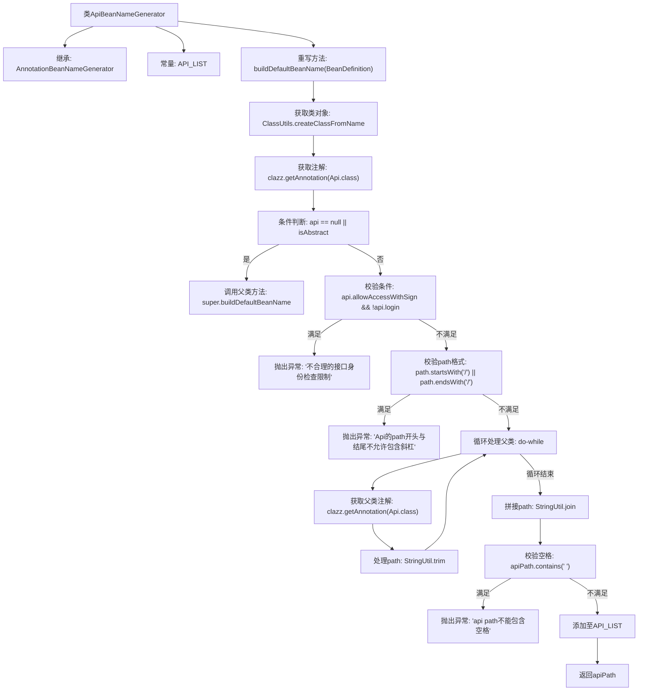

# 基础信息

|      |      |
|------|------|
| 名称 | ApiBeanNameGenerator |
| 编码语言 | .java |
| 代码路径 | WeFe/common/java/common-web/src/main/java/com/welab/wefe/common/web/config/ApiBeanNameGenerator.java |
| 包名 | com.welab.wefe.common.web.config |
| 依赖项 | ['com.welab.wefe.common.util.ClassUtils', 'com.welab.wefe.common.util.StringUtil', 'com.welab.wefe.common.web.api.base.Api', 'org.springframework.beans.factory.config.BeanDefinition', 'org.springframework.context.annotation.AnnotationBeanNameGenerator', 'java.util.ArrayList', 'java.util.List'] |
| 概述说明 | ApiBeanNameGenerator继承AnnotationBeanNameGenerator，生成API路径作为bean名。检查Api注解的path格式、验签与登录逻辑，拼接父类路径，确保无空格和斜杠，并收集所有API路径。 |

# 说明

ApiBeanNameGenerator继承AnnotationBeanNameGenerator，用于生成API类bean名称。主要逻辑：检查类是否带有Api注解且非抽象类。验证注解属性：若允许验签但无需登录则抛出异常。校验path格式，首尾不能有斜杠。递归收集父类Api路径并拼接当前路径，确保路径不含空格。最终将合法路径加入静态列表API_LIST并返回作为bean名称。

# 类列表 Class Summary

| 名称   | 类型  | 说明 |
|-------|------|-------------|
| ApiBeanNameGenerator | class | ApiBeanNameGenerator继承AnnotationBeanNameGenerator，生成API路径作为bean名。检查Api注解路径格式、验签与登录逻辑，拼接父类路径，确保无空格和斜杠，并加入全局API列表。 |

## 类 ApiBeanNameGenerator

|      |      |
|------|------|
| 访问范围 | public |
| 类型 | class |
| 名称 | ApiBeanNameGenerator |
| 说明 | ApiBeanNameGenerator继承AnnotationBeanNameGenerator，生成API路径作为bean名。检查Api注解路径格式、验签与登录逻辑，拼接父类路径，确保无空格和斜杠，并加入全局API列表。 |

### UML类图

这段代码展示了一个API Bean名称生成器，继承自`AnnotationBeanNameGenerator`，通过处理`@Api`注解来生成规范的API路径作为Bean名称。主要功能包括：验证注解配置合理性（如验签与登录逻辑）、规范化路径格式（去除首尾斜杠、处理继承路径）、检查路径空格等非法字符，并将最终路径加入静态列表。类图中清晰体现了继承关系、工具类依赖和注解接口的使用。

### 内部方法调用关系图

这段代码流程图展示了ApiBeanNameGenerator类处理API路径的核心逻辑。主要功能是通过反射获取类及其父类的Api注解，校验接口访问权限配置的合理性，规范化路径格式，最终生成标准化的API路径字符串。流程包含多层条件判断和循环处理，特别注重安全校验（验签/登录配置检查、路径格式校验、空格校验等），确保生成的API路径符合规范且无安全漏洞。所有校验失败都会立即抛出运行时异常，严格保证接口定义的规范性。

### 字段列表 Field List

| 名称  | 类型  | 说明 |
|-------|-------|------|
| API_LIST = new ArrayList<>() | List<String> | 定义静态常量API_LIST，类型为字符串列表，初始化为空ArrayList。 |

### 方法列表

| 名称  | 类型  | 说明 |
|-------|-------|------|
| buildDefaultBeanName | String | 方法根据Bean定义生成默认名称。若类无Api注解或为抽象类，调用父类方法。否则检查Api路径格式：开头结尾不能有斜杠，需验签则必须登录。递归收集父类Api路径并拼接，确保无空格后加入全局列表，返回路径作为名称。 |

