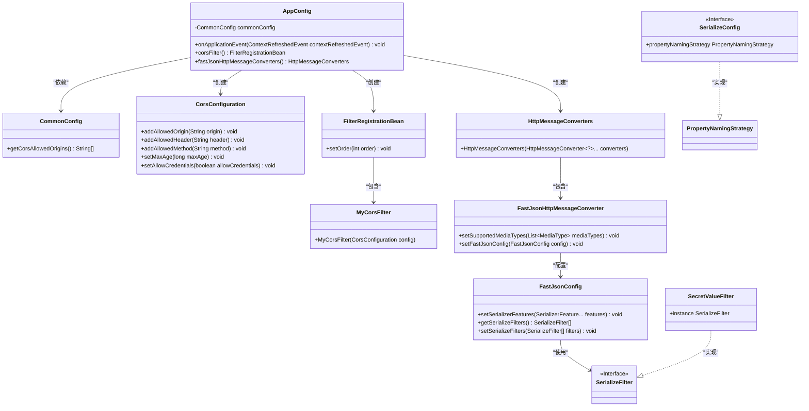
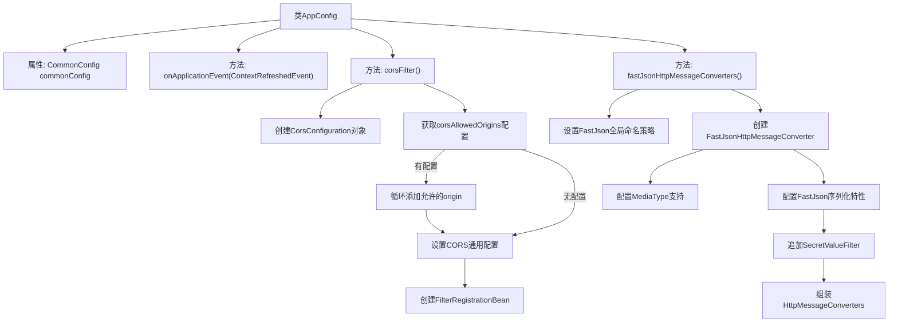

# 基础信息

|      |      |
|------|------|
| 名称 | AppConfig |
| 编码语言 | .java |
| 代码路径 | WeFe/common/java/common-web/src/main/java/com/welab/wefe/common/web/config/AppConfig.java |
| 包名 | com.welab.wefe.common.web.config |
| 依赖项 | ['com.alibaba.fastjson.PropertyNamingStrategy', 'com.alibaba.fastjson.serializer.SerializeConfig', 'com.alibaba.fastjson.serializer.SerializeFilter', 'com.alibaba.fastjson.serializer.SerializerFeature', 'com.alibaba.fastjson.support.config.FastJsonConfig', 'com.alibaba.fastjson.support.spring.FastJsonHttpMessageConverter', 'com.welab.wefe.common.TimeSpan', 'com.welab.wefe.common.fieldvalidate.secret.SecretValueFilter', 'org.springframework.beans.factory.annotation.Autowired', 'org.springframework.boot.autoconfigure.http.HttpMessageConverters', 'org.springframework.boot.web.servlet.FilterRegistrationBean', 'org.springframework.context.ApplicationListener', 'org.springframework.context.annotation.Bean', 'org.springframework.context.annotation.Configuration', 'org.springframework.context.event.ContextRefreshedEvent', 'org.springframework.http.MediaType', 'org.springframework.web.cors.CorsConfiguration', 'java.util.ArrayList', 'java.util.List'] |
| 概述说明 | AppConfig配置类实现跨域过滤器，允许指定源或全部源访问，设置FastJson为JSON序列化组件，支持蛇形命名和空值输出。 |

# 说明

这是一个Spring Boot应用配置类，主要实现跨域配置和JSON序列化设置。类实现了ApplicationListener接口监听容器刷新事件。跨域配置通过FilterRegistrationBean注册CORS过滤器，支持动态配置允许的域名，默认允许所有来源，设置允许所有方法和头部，缓存10分钟，允许凭证。JSON序列化使用FastJson，配置全局下划线命名策略，支持UTF-8 JSON媒体类型，启用字段排序、空值输出和错误getter忽略特性，并添加了敏感值过滤处理。

# 类列表 Class Summary

| 名称   | 类型  | 说明 |
|-------|------|-------------|
| AppConfig | class | AppConfig配置类实现跨域过滤器与FastJSON消息转换器。跨域配置允许指定源或全部，设置头、方法、缓存及凭证。FastJSON配置下划线命名策略，支持空字段输出，并添加SecretValueFilter。 |

## 类 AppConfig

|      |      |
|------|------|
| 访问范围 | @Configuration;public |
| 类型 | class |
| 名称 | AppConfig |
| 说明 | AppConfig配置类实现跨域过滤器与FastJSON消息转换器。跨域配置允许指定源或全部，设置头、方法、缓存及凭证。FastJSON配置下划线命名策略，支持空字段输出，并添加SecretValueFilter。 |

### UML类图

这段代码是一个Spring Boot配置类，主要实现了跨域过滤器配置和FastJSON消息转换器配置。类图中展示了AppConfig与多个组件的关系，包括CommonConfig用于获取跨域配置、CorsConfiguration设置跨域规则、FilterRegistrationBean注册过滤器、以及FastJsonHttpMessageConverter处理JSON序列化。通过依赖注入和对象创建，实现了跨域请求处理和JSON响应格式的自定义配置。

### 内部方法调用关系图

这段代码是Spring Boot的配置类，主要实现两个核心功能：1) 配置跨域过滤器(CORS)，通过读取CommonConfig中的允许来源列表，设置跨域访问规则；2) 配置FastJson作为JSON消息转换器，设置全局序列化策略、支持媒体类型和自定义过滤器。流程图清晰展示了配置初始化和处理逻辑的分支路径，特别是跨域配置的优先级处理和FastJson的多层配置过程。

### 字段列表 Field List

| 名称  | 类型  | 说明 |
|-------|-------|------|
| commonConfig | CommonConfig | 代码片段使用@Autowired注解自动注入CommonConfig依赖。 |

### 方法列表

| 名称  | 类型  | 说明 |
|-------|-------|------|
| onApplicationEvent | void | 这是一个Spring框架中的事件监听方法，用于处理应用上下文刷新完成事件。 |
| corsFilter | FilterRegistrationBean | 定义一个CORS过滤器Bean，配置允许的源、头、方法，设置缓存时间和凭证许可，注册为优先级最高的过滤器。 |
| fastJsonHttpMessageConverters | HttpMessageConverters | 配置FastJson转换器，全局使用下划线命名策略，支持UTF-8 JSON格式，启用字段排序、空值输出和错误忽略功能，并添加SecretValueFilter过滤器。 |

