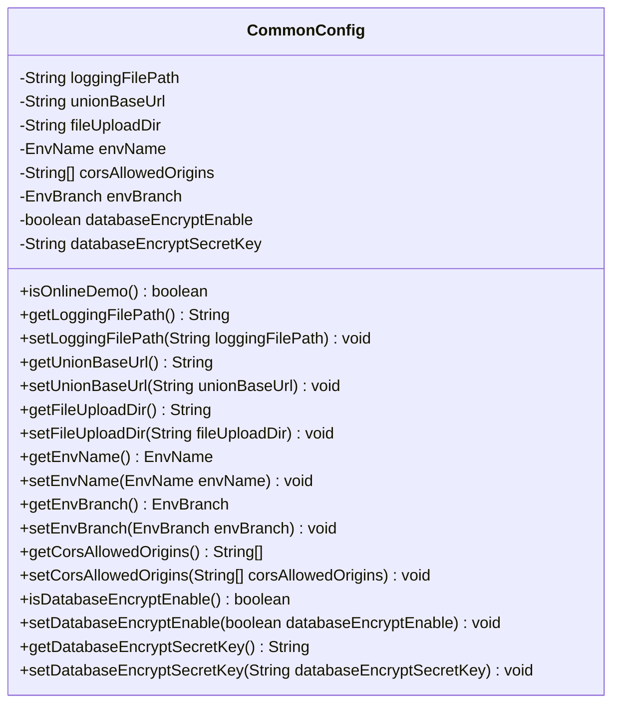
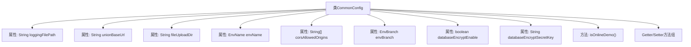

# 基础信息

|      |      |
|------|------|
| 名称 | CommonConfig |
| 编码语言 | .java |
| 代码路径 | WeFe/common/java/common-web/src/main/java/com/welab/wefe/common/web/config/CommonConfig.java |
| 包名 | com.welab.wefe.common.web.config |
| 依赖项 | ['com.welab.wefe.common.wefe.enums.env.EnvBranch', 'com.welab.wefe.common.wefe.enums.env.EnvName', 'org.springframework.beans.factory.annotation.Value', 'org.springframework.stereotype.Component'] |
| 概述说明 | CommonConfig类包含日志路径、联盟URL、文件上传目录、环境名称和分支、跨域设置、数据库加密开关及密钥等配置项，并提供getter/setter方法。 |

# 说明

CommonConfig是一个配置类，用于管理应用程序的通用设置。它包含日志文件存储路径、联盟基础URL、文件上传目录、环境名称（默认为prod）、跨域允许来源（默认为所有）、环境分支（默认为master）以及数据库加密相关配置（是否启用加密及密钥）。其中环境分支为online_demo时，限制用户只能删除自己创建的数据。类提供了所有配置项的getter和setter方法。

# 类列表 Class Summary

| 名称   | 类型  | 说明 |
|-------|------|-------------|
| CommonConfig | class | CommonConfig类包含日志路径、联合基础URL、文件上传目录、环境名称与分支、跨域允许来源、数据库加密开关及密钥等配置项，并提供getter/setter方法。 |

## 类 CommonConfig

|      |      |
|------|------|
| 访问范围 | @Component("commonConfig");public |
| 类型 | class |
| 名称 | CommonConfig |
| 说明 | CommonConfig类包含日志路径、联合基础URL、文件上传目录、环境名称与分支、跨域允许来源、数据库加密开关及密钥等配置项，并提供getter/setter方法。 |

### UML类图

这段代码展示了一个Spring配置类CommonConfig，用于集中管理应用程序的各种配置属性。该类通过@Value注解从配置文件中注入属性值，包括日志路径、文件上传目录、环境名称、跨域允许来源等。类提供了完整的getter/setter方法，并包含一个特殊方法isOnlineDemo()用于判断当前环境分支是否为在线演示模式。这个类作为配置中心，为其他组件提供统一的配置访问接口。

### 内部方法调用关系图

这段代码展示了一个Spring配置类CommonConfig，通过@Value注解从配置文件中注入各种参数值。类包含8个主要属性，涵盖日志路径、基础URL、文件上传目录、环境名称、跨域设置、环境分支、数据库加密开关及密钥等配置项。特别提供了isOnlineDemo()方法用于环境分支判断，以及完整的getter/setter方法组用于属性访问控制。所有配置项均支持默认值设置，体现了良好的容错设计。

### 字段列表 Field List

| 名称  | 类型  | 说明 |
|-------|-------|------|
| unionBaseUrl | String | 代码定义了一个私有字符串变量unionBaseUrl，通过@Value注解从配置项wefe.union.base-url注入值，默认值为空。 |
| databaseEncryptSecretKey | String | 代码定义了一个私有字符串变量databaseEncryptSecretKey，用于存储从配置项privacy.database.encrypt.secret.key获取的数据库加密密钥，默认值为空。 |
| corsAllowedOrigins | String[] | 代码定义了一个私有字符串数组corsAllowedOrigins，通过@Value注解从配置中获取允许的跨域来源，默认值为所有来源（*）。 |
| envBranch | EnvBranch | 代码定义了一个私有变量envBranch，通过@Value注解从配置中获取env.branch的值，默认值为master。 |
| databaseEncryptEnable | boolean | 配置项控制数据库加密功能是否启用，默认关闭。 |
| envName | EnvName | 代码片段定义了一个私有变量envName，通过@Value注解从配置中注入环境名称，默认值为prod。 |
| loggingFilePath | String | 代码定义了一个私有字符串变量loggingFilePath，通过@Value注解从配置文件中获取logging.file的值，默认值为空字符串。 |
| fileUploadDir | String | 代码定义了一个私有字符串变量fileUploadDir，通过@Value注解从配置项wefe.file.upload.dir注入值，默认值为空。 |

### 方法列表

| 名称  | 类型  | 说明 |
|-------|-------|------|
| isOnlineDemo | boolean | 该方法检查当前环境分支是否为线上演示环境，返回布尔值。 |
| getEnvName | EnvName | 获取当前环境名称的方法，返回EnvName类型对象。 |
| getEnvBranch | EnvBranch | 获取当前环境分支对象的方法，返回类型为EnvBranch。 |
| getLoggingFilePath | String | 获取日志文件路径的方法，返回字符串类型变量loggingFilePath。 |
| setEnvName | void | 设置环境名称的方法，将传入的envName赋值给当前对象的envName属性。 |
| getUnionBaseUrl | String | 获取unionBaseUrl的公共字符串方法。 |
| setUnionBaseUrl | void | 设置联盟基础URL的方法，将参数unionBaseUrl赋值给类成员变量unionBaseUrl。 |
| getFileUploadDir | String | 方法返回文件上传目录路径。 |
| setFileUploadDir | void | 设置文件上传目录的方法，将参数fileUploadDir赋值给类变量this.fileUploadDir。 |
| setDatabaseEncryptEnable | void | 设置数据库加密启用状态的方法，参数为布尔值，控制是否启用加密。 |
| getDatabaseEncryptSecretKey | String | 获取数据库加密密钥的方法。 |
| setDatabaseEncryptSecretKey | void | 设置数据库加密密钥的方法。 |
| setLoggingFilePath | void | 设置日志文件路径的方法，将输入参数赋值给类变量loggingFilePath。 |
| getCorsAllowedOrigins | String[] | 方法返回允许跨域请求的源地址数组。 |
| setEnvBranch | void | 设置环境分支属性，参数为EnvBranch类型。 |
| setCorsAllowedOrigins | void | 设置允许的跨域请求来源域名数组。 |
| isDatabaseEncryptEnable | boolean | 检查数据库加密是否启用，返回布尔值结果。 |

