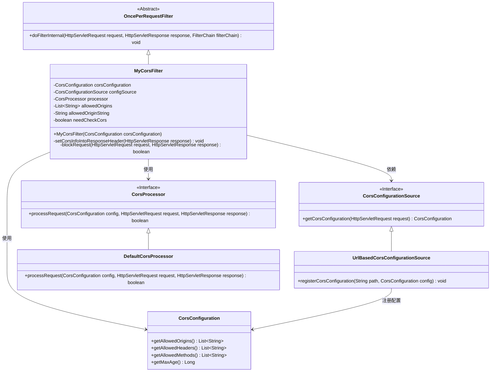
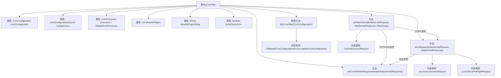

# 基础信息

|      |      |
|------|------|
| 名称 | MyCorsFilter |
| 编码语言 | .java |
| 代码路径 | WeFe/common/java/common-web/src/main/java/com/welab/wefe/common/web/config/MyCorsFilter.java |
| 包名 | com.welab.wefe.common.web.config |
| 依赖项 | ['com.welab.wefe.common.util.StringUtil', 'org.apache.commons.collections4.CollectionUtils', 'org.springframework.http.HttpHeaders', 'org.springframework.web.cors', 'org.springframework.web.filter.OncePerRequestFilter', 'javax.servlet.FilterChain', 'javax.servlet.ServletException', 'javax.servlet.http.HttpServletRequest', 'javax.servlet.http.HttpServletResponse', 'java.io.IOException', 'java.util.List'] |
| 概述说明 | 自定义CORS过滤器类，继承OncePerRequestFilter，处理跨域请求。构造函数接收CorsConfiguration配置，初始化允许的源、方法和头信息。doFilterInternal方法检查请求类型，设置响应头并验证请求源。若为OPTIONS请求直接返回200。验证失败返回403错误。 |

# 说明

这是一个自定义的CORS过滤器类MyCorsFilter，继承自OncePerRequestFilter。它通过构造函数接收CorsConfiguration配置，创建基于URL的配置源，并初始化允许的源列表和检查标志。主要功能包括：处理OPTIONS预检请求时直接返回200状态码；对于CORS请求，检查请求源是否被允许，若被禁止则返回403错误；设置响应头信息包括允许的源、头、方法和最大缓存时间。其中blockRequest方法负责验证请求是否合法，通过处理器处理配置并判断请求类型。

# 类列表 Class Summary

| 名称   | 类型  | 说明 |
|-------|------|-------------|
| MyCorsFilter | class | 自定义CORS过滤器类，继承OncePerRequestFilter，通过配置源处理跨域请求，检查允许的源并设置响应头。 |

## 类 MyCorsFilter

|      |      |
|------|------|
| 访问范围 | public |
| 类型 | class |
| 名称 | MyCorsFilter |
| 说明 | 自定义CORS过滤器类，继承OncePerRequestFilter，通过配置源处理跨域请求，检查允许的源并设置响应头。 |

### UML类图

类图描述：
该图展示了MyCorsFilter类的继承关系和依赖结构。MyCorsFilter继承自抽象类OncePerRequestFilter，实现了CORS（跨域资源共享）过滤功能。它依赖于CorsConfiguration获取跨域配置，通过UrlBasedCorsConfigurationSource（实现CorsConfigurationSource接口）管理配置路径，并使用DefaultCorsProcessor（实现CorsProcessor接口）处理跨域请求验证。类图中清晰体现了接口与实现类的关系，以及配置信息的流动方向。

### 内部方法调用关系图

这段代码实现了一个自定义的CORS过滤器，继承自OncePerRequestFilter。主要功能包括：1) 通过构造方法初始化CORS配置；2) 在doFilterInternal中处理OPTIONS预检请求和普通CORS请求；3) 通过setCorsInfoIntoResponseHeader方法设置响应头；4) 使用blockRequest方法验证请求来源合法性。流程图清晰展示了类结构、方法调用关系和主要处理逻辑分支，特别是对OPTIONS请求和CORS请求的不同处理路径。

### 字段列表 Field List

| 名称  | 类型  | 说明 |
|-------|-------|------|
| allowedOrigins | List<String> | 私有不可变列表，存储允许的源地址字符串。 |
| processor = new DefaultCorsProcessor() | CorsProcessor | 声明一个不可变的CorsProcessor实例，使用默认实现DefaultCorsProcessor。 |
| needCheckCors | boolean | 需要检查跨域请求的标志位。 |
| configSource | CorsConfigurationSource | 私有不可变的CORS配置源对象。 |
| corsConfiguration | CorsConfiguration | 私有不可变的跨域配置对象。 |
| allowedOriginString | String | 私有不可变字符串变量，存储允许的源地址。 |

### 方法列表

| 名称  | 类型  | 说明 |
|-------|-------|------|
| doFilterInternal | void | 这是一个Java过滤器方法，处理CORS请求。如果是OPTIONS方法，设置CORS响应头并返回200状态码。对于其他CORS请求，检查是否需要验证来源，若验证失败返回403错误；验证通过则设置CORS头并继续过滤器链。 |
| blockRequest | boolean | 方法检查请求是否应被拦截：若CORS配置无效或为预检请求则拦截，否则放行。 |
| setCorsInfoIntoResponseHeader | void | 方法设置CORS响应头，包括允许的源、头信息、方法和最大缓存时间。 |

