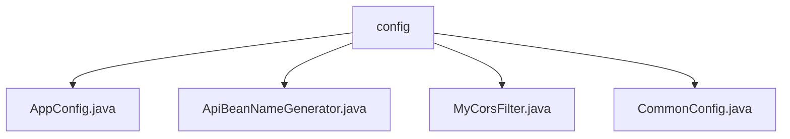

# 基础信息

|      |      |
|------|------|
| 名称 | config |
| 编码语言 | .java |
| 代码路径 | WeFe/common/java/common-web/src/main/java/com/welab/wefe/common/web/config |
| 包名 | docs.common.java.common-web.src.main.java.com.welab.wefe.common.web.config |
| 概述说明 | Spring Boot配置类实现跨域和JSON序列化设置，包含CORS过滤器、FastJson配置及敏感值处理。ApiBeanNameGenerator生成带Api注解的bean名称，校验路径格式。MyCorsFilter处理CORS请求，验证源并设置响应头。CommonConfig管理通用设置如日志路径、环境变量和数据库加密。 |

# 说明

## 概述  
该模块是Spring Boot应用的Web层核心配置组件，主要负责跨域处理、API路由管理和全局配置管理。通过FilterRegistrationBean实现动态CORS策略，类似网关层访问控制；采用FastJson定制JSON序列化规则，支持敏感数据过滤。关键数据结构包括CorsConfiguration（跨域配置）、Api注解（路由元数据）和CommonConfig（环境变量）。依赖Spring Boot Web、FastJson和Servlet API。例如MyCorsFilter会拦截OPTIONS请求并校验Origin白名单。

## 主要业务场景  
模块统一处理前后端分离架构下的典型交互场景：跨域请求（如预检响应）、API路由注册（如带验签校验的接口）和全局配置加载（如加密开关）。采用"配置即规则"模式，例如CommonConfig可限制online_demo环境的数据权限。集成案例包括：动态注册CORS过滤器、基于注解的Bean名称生成（如拼接父类路径）、JSON序列化时自动过滤敏感字段。交互流程类似策略模式，通过组合Filter和Listener实现请求生命周期管理。

### 包内部结构视图

该流程图展示了WeFe项目中common-web模块下的config目录结构。config作为根节点，包含4个Java配置文件：AppConfig、ApiBeanNameGenerator、MyCorsFilter和CommonConfig。这些配置类共同构成了项目的Web层基础配置，用于处理应用配置、Bean命名、跨域过滤等核心功能。

# 文件列表

| 名称   | 类型  | 说明 |
|-------|------|-------------|
| [AppConfig.java](AppConfig.md) | file | AppConfig配置类实现跨域过滤器，允许指定源或全部源访问，设置FastJson为JSON序列化组件，支持蛇形命名和空值输出。 |
| [ApiBeanNameGenerator.java](ApiBeanNameGenerator.md) | file | ApiBeanNameGenerator继承AnnotationBeanNameGenerator，生成API路径作为bean名。检查Api注解的path格式、验签与登录逻辑，拼接父类路径，确保无空格和斜杠，并收集所有API路径。 |
| [MyCorsFilter.java](MyCorsFilter.md) | file | 自定义CORS过滤器类，继承OncePerRequestFilter，处理跨域请求。构造函数接收CorsConfiguration配置，初始化允许的源、方法和头信息。doFilterInternal方法检查请求类型，设置响应头并验证请求源。若为OPTIONS请求直接返回200。验证失败返回403错误。 |
| [CommonConfig.java](CommonConfig.md) | file | CommonConfig类包含日志路径、联盟URL、文件上传目录、环境名称和分支、跨域设置、数据库加密开关及密钥等配置项，并提供getter/setter方法。 |

