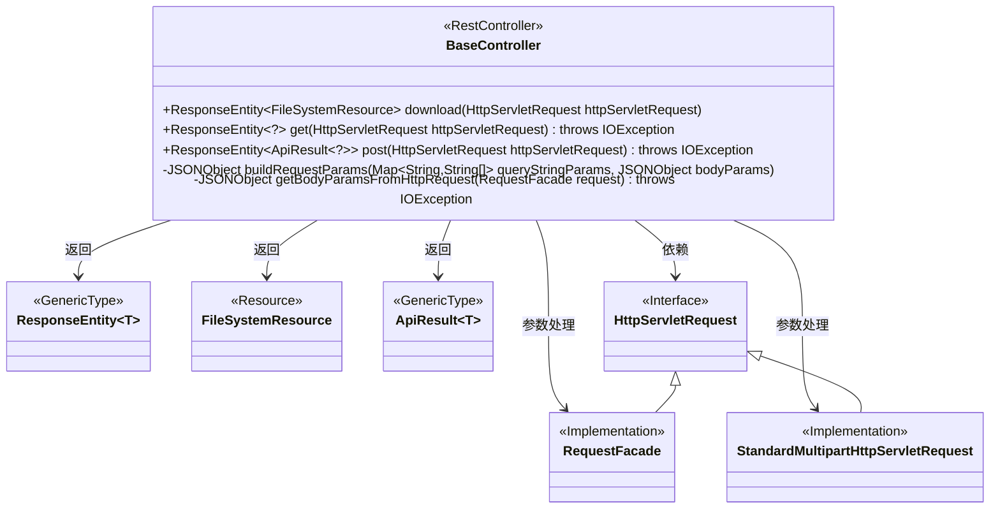
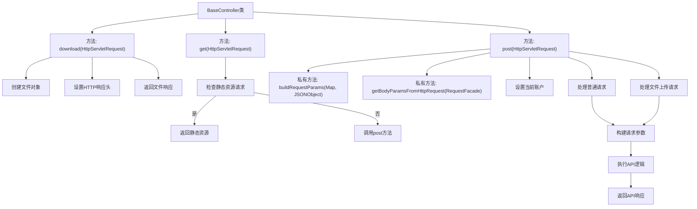

# 基础信息

|      |      |
|------|------|
| 名称 | BaseController |
| 编码语言 | .java |
| 代码路径 | WeFe/common/java/common-web/src/main/java/com/welab/wefe/common/web/controller/BaseController.java |
| 包名 | com.welab.wefe.common.web.controller |
| 依赖项 | ['com.alibaba.fastjson.JSON', 'com.alibaba.fastjson.JSONObject', 'com.alibaba.fastjson.parser.Feature', 'com.welab.wefe.common.util.StringUtil', 'com.welab.wefe.common.util.UrlUtil', 'com.welab.wefe.common.web.ApiExecutor', 'com.welab.wefe.common.web.dto.ApiResult', 'com.welab.wefe.common.web.util.CurrentAccountUtil', 'org.apache.catalina.connector.RequestFacade', 'org.springframework.core.io.ClassPathResource', 'org.springframework.core.io.FileSystemResource', 'org.springframework.http.HttpHeaders', 'org.springframework.http.MediaType', 'org.springframework.http.ResponseEntity', 'org.springframework.util.FileCopyUtils', 'org.springframework.util.MultiValueMap', 'org.springframework.web.bind.annotation.GetMapping', 'org.springframework.web.bind.annotation.PostMapping', 'org.springframework.web.bind.annotation.RestController', 'org.springframework.web.multipart.MultipartFile', 'org.springframework.web.multipart.support.StandardMultipartHttpServletRequest', 'javax.servlet.http.HttpServletRequest', 'java.io.BufferedReader', 'java.io.File', 'java.io.IOException', 'java.util.Map', 'java.util.TreeMap'] |
| 概述说明 | BaseController提供REST接口，包含下载文件、处理静态资源、GET/POST请求功能，支持参数合并和文件上传，统一返回ApiResult格式。 |

# 说明

该代码定义了一个基于Spring框架的REST控制器BaseController，包含三个核心接口。download接口实现文件下载功能，设置HTTP头禁用缓存并指定附件格式。get接口处理静态资源请求，返回PNG图片或转发到post接口。post接口为核心请求处理器，支持普通参数和文件上传，合并GET/POST参数，通过ApiExecutor执行逻辑并返回统一格式的ApiResult响应。控制器还包含工具方法：buildRequestParams用于合并请求参数，getBodyParamsFromHttpRequest用于提取请求体参数。整个过程包含请求计时、账户信息管理，并最终清理线程变量。

# 类列表 Class Summary

| 名称   | 类型  | 说明 |
|-------|------|-------------|
| BaseController | class | BaseController类提供三个端点：1) /download返回文件下载；2) GET请求处理静态资源或转发到POST；3) POST处理普通/文件请求，合并参数并执行API逻辑，返回统一响应格式。包含请求参数处理和性能统计。 |

## 类 BaseController

|      |      |
|------|------|
| 访问范围 | @RestController;public |
| 类型 | class |
| 名称 | BaseController |
| 说明 | BaseController类提供三个端点：1) /download返回文件下载；2) GET请求处理静态资源或转发到POST；3) POST处理普通/文件请求，合并参数并执行API逻辑，返回统一响应格式。包含请求参数处理和性能统计。 |

### UML类图

该代码是一个Spring Boot的控制器类，主要处理文件下载、静态资源请求和通用API请求。BaseController通过三个主要方法处理不同类型的HTTP请求：download()处理文件下载，get()处理静态资源请求，post()处理通用API请求并支持文件上传。类图中展示了控制器与请求/响应对象的关系，以及不同请求类型的继承结构。控制器内部还包含两个私有方法用于参数处理和请求体解析。

### 内部方法调用关系图

这段代码实现了一个Spring Boot控制器，主要提供三个功能：文件下载、静态资源获取和通用API请求处理。流程图展示了BaseController类的核心方法调用关系，包括download方法处理文件下载，get方法处理GET请求并区分静态资源请求，post方法处理POST请求并支持文件上传。控制器还包含参数构建和请求体解析的辅助方法，最终返回不同类型的HTTP响应。

### 字段列表 Field List

| 名称  | 类型  | 说明 |
|-------|-------|------|

### 方法列表

| 名称  | 类型  | 说明 |
|-------|-------|------|
| getBodyParamsFromHttpRequest | JSONObject | 从HTTP请求获取JSON参数，读取请求体并解析为有序JSON对象。 |
| buildRequestParams | JSONObject | 构建请求参数：合并URL查询参数（解码后处理null值）和JSON请求体参数，返回整合后的JSON对象。 |
| download | ResponseEntity<FileSystemResource> | Spring Boot下载接口，设置无缓存响应头，返回文件流。 |
| get | ResponseEntity<?> | 这是一个Spring MVC控制器方法，处理所有GET请求。如果请求路径以/static/开头，返回对应的静态资源文件（如图片），否则转发到post方法处理。响应格式为JSON，字符集为UTF-8。 |
| post | ResponseEntity<ApiResult<?>> | 处理HTTP POST请求，支持普通和文件上传，返回JSON响应，记录耗时并清理线程变量。 |

