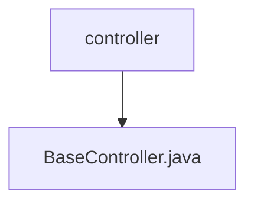

# 基础信息

|      |      |
|------|------|
| 名称 | controller |
| 编码语言 | .java |
| 代码路径 | WeFe/common/java/common-web/src/main/java/com/welab/wefe/common/web/controller |
| 包名 | docs.common.java.common-web.src.main.java.com.welab.wefe.common.web.controller |
| 概述说明 | BaseController提供REST接口，包含下载文件、处理静态资源、GET/POST请求功能，支持参数合并和文件上传，统一返回ApiResult格式。 |

# 说明

该代码定义了一个基于Spring框架的REST控制器BaseController，包含三个核心接口。download接口实现文件下载功能，设置HTTP头禁用缓存并指定附件格式。get接口处理静态资源请求，返回PNG图片或转发到post接口。post接口为核心请求处理器，支持普通参数和文件上传，合并GET/POST参数，通过ApiExecutor执行逻辑并返回统一格式的ApiResult响应。控制器还包含工具方法：buildRequestParams用于合并请求参数，getBodyParamsFromHttpRequest用于提取请求体参数。整个过程包含请求计时、账户信息管理，并最终清理线程变量。

### 包内部结构视图

该流程图展示了WeFe项目中common-web模块的控制器层级结构。顶层节点是controller文件夹，它包含一个基础控制器文件BaseController.java。这种结构是典型MVC架构中控制器层的简化表示，BaseController通常作为其他控制器的父类提供通用功能。

# 文件列表

| 名称   | 类型  | 说明 |
|-------|------|-------------|
| [BaseController.java](BaseController.md) | file | BaseController提供REST接口，包含下载文件、处理静态资源、GET/POST请求功能，支持参数合并和文件上传，统一返回ApiResult格式。 |

