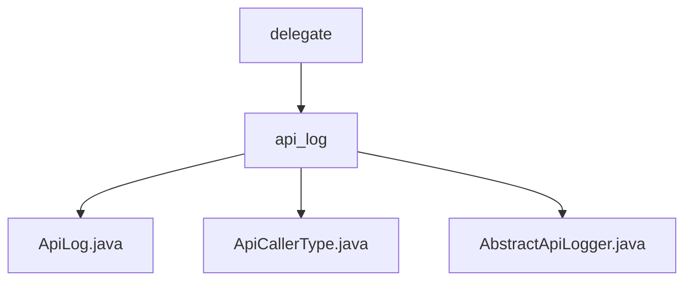

# 基础信息

|      |      |
|------|------|
| 名称 | delegate |
| 编码语言 | .java |
| 代码路径 | WeFe/common/java/common-web/src/main/java/com/welab/wefe/common/web/delegate |
| 包名 | docs.common.java.common-web.src.main.java.com.welab.wefe.common.web.delegate |
| 概述说明 | ApiLog类记录API调用日志，包含请求响应信息。ApiCallerType枚举定义调用者类型，目前仅支持User。AbstractApiLogger抽象类管理日志和用户活动时间，提供忽略API列表和更新功能。 |

# 说明

## 概述  
该模块核心职责是规范化和记录API调用日志，同时管理用户活动时间。接口规范包括日志记录抽象方法save/updateAccountLastActionTime，以及忽略规则控制方法ignoreWithoutLogin。关键数据结构为ApiLog日志实体（含请求/响应全链路字段）和ConcurrentHashMap存储的用户活动时间表。外部依赖仅涉及Java基础并发库。例如通过静态IGNORE_LOG_APIS列表实现白名单过滤，类似事件总线模式的消息筛选机制。

## 主要业务场景  
典型场景为API网关拦截请求后，通过AbstractApiLogger自动记录带调用者信息的结构化日志（例如User类型+IP+耗时），同时维护用户活跃状态。交互模式采用"执行后拦截"机制，结合线程池异步处理日志持久化。完整功能涵盖日志字段装配、访问频控（如5分钟间隔更新活动时间）、白名单过滤等。集成案例表现为通过枚举限定调用者类型，预留未来扩展第三方应用类型的能力。

### 包内部结构视图

该流程图展示了WeFe项目中common-web模块下的delegate目录结构。顶层为delegate文件夹，其下包含api_log子目录。api_log目录中包含三个Java文件：ApiLog.java、ApiCallerType.java和AbstractApiLogger.java，这些文件共同构成了API日志记录功能的核心实现。

# 文件列表

| 名称   | 类型  | 说明 |
|-------|------|-------------|
| [api_log](api_log/_module.md) | package | ApiLog类记录API调用日志，包含请求响应信息。ApiCallerType枚举定义调用者类型，目前仅支持User。AbstractApiLogger抽象类管理日志和用户活动时间，提供忽略API列表和更新功能。 |

