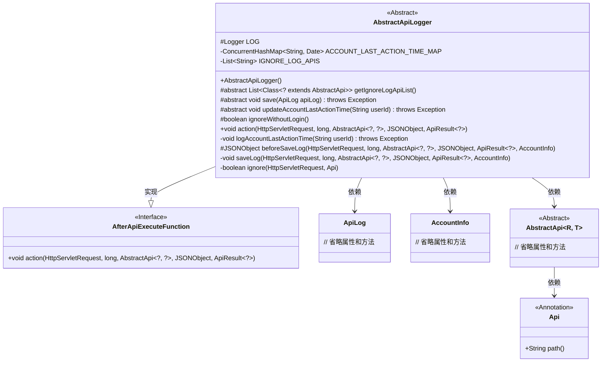
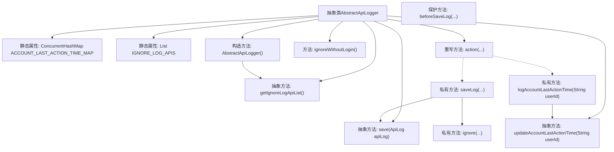

# 基础信息

|      |      |
|------|------|
| 名称 | AbstractApiLogger |
| 编码语言 | .java |
| 代码路径 | WeFe/common/java/common-web/src/main/java/com/welab/wefe/common/web/delegate/api_log/AbstractApiLogger.java |
| 包名 | com.welab.wefe.common.web.delegate.api_log |
| 依赖项 | ['com.alibaba.fastjson.JSON', 'com.alibaba.fastjson.JSONObject', 'com.welab.wefe.common.fastjson.LoggerValueFilter', 'com.welab.wefe.common.util.StringUtil', 'com.welab.wefe.common.web.api.base.AbstractApi', 'com.welab.wefe.common.web.api.base.Api', 'com.welab.wefe.common.web.dto.ApiResult', 'com.welab.wefe.common.web.function.AfterApiExecuteFunction', 'com.welab.wefe.common.web.service.account.AccountInfo', 'com.welab.wefe.common.web.util.HttpServletRequestUtil', 'org.slf4j.Logger', 'org.slf4j.LoggerFactory', 'javax.servlet.http.HttpServletRequest', 'java.util.ArrayList', 'java.util.Date', 'java.util.List', 'java.util.concurrent.ConcurrentHashMap', 'java.util.stream.Collectors'] |
| 概述说明 | 抽象类AbstractApiLogger实现API日志记录，包含忽略日志API列表、用户最后活动时间更新及日志保存功能，支持异步处理和参数过滤。 |

# 说明

AbstractApiLogger是一个抽象类，实现了AfterApiExecuteFunction接口，用于记录API日志和管理用户最后活动时间。它包含一个静态的ConcurrentHashMap来存储用户最后活动时间，以及一个静态列表IGNORE_LOG_APIS来存储不需要记录日志的API。类提供了抽象方法getIgnoreLogApiList、save和updateAccountLastActionTime，分别用于获取忽略日志的API列表、保存日志和更新用户活动时间。构造函数初始化忽略日志的API列表并启动一个线程。方法ignoreWithoutLogin控制是否忽略未登录请求的日志。action方法处理API执行后的日志记录和用户活动时间更新。saveLog方法构建日志对象并调用save方法保存，而ignore方法根据请求参数和API路径判断是否忽略日志记录。logAccountLastActionTime方法管理用户活动时间的更新频率。

# 类列表 Class Summary

| 名称   | 类型  | 说明 |
|-------|------|-------------|
| AbstractApiLogger | class | 抽象类AbstractApiLogger实现API日志记录，包含忽略日志API列表、用户最后活动时间更新及日志保存功能，支持异步处理和条件过滤。 |

## 类 AbstractApiLogger

|      |      |
|------|------|
| 访问范围 | public abstract |
| 类型 | class |
| 名称 | AbstractApiLogger |
| 说明 | 抽象类AbstractApiLogger实现API日志记录，包含忽略日志API列表、用户最后活动时间更新及日志保存功能，支持异步处理和条件过滤。 |

### UML类图

类图描述：该图展示了一个抽象API日志记录器`AbstractApiLogger`的结构，它实现了`AfterApiExecuteFunction`接口，包含日志记录、用户活动时间更新等核心功能。通过静态缓存不需要记录的API列表，并提供了日志保存前的参数处理钩子方法。与`ApiLog`、`AccountInfo`等类存在依赖关系，同时通过泛型`AbstractApi`处理不同类型的API请求。

### 内部方法调用关系图

该流程图展示了AbstractApiLogger类的核心结构和调用关系。类包含静态哈希表和时间列表，通过构造方法初始化忽略API列表。核心功能由action方法触发，分两条路径：saveLog处理日志保存（涉及参数处理和ignore检查），logAccountLastActionTime管理用户活动时间更新。抽象方法由子类实现，形成模板方法模式。日志保存前会经过多层校验和预处理，最终通过save方法持久化。

### 字段列表 Field List

| 名称  | 类型  | 说明 |
|-------|-------|------|
| LOG = LoggerFactory.getLogger(this.getClass()) | Logger | 声明一个受保护的最终日志对象LOG，使用当前类名初始化。 |
| ACCOUNT_LAST_ACTION_TIME_MAP = new ConcurrentHashMap() | ConcurrentHashMap<String, Date> | 线程安全的哈希映射，存储账号与最后操作时间的键值对。 |
| IGNORE_LOG_APIS = new ArrayList<>() | List<String> | 定义静态列表IGNORE_LOG_APIS，用于存储忽略日志的API名称。 |

### 方法列表

| 名称  | 类型  | 说明 |
|-------|-------|------|
| action | void | 方法重写，处理HTTP请求，记录日志并更新用户最后活动时间，异常捕获记录错误。 |
| ignoreWithoutLogin | boolean | 方法ignoreWithoutLogin返回false，表示不忽略未登录情况。 |
| updateAccountLastActionTime | void | 抽象方法，更新用户账户最后操作时间，需传入用户ID，可能抛出异常。 |
| logAccountLastActionTime | void | 记录用户最后操作时间：首次访问立即更新，之后每分钟更新一次。 |
| save | void | 抽象方法save，接收ApiLog参数，可能抛出异常。 |
| getIgnoreLogApiList | List<Class<? extends AbstractApi>> | 获取忽略日志记录的API类列表的抽象方法。 |
| beforeSaveLog | JSONObject | 这是一个Java方法，用于在保存日志前处理请求参数。方法接收HTTP请求、开始时间、API对象、参数JSON、结果和账户信息，返回处理后的参数JSON对象。 |
| saveLog | void | 方法saveLog记录API调用日志，包括请求时间、耗时、响应时间、调用者IP、ID、昵称、API路径、请求数据、响应码和消息。忽略特定请求时跳过。异常时记录错误。 |
| ignore | boolean | 方法检查请求是否需忽略：前端刷新参数为true或接口在黑名单中则跳过日志记录。 |

