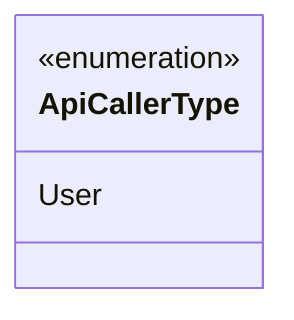
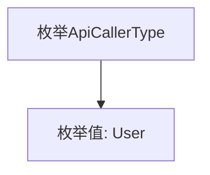

# 基础信息

|      |      |
|------|------|
| 名称 | ApiCallerType |
| 编码语言 | .java |
| 代码路径 | WeFe/common/java/common-web/src/main/java/com/welab/wefe/common/web/delegate/api_log/ApiCallerType.java |
| 包名 | com.welab.wefe.common.web.delegate.api_log |
| 依赖项 | [] |
| 概述说明 | 枚举类型ApiCallerType定义了一个成员User，表示API调用者类型。 |

# 说明

该内容定义了一个名为ApiCallerType的公共枚举类型，其中仅包含一个枚举值User。这表示API调用者类型的分类，目前仅支持用户这一种类型。枚举用于限定变量取值范围，此处为后续代码提供明确的调用者类型标识。整个定义简洁明了，为系统扩展预留了空间。

# 类列表 Class Summary

| 名称   | 类型  | 说明 |
|-------|------|-------------|
| ApiCallerType | enum | 枚举类型ApiCallerType定义了一个值User。 |

## 类 ApiCallerType

|      |      |
|------|------|
| 访问范围 | public |
| 类型 | enum |
| 名称 | ApiCallerType |
| 说明 | 枚举类型ApiCallerType定义了一个值User。 |

### UML类图

这段代码定义了一个名为`ApiCallerType`的枚举类型，当前仅包含一个枚举常量`User`。枚举类型用于表示一组固定的常量值，在此场景下可能用于标识API调用者的类型。由于是枚举定义，类图中使用`<<enumeration>>`标记，并直接列出枚举值。该设计为后续扩展不同调用者类型（如Admin、System等）提供了基础结构。

### 内部方法调用关系图

这段代码定义了一个名为ApiCallerType的枚举类型，其中包含一个枚举值User。枚举是一种特殊的类，用于表示一组固定的常量。在这个例子中，ApiCallerType枚举仅包含一个常量User，可能用于标识API调用者的类型。枚举类型通常用于限制变量的取值范围，提高代码的可读性和安全性。

### 字段列表 Field List

| 名称  | 类型  | 说明 |
|-------|-------|------|

### 方法列表

| 名称  | 类型  | 说明 |
|-------|-------|------|

