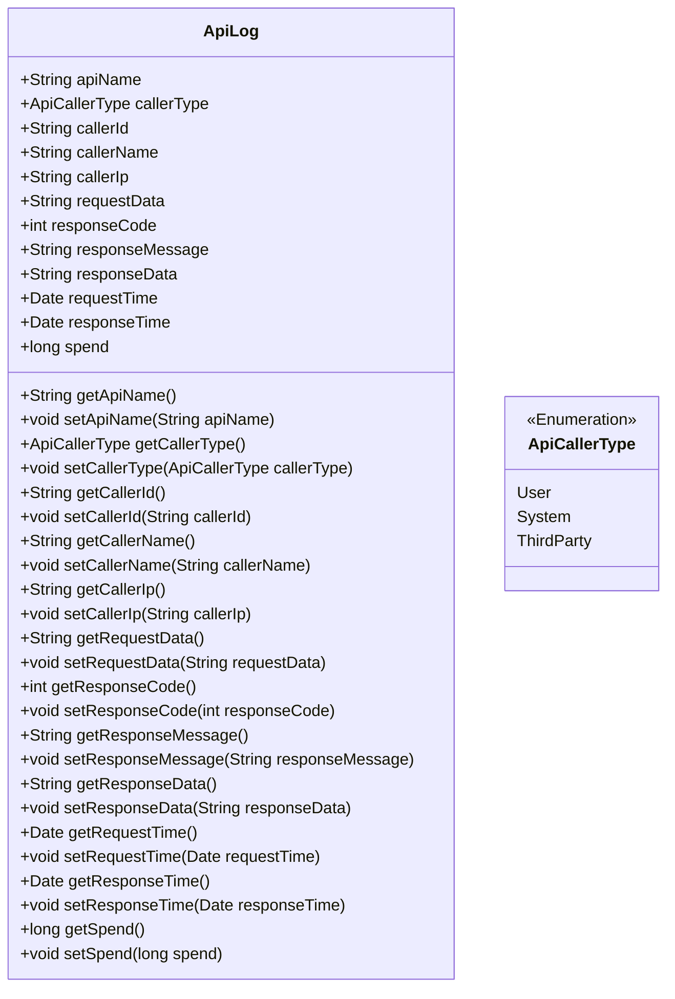

# 基础信息

|      |      |
|------|------|
| 名称 | ApiLog |
| 编码语言 | .java |
| 代码路径 | WeFe/common/java/common-web/src/main/java/com/welab/wefe/common/web/delegate/api_log/ApiLog.java |
| 包名 | com.welab.wefe.common.web.delegate.api_log |
| 依赖项 | ['java.util.Date'] |
| 概述说明 | ApiLog类记录API调用信息，包括接口名、调用者类型、ID、名称、IP、请求参数、响应码、消息、内容、请求和响应时间及耗时。提供getter/setter方法。 |

# 说明

ApiLog类用于记录API调用日志，包含请求接口名称、调用者类型、ID、名称、IP、请求参数、响应码、消息、内容、请求时间、响应时间及耗时。提供各字段的getter和setter方法，默认调用者类型为用户。

# 类列表 Class Summary

| 名称   | 类型  | 说明 |
|-------|------|-------------|
| ApiLog | class | ApiLog类记录API调用信息，包括接口名、调用者类型/ID/名称/IP、请求参数、响应码/消息/内容、请求/响应时间及耗时。 |

## 类 ApiLog

|      |      |
|------|------|
| 访问范围 | public |
| 类型 | class |
| 名称 | ApiLog |
| 说明 | ApiLog类记录API调用信息，包括接口名、调用者类型/ID/名称/IP、请求参数、响应码/消息/内容、请求/响应时间及耗时。 |

### UML类图

这段代码定义了一个名为`ApiLog`的类，用于记录API调用的详细信息。该类包含多个公有字段，如API名称、调用者类型、调用者ID、请求参数、响应码等，并提供了相应的getter和setter方法。`ApiCallerType`是一个枚举类型，用于表示调用者的类型，包括用户、系统和第三方。该类主要用于日志记录，便于追踪和分析API调用情况。

### 内部方法调用关系图

```mermaid
graph TD
    A["类ApiLog"]
    B["属性: String apiName"]
    C["属性: ApiCallerType callerType = User"]
    D["属性: String callerId"]
    E["属性: String callerName"]
    F["属性: String callerIp"]
    G["属性: String requestData"]
    H["属性: int responseCode"]
    I["属性: String responseMessage"]
    J["属性: String responseData"]
    K["属性: Date requestTime"]
    L["属性: Date responseTime"]
    M["属性: long spend"]
    N["Getter/Setter方法组"]
    
    A --> B
    A --> C
    A --> D
    A --> E
    A --> F
    A --> G
    A --> H
    A --> I
    A --> J
    A --> K
    A --> L
    A --> M
    A --> N
    N --> O["getApiName/setApiName"]
    N --> P["getCallerType/setCallerType"]
    N --> Q["getCallerId/setCallerId"]
    N --> R["getCallerName/setCallerName"]
    N --> S["getCallerIp/setCallerIp"]
    N --> T["getRequestData/setRequestData"]
    N --> U["getResponseCode/setResponseCode"]
    N --> V["getResponseMessage/setResponseMessage"]
    N --> W["getResponseData/setResponseData"]
    N --> X["getRequestTime/setRequestTime"]
    N --> Y["getResponseTime/setResponseTime"]
    N --> Z["getSpend/setSpend"]
```

该流程图展示了ApiLog类的完整结构，包含12个属性和对应的24个getter/setter方法。类属性记录了API调用的全链路信息，包括请求方身份、请求参数、响应数据和耗时统计等核心字段。所有属性均通过标准JavaBean规范封装，形成典型的POJO类结构，适用于日志记录和序列化场景。流程图采用垂直布局清晰呈现了类成员间的从属关系，属性与方法分组排列便于理解数据封装逻辑。

### 字段列表 Field List

| 名称  | 类型  | 说明 |
|-------|-------|------|
| apiName | String | 声明一个名为apiName的公共字符串变量。 |
| callerName | String | 公共字符串变量，存储调用者名称。 |
| responseData | String | 公共字符串变量responseData，用于存储响应数据。 |
| responseMessage | String | 声明一个公共字符串变量responseMessage，用于存储响应消息。 |
| requestData | String | 请求数据的公共字符串变量。 |
| callerIp | String | 定义公共字符串变量callerIp，用于存储调用者IP地址。 |
| requestTime | Date | 声明一个名为requestTime的公共Date类型变量。 |
| responseTime | Date | 声明一个名为responseTime的Date类型公共变量。 |
| spend | long | 变量spend为长整型，表示花费金额。 |
| callerType = ApiCallerType.User | ApiCallerType | API调用者类型设置为用户。 |
| responseCode | int | 整型变量responseCode，用于存储响应代码。 |
| callerId | String | 定义了一个公开的字符串类型变量callerId。 |

### 方法列表

| 名称  | 类型  | 说明 |
|-------|-------|------|
| getCallerIp | String | 获取调用者IP地址的方法，返回字符串类型的callerIp值。 |
| setCallerName | void | 设置调用者名称的方法，将参数callerName赋值给类的成员变量callerName。 |
| getCallerName | String | 这是一个Java方法，返回调用者的名称字符串。方法名为getCallerName，返回类型为String。 |
| getResponseData | String | 获取响应数据的方法，返回字符串类型的responseData。 |
| setResponseTime | void | 设置响应时间的方法，将传入的Date对象赋值给类的responseTime属性。 |
| setCallerType | void | 设置调用者类型的方法，将传入的callerType赋值给当前对象的callerType字段。 |
| setRequestData | void | 定义公共方法setRequestData，接收字符串参数requestData并赋值给类成员变量this.requestData。 |
| getCallerId | String | 获取callerId的公共方法，返回字符串类型。 |
| getCallerType | ApiCallerType | 获取调用者类型的方法，返回ApiCallerType对象。 |
| setCallerId | void | 设置调用者ID的方法，将参数callerId赋值给当前对象的callerId属性。 |
| getResponseCode | int | 获取响应码的方法，返回整型变量responseCode的值。 |
| setRequestTime | void | 方法setRequestTime接收Date参数，将其赋值给类的requestTime成员变量。 |
| getApiName | String | 获取API名称的方法，返回字符串类型的apiName。 |
| getResponseTime | Date | 获取响应时间的方法，返回Date类型的responseTime。 |
| setSpend | void | 这是一个Java方法，用于设置类成员变量spend的值。方法接受一个long类型参数，并将其赋值给当前对象的spend属性。 |
| getResponseMessage | String | 获取响应消息的方法，返回字符串类型的responseMessage。 |
| getSpend | long | 方法返回spend变量的值。 |
| setResponseData | void | 设置响应数据的方法，将传入的字符串赋值给类的responseData成员变量。 |
| setResponseCode | void | 设置HTTP响应状态码的方法，将传入的整数值赋给类的responseCode成员变量。 |
| getRequestData | String | 获取请求数据的方法，返回字符串类型的requestData。 |
| setCallerIp | void | 设置调用者IP地址的方法。 |
| setResponseMessage | void | 这是一个Java方法，用于设置类的responseMessage属性值。方法接收一个字符串参数，并将其赋值给类的成员变量。 |
| setApiName | void | Java方法：设置apiName属性值。 |
| getRequestTime | Date | 获取请求时间的方法，返回Date类型值。 |

