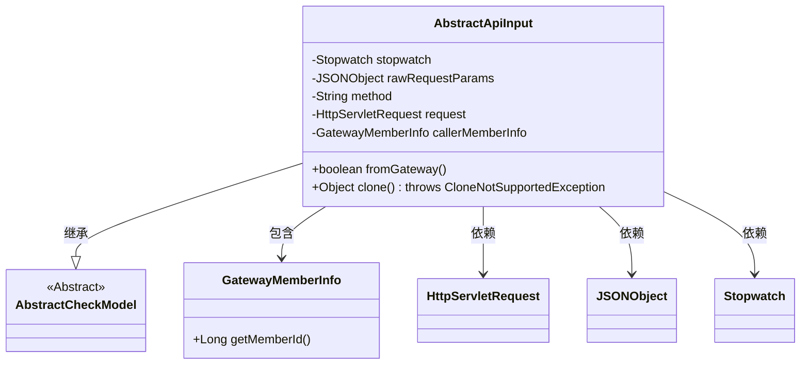
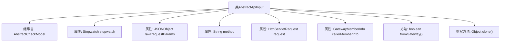

# 基础信息

|      |      |
|------|------|
| 名称 | AbstractApiInput |
| 编码语言 | .java |
| 代码路径 | WeFe/common/java/common-web/src/main/java/com/welab/wefe/common/web/dto/AbstractApiInput.java |
| 包名 | com.welab.wefe.common.web.dto |
| 依赖项 | ['com.alibaba.fastjson.JSONObject', 'com.alibaba.fastjson.annotation.JSONField', 'com.welab.wefe.common.Stopwatch', 'com.welab.wefe.common.fieldvalidate.AbstractCheckModel', 'com.welab.wefe.common.fieldvalidate.annotation.Check', 'javax.servlet.http.HttpServletRequest'] |
| 概述说明 | AbstractApiInput类继承AbstractCheckModel，包含调试耗时、原始请求参数、请求方法和对象，以及网关调用者信息，提供网关请求判断和克隆方法。 |

# 说明

AbstractApiInput类继承自AbstractCheckModel，主要用于处理API请求输入。它包含一个用于调试API耗时的Stopwatch对象，以及存储原始请求参数的JSONObject。类中定义了请求方式method和请求对象request，并标注了校验注解。通过callerMemberInfo字段判断请求是否来自网关，并提供了fromGateway方法进行验证。此外，该类还实现了clone方法，支持对象克隆功能。所有敏感字段均标记为不参与JSON序列化。

# 类列表 Class Summary

| 名称   | 类型  | 说明 |
|-------|------|-------------|
| AbstractApiInput | class | AbstractApiInput类继承AbstractCheckModel，包含调试耗时、原始请求参数、请求方法和来源检查等功能，支持克隆操作。 |

## 类 AbstractApiInput

|      |      |
|------|------|
| 访问范围 | public |
| 类型 | class |
| 名称 | AbstractApiInput |
| 说明 | AbstractApiInput类继承AbstractCheckModel，包含调试耗时、原始请求参数、请求方法和来源检查等功能，支持克隆操作。 |

### UML类图

这段代码展示了一个抽象API输入类`AbstractApiInput`，它继承自`AbstractCheckModel`基类。该类封装了API请求的核心属性，包括调试用的计时器、原始请求参数、HTTP方法、请求对象和调用方信息。特别值得注意的是`fromGateway()`方法用于判断请求是否来自网关，以及重写了`clone()`方法实现浅拷贝。类中多个字段通过`@JSONField(serialize=false)`注解标记为不参与JSON序列化，体现了对敏感数据的保护意识。该类与`GatewayMemberInfo`、`HttpServletRequest`等组件存在明确的依赖关系，形成了完整的请求处理基础结构。

### 内部方法调用关系图

这段代码展示了一个继承自AbstractCheckModel的AbstractApiInput类，主要用于处理API请求输入。类包含5个关键属性：用于调试的Stopwatch计时器、原始请求参数的JSONObject、请求方法的String、HttpServletRequest对象以及网关调用者信息GatewayMemberInfo。提供了两个核心方法：fromGateway()用于判断请求是否来自网关，以及重写的clone()方法实现浅拷贝。所有属性均标记为不参与JSON序列化，体现了对敏感数据的保护意识。

### 字段列表 Field List

| 名称  | 类型  | 说明 |
|-------|-------|------|
| request | HttpServletRequest | 这是一个Java代码片段，定义了一个名为request的HttpServletRequest对象，带有@Check和@JSONField注解，其中@JSONField注解指定不序列化该字段。 |
| rawRequestParams | JSONObject | 代码定义了一个不参与JSON序列化的JSONObject类型字段rawRequestParams。 |
| callerMemberInfo | GatewayMemberInfo | JSON字段注解，标记callerMemberInfo不参与序列化。 |
| stopwatch = Stopwatch.startNew() | Stopwatch | JSONField注解标记stopwatch不序列化，Stopwatch实例创建并立即启动。 |
| method | String | Java字段注解：@Check标记请求方式，@JSONField禁止JSON序列化。 |

### 方法列表

| 名称  | 类型  | 说明 |
|-------|-------|------|
| fromGateway | boolean | 方法检查调用者是否为网关：若callerMemberInfo及其memberId均非空则返回true。 |
| clone | Object | Java中重写clone方法，调用父类的clone实现并返回对象副本，可能抛出CloneNotSupportedException异常。 |

