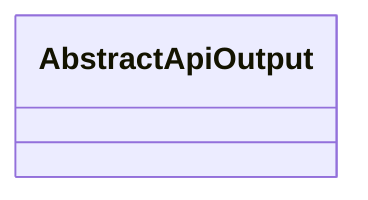
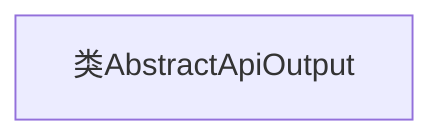

# 基础信息

|      |      |
|------|------|
| 名称 | AbstractApiOutput |
| 编码语言 | .java |
| 代码路径 | WeFe/common/java/common-web/src/main/java/com/welab/wefe/common/web/dto/AbstractApiOutput.java |
| 包名 | com.welab.wefe.common.web.dto |
| 依赖项 | [] |
| 概述说明 | 抽象API输出基类，无具体实现。 |

# 说明

AbstractApiOutput是一个公共抽象类，用于定义API输出的基础结构。该类目前为空，可能作为其他具体API输出类的父类，提供统一的扩展接口。

# 类列表 Class Summary

| 名称   | 类型  | 说明 |
|-------|------|-------------|
| AbstractApiOutput | class | 抽象API输出基类 |

## 类 AbstractApiOutput

|      |      |
|------|------|
| 访问范围 | public |
| 类型 | class |
| 名称 | AbstractApiOutput |
| 说明 | 抽象API输出基类 |

### UML类图

这段类图描述了一个名为AbstractApiOutput的抽象类，目前该类为空，没有定义任何成员变量或方法。根据类名可以推测，它可能作为API输出结果的基类，用于规范子类的输出格式或行为。后续可通过继承扩展具体实现类，添加必要的字段和方法来完成特定功能。

### 内部方法调用关系图

这段代码定义了一个名为`AbstractApiOutput`的空类，没有包含任何属性或方法。该类可能作为其他类的基类或接口的抽象实现存在，但目前仅作为框架结构预留。由于缺乏具体实现，流程图仅展示类声明节点，无其他关联元素。后续可通过继承扩展功能或添加抽象方法约束子类行为。

### 字段列表 Field List

| 名称  | 类型  | 说明 |
|-------|-------|------|

### 方法列表

| 名称  | 类型  | 说明 |
|-------|-------|------|

