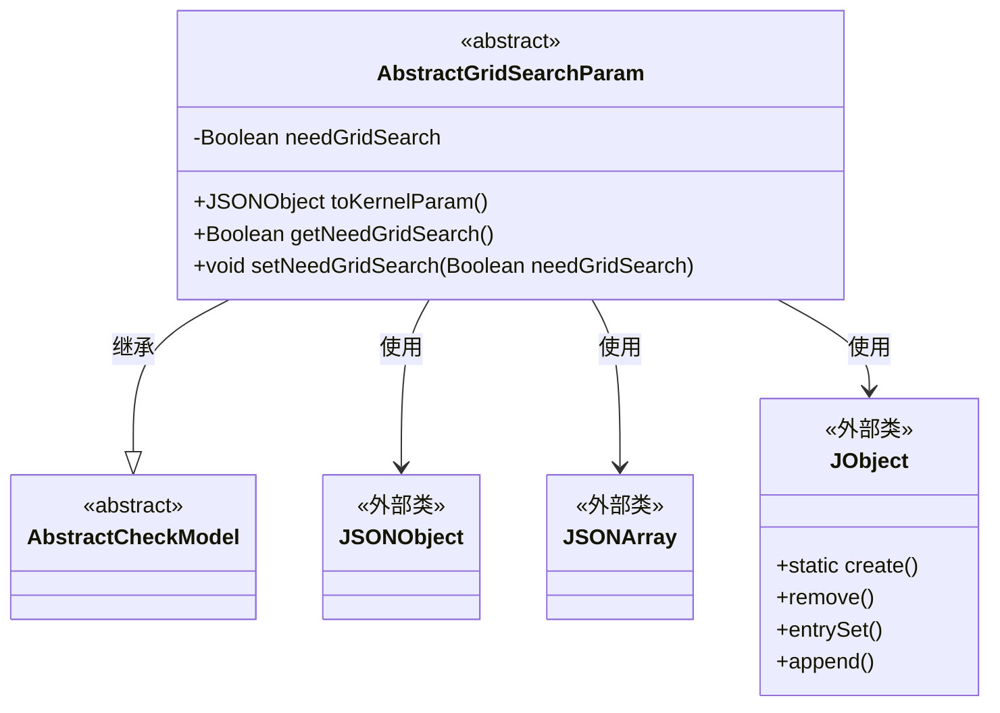
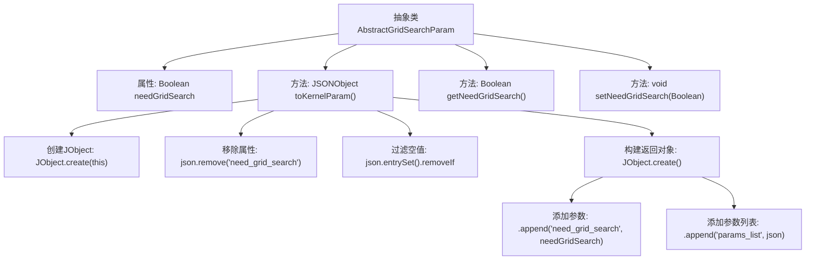

# 基础信息

|      |      |
|------|------|
| 名称 | AbstractGridSearchParam |
| 编码语言 | .java |
| 代码路径 | WeFe/common/java/common-web/src/main/java/com/welab/wefe/common/web/dto/AbstractGridSearchParam.java |
| 包名 | com.welab.wefe.common.web.dto |
| 依赖项 | ['com.alibaba.fastjson.JSONArray', 'com.alibaba.fastjson.JSONObject', 'com.alibaba.fastjson.annotation.JSONField', 'com.welab.wefe.common.fieldvalidate.AbstractCheckModel', 'com.welab.wefe.common.util.JObject'] |
| 概述说明 | 抽象类AbstractGridSearchParam继承AbstractCheckModel，包含needGridSearch属性和toKernelParam方法，用于转换为内核所需的JSON结构，移除空值项并保留参数列表。提供getter/setter方法。 |

# 说明

AbstractGridSearchParam是一个抽象类，继承自AbstractCheckModel，主要用于网格搜索参数处理。核心字段needGridSearch控制是否启用网格搜索。关键方法toKernelParam将对象转换为内核所需的JSON结构，移除空值和空数组后，生成包含needGrid_search标志和params_list参数列表的对象。参数列表支持多组键值对，如优化器类型、迭代次数等。类提供标准的getter/setter方法访问needGridSearch字段。转换过程使用JSONField注解禁止序列化该方法。

# 类列表 Class Summary

| 名称   | 类型  | 说明 |
|-------|------|-------------|
| AbstractGridSearchParam | class | 抽象类AbstractGridSearchParam继承AbstractCheckModel，提供网格搜索参数转换功能。包含needGridSearch属性和toKernelParam方法，用于生成内核所需JSON结构，移除空值和空数组。含getter/setter方法。 |

## 类 AbstractGridSearchParam

|      |      |
|------|------|
| 访问范围 | public abstract |
| 类型 | class |
| 名称 | AbstractGridSearchParam |
| 说明 | 抽象类AbstractGridSearchParam继承AbstractCheckModel，提供网格搜索参数转换功能。包含needGridSearch属性和toKernelParam方法，用于生成内核所需JSON结构，移除空值和空数组。含getter/setter方法。 |

### UML类图

这段代码展示了一个抽象类`AbstractGridSearchParam`，它继承自`AbstractCheckModel`，主要用于处理网格搜索参数。类中包含一个私有布尔字段`needGridSearch`和三个公有方法：`toKernelParam()`用于将参数转换为内核需要的JSON结构，以及`needGridSearch`的getter和setter方法。该类依赖外部类`JSONObject`、`JSONArray`和`JObject`来完成JSON数据的处理和转换。

### 内部方法调用关系图

这段代码定义了一个抽象类AbstractGridSearchParam，主要用于处理网格搜索参数的转换和封装。核心方法toKernelParam()将对象转换为内核所需的JSON结构，包含参数清理（移除空值和特定字段）和结构化封装（添加need_grid_search标志和参数列表）两个主要流程。通过getter/setter控制网格搜索开关状态，整体设计注重数据过滤和格式标准化。

### 字段列表 Field List

| 名称  | 类型  | 说明 |
|-------|-------|------|
| needGridSearch = false | Boolean | 定义布尔变量needGridSearch，初始值为false，用于控制是否进行网格搜索。 |

### 方法列表

| 名称  | 类型  | 说明 |
|-------|-------|------|
| toKernelParam | JSONObject | 方法toKernelParam将对象转为JSON，移除null值和空数组，保留need_grid_search和params_list字段。 |
| getNeedGridSearch | Boolean | 方法返回布尔值needGridSearch。 |
| setNeedGridSearch | void | 该方法用于设置是否需要网格搜索，通过布尔参数控制。 |

