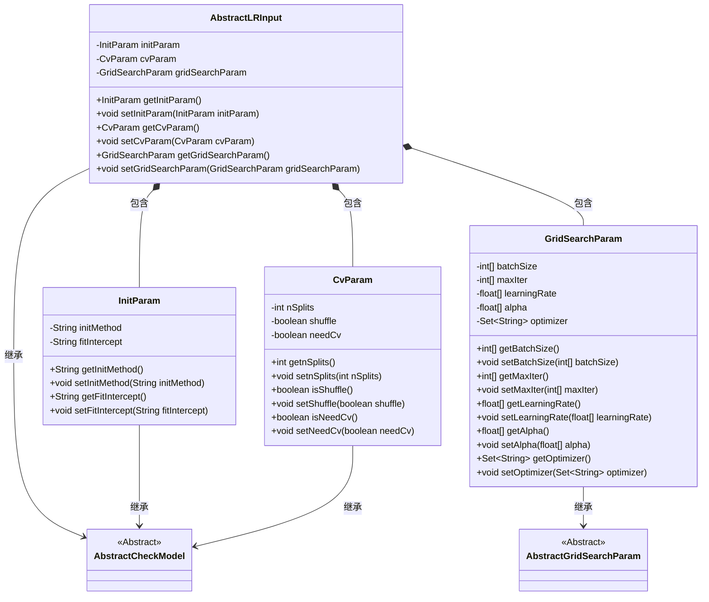

# 基础信息

|      |      |
|------|------|
| 名称 | AbstractLRInput |
| 编码语言 | .java |
| 代码路径 | WeFe/common/java/common-web/src/main/java/com/welab/wefe/common/web/dto/AbstractLRInput.java |
| 包名 | com.welab.wefe.common.web.dto |
| 依赖项 | ['com.welab.wefe.common.fieldvalidate.AbstractCheckModel', 'com.welab.wefe.common.fieldvalidate.annotation.Check', 'java.util.Set'] |
| 概述说明 | AbstractLRInput类继承AbstractCheckModel，包含必填参数initParam、cvParam和gridSearchParam。initParam含初始化方法和偏置系数设置；cvParam定义交叉验证参数；gridSearchParam包含批量大小、迭代次数等网格搜索参数。 |

# 说明

AbstractLRInput类继承自AbstractCheckModel，包含三个必填参数：initParam、cvParam和gridSearchParam。initParam是InitParam类型，包含模型初始化方式和是否需要偏置系数两个必填字段。cvParam是CvParam类型，包含KFold分割符大小、是否洗牌和是否需要此模块三个必填字段。gridSearchParam是GridSearchParam类型，包含批量大小、最大迭代次数、学习率、惩罚项系数和优化算法等可配置参数。所有参数均通过getter和setter方法进行访问和修改。

# 类列表 Class Summary

| 名称   | 类型  | 说明 |
|-------|------|-------------|
| AbstractLRInput | class | AbstractLRInput类继承AbstractCheckModel，包含InitParam、CvParam和GridSearchParam三个嵌套类。InitParam有initMethod和fitIntercept属性；CvParam包含nSplits、shuffle和needCv；GridSearchParam有batchSize、maxIter等参数。所有属性均有getter和setter方法。 |

## 类 AbstractLRInput

|      |      |
|------|------|
| 访问范围 | public |
| 类型 | class |
| 名称 | AbstractLRInput |
| 说明 | AbstractLRInput类继承AbstractCheckModel，包含InitParam、CvParam和GridSearchParam三个嵌套类。InitParam有initMethod和fitIntercept属性；CvParam包含nSplits、shuffle和needCv；GridSearchParam有batchSize、maxIter等参数。所有属性均有getter和setter方法。 |

### UML类图

这段代码展示了一个机器学习模型配置系统的类结构。AbstractLRInput作为主配置类，继承自AbstractCheckModel，包含三个嵌套配置类：InitParam（模型初始化参数）、CvParam（交叉验证参数）和GridSearchParam（网格搜索参数）。所有配置类都通过继承实现参数校验功能，其中GridSearchParam继承自专门的AbstractGridSearchParam。类之间通过组合关系形成层级结构，每个配置类都包含特定领域的参数和对应的getter/setter方法。

### 内部方法调用关系图

```mermaid
graph TD
    A["类AbstractLRInput"]
    B["属性: InitParam initParam"]
    C["方法: getInitParam()/setInitParam()"]
    D["静态内部类InitParam"]
    E["属性: String initMethod"]
    F["属性: String fitIntercept"]
    G["方法: getInitMethod()/setInitMethod()"]
    H["方法: getFitIntercept()/setFitIntercept()"]
    I["属性: CvParam cvParam"]
    J["方法: getCvParam()/setCvParam()"]
    K["静态内部类CvParam"]
    L["属性: int nSplits"]
    M["属性: boolean shuffle"]
    N["属性: boolean needCv"]
    O["方法: getnSplits()/setnSplits()"]
    P["方法: isShuffle()/setShuffle()"]
    Q["方法: isNeedCv()/setNeedCv()"]
    R["属性: GridSearchParam gridSearchParam"]
    S["方法: getGridSearchParam()/setGridSearchParam()"]
    T["静态内部类GridSearchParam"]
    U["属性: int[] batchSize"]
    V["属性: int[] maxIter"]
    W["属性: float[] learningRate"]
    X["属性: float[] alpha"]
    Y["属性: Set<String> optimizer"]
    Z["方法: getBatchSize()/setBatchSize()"]
    AA["方法: getMaxIter()/setMaxIter()"]
    AB["方法: getLearningRate()/setLearningRate()"]
    AC["方法: getAlpha()/setAlpha()"]
    AD["方法: getOptimizer()/setOptimizer()"]

    A --> B
    A --> C
    A --> D
    D --> E
    D --> F
    D --> G
    D --> H
    A --> I
    A --> J
    A --> K
    K --> L
    K --> M
    K --> N
    K --> O
    K --> P
    K --> Q
    A --> R
    A --> S
    A --> T
    T --> U
    T --> V
    T --> W
    T --> X
    T --> Y
    T --> Z
    T --> AA
    T --> AB
    T --> AC
    T --> AD
```

这段代码展示了一个机器学习模型参数配置类AbstractLRInput的结构，它继承自AbstractCheckModel。该类包含三个主要静态内部类：InitParam(初始化参数)、CvParam(交叉验证参数)和GridSearchParam(网格搜索参数)，每个内部类都有各自的属性和getter/setter方法。所有属性都使用@Check注解进行校验标记，体现了参数校验的完整性设计。整体结构清晰地分离了不同类型的模型参数，便于参数管理和扩展。

### 字段列表 Field List

| 名称  | 类型  | 说明 |
|-------|-------|------|
| initParam | InitParam | 强制检查非空的初始化参数initParam。 |
| cvParam | CvParam | 代码定义了一个私有变量cvParam，类型为CvParam，并标注了@Check(require=true)表示该参数必须存在且非空。 |
| gridSearchParam | GridSearchParam | 强制校验的网格搜索参数对象。 |

### 方法列表

| 名称  | 类型  | 说明 |
|-------|-------|------|
| getGridSearchParam | GridSearchParam | 获取网格搜索参数的方法，返回gridSearchParam对象。 |
| setCvParam | void | 设置CvParam对象的方法。 |
| setInitParam | void | 设置初始化参数方法，将传入的initParam赋值给当前对象的同名属性。 |
| getInitParam | InitParam | 获取初始化参数对象的方法。 |
| setGridSearchParam | void | 设置网格搜索参数的方法，将输入参数赋值给类的成员变量gridSearchParam。 |
| getCvParam | CvParam | 获取cvParam对象的方法。 |

