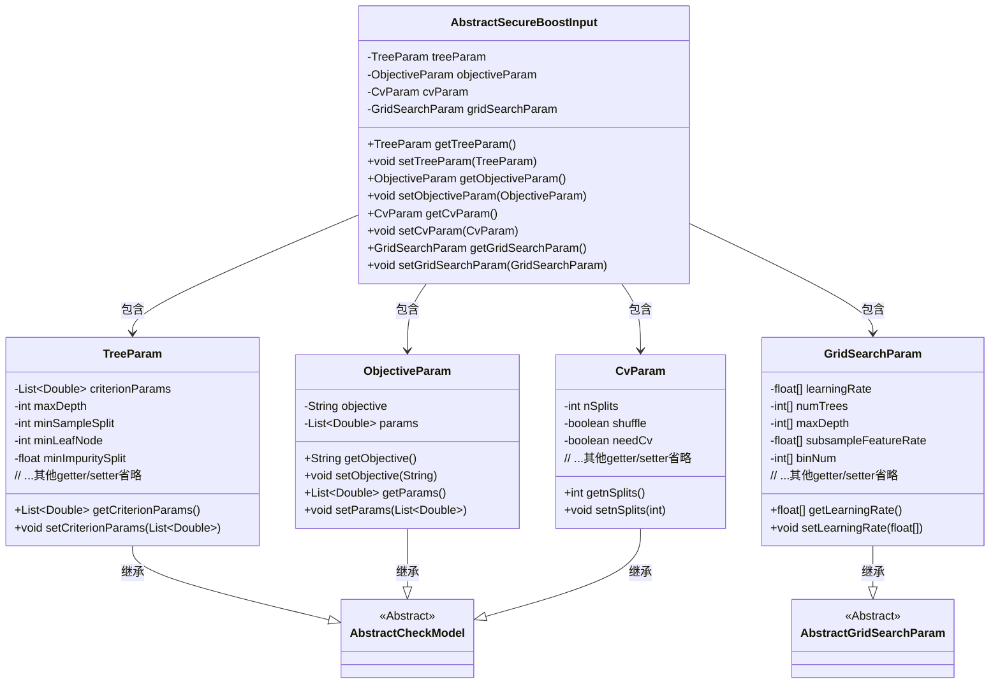

# 基础信息

|      |      |
|------|------|
| 名称 | AbstractSecureBoostInput |
| 编码语言 | .java |
| 代码路径 | WeFe/common/java/common-web/src/main/java/com/welab/wefe/common/web/dto/AbstractSecureBoostInput.java |
| 包名 | com.welab.wefe.common.web.dto |
| 依赖项 | ['com.welab.wefe.common.fieldvalidate.AbstractCheckModel', 'com.welab.wefe.common.fieldvalidate.annotation.Check', 'java.util.List'] |
| 概述说明 | AbstractSecureBoostInput类包含树参数、目标参数、交叉验证参数和网格搜索参数，用于配置安全增强的XGBoost模型训练。 |

# 说明

AbstractSecureBoostInput类继承自AbstractCheckModel，包含四个主要参数：treeParam、objectiveParam、cvParam和gridSearchParam。treeParam定义了树的参数，包括正则项系数、最大深度、最小样本分裂数、叶子节点最小样本数和最小增益。objectiveParam包含损失函数及其正则项系数。cvParam设置交叉验证参数，如分割数、是否洗牌和是否需要验证。gridSearchParam用于网格搜索，包括学习率、树数量、深度、特征采样率和桶数量等可调参数范围。所有参数均通过getter和setter方法访问和修改。

# 类列表 Class Summary

| 名称   | 类型  | 说明 |
|-------|------|-------------|
| AbstractSecureBoostInput | class | AbstractSecureBoostInput类包含树参数、目标参数、交叉验证参数和网格搜索参数，用于配置安全增强的梯度提升树模型。 |

## 类 AbstractSecureBoostInput

|      |      |
|------|------|
| 访问范围 | public |
| 类型 | class |
| 名称 | AbstractSecureBoostInput |
| 说明 | AbstractSecureBoostInput类包含树参数、目标参数、交叉验证参数和网格搜索参数，用于配置安全增强的梯度提升树模型。 |

### UML类图

类图描述：该图展示了一个安全增强的机器学习输入配置系统。AbstractSecureBoostInput作为主类，包含TreeParam（树参数）、ObjectiveParam（目标函数参数）、CvParam（交叉验证参数）和GridSearchParam（网格搜索参数）四个嵌套配置类。所有参数类都继承自AbstractCheckModel（除GridSearchParam继承自AbstractGridSearchParam），体现了参数校验的共性。图中清晰呈现了包含关系和继承层次，各配置类封装了机器学习算法调参所需的关键参数。

### 内部方法调用关系图

```mermaid
graph TD
    A["类AbstractSecureBoostInput"]
    B["属性: TreeParam treeParam"]
    C["方法: getTreeParam/setTreeParam"]
    D["静态内部类TreeParam"]
    E["属性: List<Double> criterionParams"]
    F["属性: int maxDepth"]
    G["属性: int minSampleSplit"]
    H["属性: int minLeafNode"]
    I["属性: float minImpuritySplit"]
    J["方法: 各属性getter/setter"]
    K["属性: ObjectiveParam objectiveParam"]
    L["方法: getObjectiveParam/setObjectiveParam"]
    M["静态内部类ObjectiveParam"]
    N["属性: String objective"]
    O["属性: List<Double> params"]
    P["方法: 各属性getter/setter"]
    Q["属性: CvParam cvParam"]
    R["方法: getCvParam/setCvParam"]
    S["静态内部类CvParam"]
    T["属性: int nSplits"]
    U["属性: boolean shuffle"]
    V["属性: boolean needCv"]
    W["方法: 各属性getter/setter"]
    X["属性: GridSearchParam gridSearchParam"]
    Y["方法: getGridSearchParam/setGridSearchParam"]
    Z["静态内部类GridSearchParam"]
    AA["属性: float[] learningRate"]
    AB["属性: int[] numTrees"]
    AC["属性: int[] maxDepth"]
    AD["属性: float[] subsampleFeatureRate"]
    AE["属性: int[] binNum"]
    AF["方法: 各属性getter/setter"]

    A --> B
    A --> C
    A --> D
    D --> E
    D --> F
    D --> G
    D --> H
    D --> I
    D --> J
    A --> K
    A --> L
    A --> M
    M --> N
    M --> O
    M --> P
    A --> Q
    A --> R
    A --> S
    S --> T
    S --> U
    S --> V
    S --> W
    A --> X
    A --> Y
    A --> Z
    Z --> AA
    Z --> AB
    Z --> AC
    Z --> AD
    Z --> AE
    Z --> AF
```

该流程图展示了AbstractSecureBoostInput类及其嵌套类的结构关系。主类包含4个核心参数类(TreeParam/ObjectiveParam/CvParam/GridSearchParam)作为属性，每个参数类又包含多个带校验注解的配置参数和对应的getter/setter方法。所有嵌套类都继承自AbstractCheckModel，其中GridSearchParam还额外继承AbstractGridSearchParam，形成多层级的配置参数体系。

### 字段列表 Field List

| 名称  | 类型  | 说明 |
|-------|-------|------|
| objectiveParam | ObjectiveParam | 代码片段定义了一个私有变量objectiveParam，并标注了@Check(require=true)校验注解，表示该参数必填。 |
| cvParam | CvParam | 代码片段定义了一个私有变量cvParam，类型为CvParam，并标注了@Check(require = true)表示该参数必须校验。 |
| gridSearchParam | GridSearchParam | 代码片段定义了一个私有变量gridSearchParam，使用@Check注解标记为必填项。 |
| treeParam | TreeParam | 强制校验的树形参数对象。 |

### 方法列表

| 名称  | 类型  | 说明 |
|-------|-------|------|
| getCvParam | CvParam | 获取cvParam对象的方法。 |
| getObjectiveParam | ObjectiveParam | 方法返回ObjectiveParam对象。 |
| getTreeParam | TreeParam | 方法返回treeParam对象。 |
| setObjectiveParam | void | 设置目标参数方法，将传入的objectiveParam赋值给当前对象的同名属性。 |
| setTreeParam | void | 设置树形参数的方法，将传入的treeParam赋值给当前对象的treeParam属性。 |
| setCvParam | void | 这是一个Java方法，用于设置类的cvParam成员变量。方法接受一个CvParam类型参数，并将其赋值给当前对象的cvParam属性。 |
| getGridSearchParam | GridSearchParam | 获取网格搜索参数的方法，返回gridSearchParam对象。 |
| setGridSearchParam | void | 设置网格搜索参数的方法，将输入参数赋值给类的成员变量。 |

