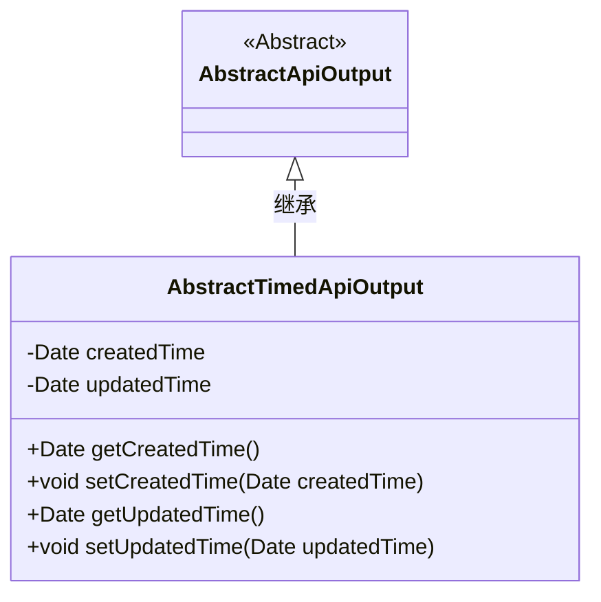
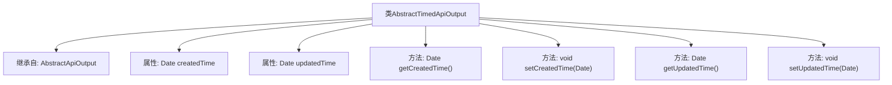

# 基础信息

|      |      |
|------|------|
| 名称 | AbstractTimedApiOutput |
| 编码语言 | .java |
| 代码路径 | WeFe/common/java/common-web/src/main/java/com/welab/wefe/common/web/dto/AbstractTimedApiOutput.java |
| 包名 | com.welab.wefe.common.web.dto |
| 依赖项 | ['java.util.Date'] |
| 概述说明 | AbstractTimedApiOutput类继承AbstractApiOutput，包含创建时间和更新时间属性及其getter和setter方法。 |

# 说明

这是一个名为AbstractTimedApiOutput的抽象类，继承自AbstractApiOutput。该类包含两个受保护的Date类型属性：createdTime和updatedTime，分别表示创建时间和更新时间。提供了四个公共方法：getCreatedTime和setCreatedTime用于获取和设置创建时间，getUpdatedTime和setUpdatedTime用于获取和设置更新时间。

# 类列表 Class Summary

| 名称   | 类型  | 说明 |
|-------|------|-------------|
| AbstractTimedApiOutput | class | AbstractTimedApiOutput类继承AbstractApiOutput，包含创建时间和更新时间属性及其getter和setter方法。 |

## 类 AbstractTimedApiOutput

|      |      |
|------|------|
| 访问范围 | public |
| 类型 | class |
| 名称 | AbstractTimedApiOutput |
| 说明 | AbstractTimedApiOutput类继承AbstractApiOutput，包含创建时间和更新时间属性及其getter和setter方法。 |

### UML类图

这段类图展示了AbstractTimedApiOutput继承自抽象类AbstractApiOutput的关系。子类添加了两个Date类型的私有属性createdTime和updatedTime，并提供了对应的getter和setter方法。该设计扩展了基础API输出功能，增加了时间戳管理能力，适用于需要记录创建和修改时间的场景。类图清晰地体现了面向对象的继承特性与时间属性的封装。

### 内部方法调用关系图

这段代码展示了一个继承自AbstractApiOutput的AbstractTimedApiOutput类，主要功能是管理时间相关的属性createdTime和updatedTime。类中包含四个方法，分别用于获取和设置这两个时间属性。流程图清晰地展示了类的继承关系、属性定义以及方法结构，体现了对时间戳数据的封装管理能力。

### 字段列表 Field List

| 名称  | 类型  | 说明 |
|-------|-------|------|
| updatedTime | Date | 字段updatedTime为受保护的日期类型，记录更新时间。 |
| createdTime | Date | 创建时间字段，类型为Date。 |

### 方法列表

| 名称  | 类型  | 说明 |
|-------|-------|------|
| getUpdatedTime | Date | 方法返回更新时间对象。 |
| getCreatedTime | Date | 获取创建时间的方法，返回Date类型。 |
| setCreatedTime | void | 设置对象创建时间的方法，参数为Date类型。 |
| setUpdatedTime | void | 设置更新时间的方法，将参数updatedTime赋值给对象的updatedTime属性。 |

