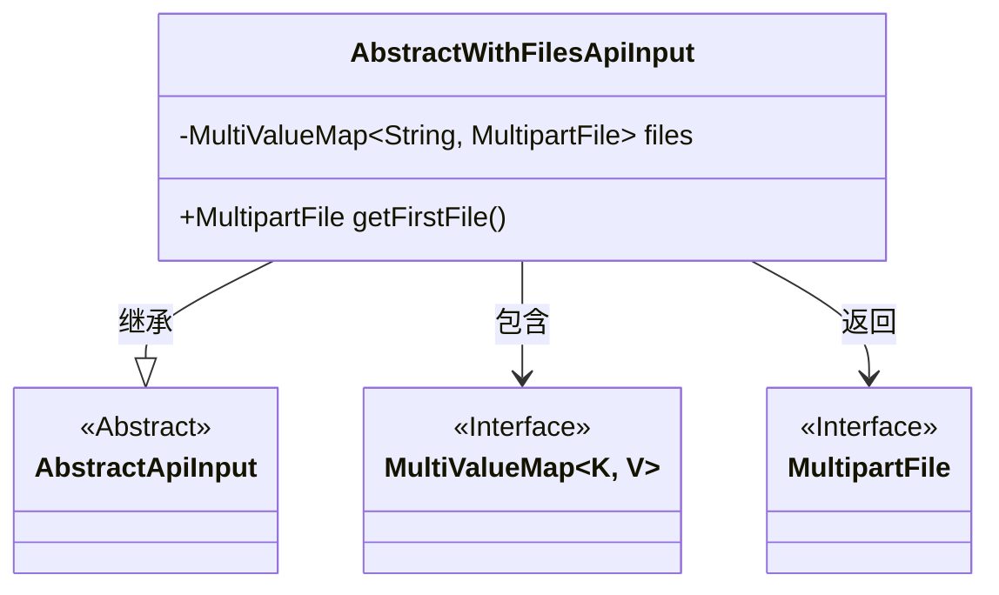
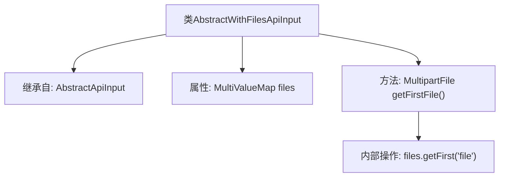

# 基础信息

|      |      |
|------|------|
| 名称 | AbstractWithFilesApiInput |
| 编码语言 | .java |
| 代码路径 | WeFe/common/java/common-web/src/main/java/com/welab/wefe/common/web/dto/AbstractWithFilesApiInput.java |
| 包名 | com.welab.wefe.common.web.dto |
| 依赖项 | ['org.springframework.util.MultiValueMap', 'org.springframework.web.multipart.MultipartFile'] |
| 概述说明 | AbstractWithFilesApiInput类继承AbstractApiInput，包含文件映射字段files和获取首个文件的方法getFirstFile。 |

# 说明

AbstractWithFilesApiInput类继承自AbstractApiInput，用于处理包含文件上传的API输入。该类包含一个MultiValueMap类型的files成员变量，用于存储多个MultipartFile文件。提供了getFirstFile方法，用于获取键为"file"的第一个文件对象。该类简化了文件上传操作中的文件获取流程。

# 类列表 Class Summary

| 名称   | 类型  | 说明 |
|-------|------|-------------|
| AbstractWithFilesApiInput | class | AbstractWithFilesApiInput类继承AbstractApiInput，包含文件映射和获取首个文件的方法。 |

## 类 AbstractWithFilesApiInput

|      |      |
|------|------|
| 访问范围 | public |
| 类型 | class |
| 名称 | AbstractWithFilesApiInput |
| 说明 | AbstractWithFilesApiInput类继承AbstractApiInput，包含文件映射和获取首个文件的方法。 |

### UML类图

这段类图展示了AbstractWithFilesApiInput继承自抽象类AbstractApiInput，并包含一个MultiValueMap类型的files成员变量，该映射存储字符串键和MultipartFile接口类型的值。类中提供了getFirstFile()方法用于获取键为"file"的第一个文件。MultiValueMap和MultipartFile均为接口类型，体现了文件上传功能中常见的多文件处理模式。整个设计通过继承和组合实现了文件上传API输入的基础功能。

### 内部方法调用关系图

这段流程图展示了AbstractWithFilesApiInput类的结构，它继承自AbstractApiInput基类。该类包含一个MultiValueMap类型的files属性，用于存储多个文件。核心方法是getFirstFile()，通过调用files.getFirst("file")获取第一个上传的文件对象。流程图清晰地呈现了类继承关系、属性定义和方法调用链路，突出了文件处理API输入的关键设计点。

### 字段列表 Field List

| 名称  | 类型  | 说明 |
|-------|-------|------|
| files | MultiValueMap<String, MultipartFile> | 多值映射，键为字符串，值为多部分文件对象。 |

### 方法列表

| 名称  | 类型  | 说明 |
|-------|-------|------|
| getFirstFile | MultipartFile | 获取文件列表中的第一个文件。 |

