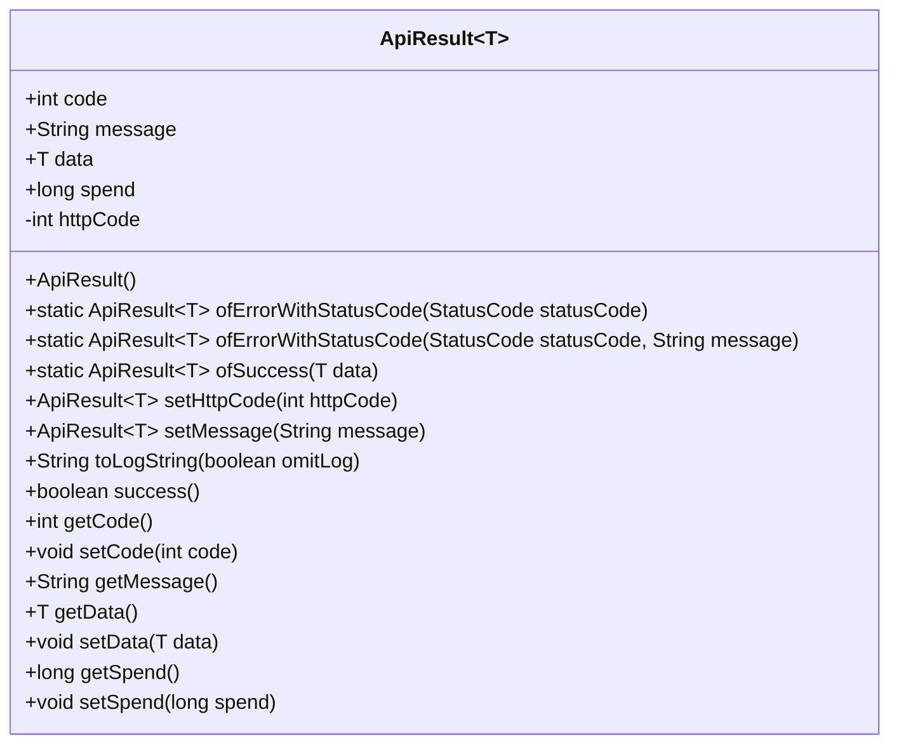
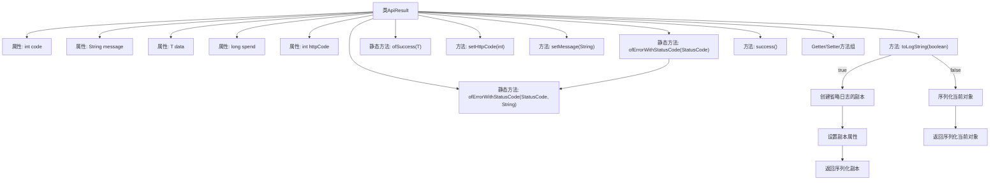

# 基础信息

|      |      |
|------|------|
| 名称 | ApiResult |
| 编码语言 | .java |
| 代码路径 | WeFe/common/java/common-web/src/main/java/com/welab/wefe/common/web/dto/ApiResult.java |
| 包名 | com.welab.wefe.common.web.dto |
| 依赖项 | ['com.alibaba.fastjson.JSON', 'com.alibaba.fastjson.annotation.JSONField', 'com.welab.wefe.common.StatusCode', 'com.welab.wefe.common.fastjson.LoggerValueFilter'] |
| 概述说明 | ApiResult是通用API响应类，包含状态码、消息、数据、耗时和HTTP状态码，提供成功/错误构造方法、日志输出和状态判断功能。 |

# 说明

ApiResult是一个泛型类，用于封装API响应数据。包含状态码code、消息message、泛型数据data、耗时spend和HTTP状态码httpCode。提供静态方法创建错误或成功响应，支持链式调用设置属性。包含日志输出方法toLogString，可控制是否省略日志内容。通过success方法判断响应是否成功。包含各属性的getter和setter方法。

# 类列表 Class Summary

| 名称   | 类型  | 说明 |
|-------|------|-------------|
| ApiResult | class | ApiResult是通用API响应类，包含状态码、消息、数据、耗时和HTTP状态码，提供成功/错误构造方法、日志输出和链式调用。 |

## 类 ApiResult

|      |      |
|------|------|
| 访问范围 | public |
| 类型 | class |
| 名称 | ApiResult |
| 说明 | ApiResult是通用API响应类，包含状态码、消息、数据、耗时和HTTP状态码，提供成功/错误构造方法、日志输出和链式调用。 |

### UML类图

这段代码定义了一个泛型类`ApiResult<T>`，用于封装API响应数据，包含状态码、消息、泛型数据、耗时等字段，提供了错误和成功响应的静态工厂方法，以及日志输出和状态判断功能。类图展示了其公有字段、构造方法、静态工厂方法、链式设置方法和常规getter/setter，其中`httpCode`被标记为私有且不序列化，体现了响应结果包装和日志处理的通用设计模式。

### 内部方法调用关系图

流程图描述了ApiResult泛型类的结构和主要方法调用关系。该类用于封装API响应数据，包含状态码、消息、泛型数据和耗时等属性。核心方法包括构造错误/成功响应、设置HTTP状态码、日志字符串生成和状态判断。特别注意toLogString方法的分支逻辑，根据omitLog参数决定是否省略日志数据，避免文件资源序列化问题。类结构清晰地区分了属性和方法组，体现了响应对象的完整生命周期管理能力。

### 字段列表 Field List

| 名称  | 类型  | 说明 |
|-------|-------|------|
| data | T | 声明一个公共变量data，类型为泛型T。 |
| httpCode = 200 | int | JSONField注解标记httpCode为200且不序列化。 |
| spend | long | 变量spend为长整型，用于存储支出金额。 |
| code = 0 | int | 定义整型变量code，初始值为0。 |
| message | String | 声明一个公共字符串变量message。 |

### 方法列表

| 名称  | 类型  | 说明 |
|-------|-------|------|
| ofErrorWithStatusCode | ApiResult<T> | 静态方法`ofErrorWithStatusCode`创建包含状态码和错误信息的`ApiResult`对象，返回该对象。 |
| ofErrorWithStatusCode | ApiResult<T> | 静态方法`ofErrorWithStatusCode`接收状态码参数，返回包含该状态码及其消息的ApiResult错误对象。 |
| setHttpCode | ApiResult<T> | 方法setHttpCode设置http状态码并返回当前对象实例。 |
| success | boolean | 方法success检查code是否为0，返回布尔值表示操作是否成功。 |
| setMessage | ApiResult<T> | 这是一个泛型方法，用于设置消息并返回当前ApiResult对象实例。 |
| getCode | int | 方法返回整型变量code的值。 |
| ofSuccess | ApiResult<T> | 这是一个Java静态方法，用于创建包含成功数据的ApiResult对象。方法接收泛型数据参数，将其赋值给新创建的ApiResult实例并返回。 |
| toLogString | String | 方法根据omitLog参数决定日志输出格式：若为true，返回简化版JSON（仅保留关键字段）；若为false，返回完整对象JSON并使用默认过滤器。 |
| setCode | void | 设置整型变量code的值。 |
| getMessage | String | 获取message字符串的方法。 |
| getData | T | 这是一个Java方法，返回类型为泛型T的data变量值。 |
| setData | void | 设置对象的数据属性。 |
| getSpend | long | 获取消费金额的方法，返回长整型变量spend的值。 |
| setSpend | void | 设置花费金额的方法，将参数值赋给类成员变量spend。 |

