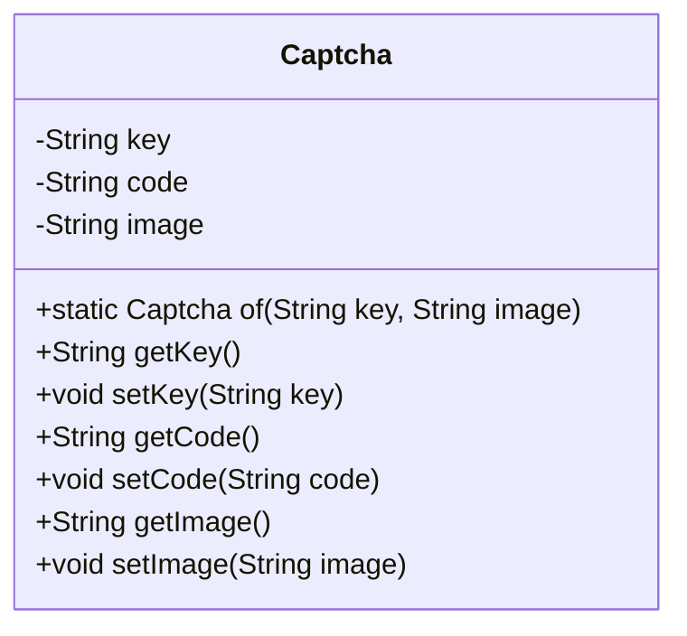
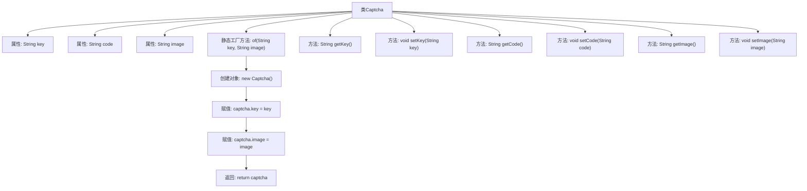

# 基础信息

|      |      |
|------|------|
| 名称 | Captcha |
| 编码语言 | .java |
| 代码路径 | WeFe/common/java/common-web/src/main/java/com/welab/wefe/common/web/dto/Captcha.java |
| 包名 | com.welab.wefe.common.web.dto |
| 依赖项 | [] |
| 概述说明 | Captcha类包含key、code、image属性，提供getter/setter方法和静态工厂方法of用于创建实例。 |

# 说明

Captcha类是一个用于验证码功能的Java类，包含三个私有字段：key、code和image。提供了静态工厂方法of用于创建实例并初始化key和image字段。类中还为每个字段提供了对应的getter和setter方法，用于获取和设置字段值。key和image通过of方法初始化，code可通过setter方法设置。

# 类列表 Class Summary

| 名称   | 类型  | 说明 |
|-------|------|-------------|
| Captcha | class | Captcha类包含key、code、image属性，提供getter/setter方法和静态工厂方法of用于创建实例。 |

## 类 Captcha

|      |      |
|------|------|
| 访问范围 | public |
| 类型 | class |
| 名称 | Captcha |
| 说明 | Captcha类包含key、code、image属性，提供getter/setter方法和静态工厂方法of用于创建实例。 |

### UML类图

这段代码定义了一个名为`Captcha`的类，用于表示验证码信息。该类包含三个私有属性：`key`（验证码唯一标识）、`code`（验证码文本）和`image`（验证码图片数据），并提供了对应的getter和setter方法。核心功能是通过静态工厂方法`of()`创建实例，该方法接收key和image参数并初始化对象。这个类典型用于验证码生成场景，支持后续通过setCode()设置验证码值，适合需要动态生成和校验验证码的系统模块。

### 内部方法调用关系图

这段代码定义了一个Captcha类，用于表示验证码信息，包含key、code和image三个属性。通过静态工厂方法of创建对象并初始化key和image属性，同时提供了各个属性的getter和setter方法。流程图展示了类的结构、属性、方法以及工厂方法内部的创建和初始化过程。

### 字段列表 Field List

| 名称  | 类型  | 说明 |
|-------|-------|------|
| image | String | 私有字符串变量image，用于存储图像信息。 |
| code | String | 定义了一个私有字符串变量code。 |
| key | String | 私有字符串类型变量key。 |

### 方法列表

| 名称  | 类型  | 说明 |
|-------|-------|------|
| getImage | String | 获取image字符串的方法。 |
| setCode | void | 设置字符串类型的code值。 |
| setKey | void | 这是一个Java方法，用于设置类成员变量key的值。方法接收一个字符串参数key，并将其赋值给当前对象的key属性。 |
| getCode | String | 获取code字符串的方法。 |
| getKey | String | 获取key值的公共方法。 |
| of | Captcha | 静态方法`of`创建并返回一个`Captcha`对象，设置其`key`和`image`属性为传入参数。 |
| setImage | void | 这是一个Java方法，用于设置对象的image属性值。方法接收一个字符串参数image，并将其赋值给当前对象的image成员变量。 |

