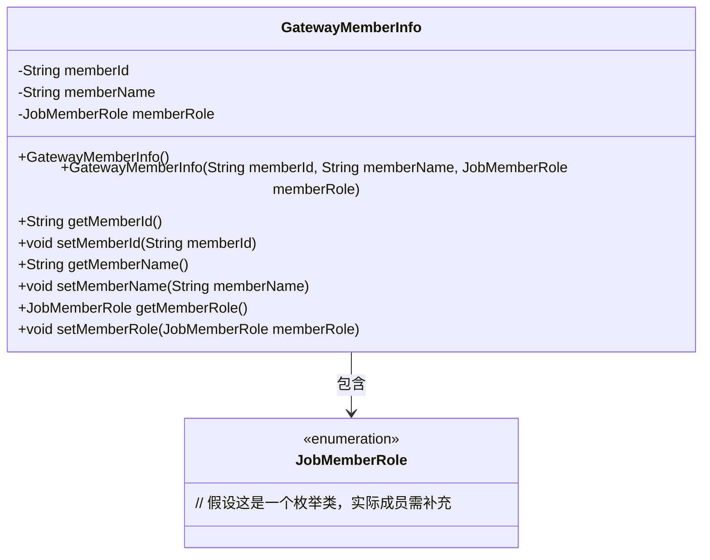
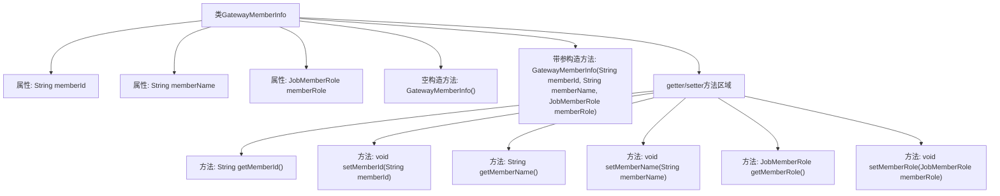

# 基础信息

|      |      |
|------|------|
| 名称 | GatewayMemberInfo |
| 编码语言 | .java |
| 代码路径 | WeFe/common/java/common-web/src/main/java/com/welab/wefe/common/web/dto/GatewayMemberInfo.java |
| 包名 | com.welab.wefe.common.web.dto |
| 依赖项 | ['com.welab.wefe.common.wefe.enums.JobMemberRole'] |
| 概述说明 | GatewayMemberInfo类包含成员ID、名称和角色属性，提供空构造器和带参构造器，以及对应的getter和setter方法。 |

# 说明

GatewayMemberInfo类用于存储成员信息，包含成员ID、名称和角色三个属性。该类提供了无参构造方法以确保反序列化正常，以及带参构造方法初始化所有属性。同时为每个属性提供了对应的getter和setter方法，便于访问和修改成员信息。成员角色使用JobMemberRole枚举类型表示。

# 类列表 Class Summary

| 名称   | 类型  | 说明 |
|-------|------|-------------|
| GatewayMemberInfo | class | GatewayMemberInfo类包含成员ID、名称和角色，提供空构造和带参构造方法，以及各属性的getter和setter方法。 |

## 类 GatewayMemberInfo

|      |      |
|------|------|
| 访问范围 | public |
| 类型 | class |
| 名称 | GatewayMemberInfo |
| 说明 | GatewayMemberInfo类包含成员ID、名称和角色，提供空构造和带参构造方法，以及各属性的getter和setter方法。 |

### UML类图

这段代码定义了一个`GatewayMemberInfo`类，用于表示网关成员信息，包含成员ID、名称和角色三个核心属性。该类提供了两个构造函数（一个空构造用于序列化，一个全参数构造）以及完整的getter/setter方法。通过类图可见其与`JobMemberRole`枚举存在组合关系，后者可能定义了成员角色类型（如ADMIN/USER等）。这是一个典型的数据传输对象(DTO)设计，适合用于系统间成员信息的序列化传输。

### 内部方法调用关系图

这段代码定义了一个名为GatewayMemberInfo的类，用于存储网关成员的基本信息，包括成员ID、名称和角色。类中包含两个构造方法（一个空构造方法用于反序列化，一个带参构造方法用于初始化所有属性）以及对应的getter和setter方法。流程图清晰地展示了类的结构，包括属性、构造方法和getter/setter方法的层级关系，便于理解类的组成和功能。

### 字段列表 Field List

| 名称  | 类型  | 说明 |
|-------|-------|------|
| memberRole | JobMemberRole | 私有成员变量，类型为JobMemberRole，表示工作成员角色。 |
| memberId | String | 定义私有字符串类型变量memberId。 |
| memberName | String | 私有字符串类型变量，存储成员名称。 |

### 方法列表

| 名称  | 类型  | 说明 |
|-------|-------|------|
| setMemberRole | void | 这是一个Java方法，用于设置成员角色属性。方法接受一个JobMemberRole类型参数，并将其赋值给当前对象的memberRole字段。 |
| setMemberName | void | 定义公共方法setMemberName，接收字符串参数memberName并赋值给当前对象的同名成员变量。 |
| setMemberId | void | 设置成员ID的方法，将输入参数memberId赋值给当前对象的memberId属性。 |
| getMemberRole | JobMemberRole | 获取成员角色方法，返回JobMemberRole类型对象。 |
| getMemberName | String | 这是一个Java方法，返回成员变量memberName的值。 |
| getMemberId | String | 方法返回成员ID字符串。 |

