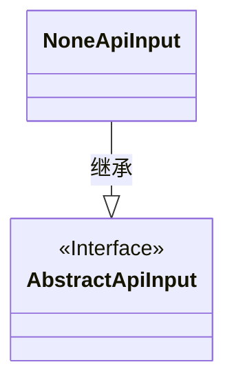
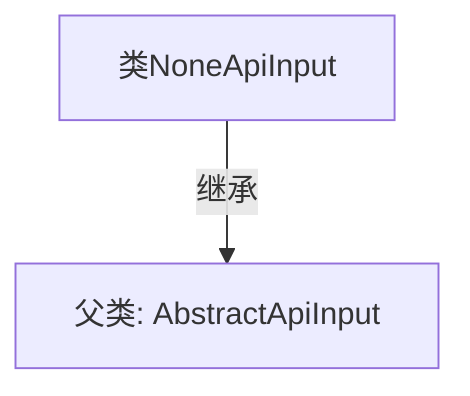

# 基础信息

|      |      |
|------|------|
| 名称 | NoneApiInput |
| 编码语言 | .java |
| 代码路径 | WeFe/common/java/common-web/src/main/java/com/welab/wefe/common/web/dto/NoneApiInput.java |
| 包名 | com.welab.wefe.common.web.dto |
| 依赖项 | [] |
| 概述说明 | NoneApiInput类继承自AbstractApiInput，表示无API输入。 |

# 说明

NoneApiInput是一个继承自AbstractApiInput的公开类，用于表示无API输入的情况。该类没有定义任何额外属性或方法，仅通过继承基类AbstractApiInput来表明其作为API输入类型的身份。这种设计通常用于需要类型占位或默认输入参数的场景，保持代码结构的完整性。

# 类列表 Class Summary

| 名称   | 类型  | 说明 |
|-------|------|-------------|
| NoneApiInput | class | 类NoneApiInput继承自AbstractApiInput，无额外实现。 |

## 类 NoneApiInput

|      |      |
|------|------|
| 访问范围 | public |
| 类型 | class |
| 名称 | NoneApiInput |
| 说明 | 类NoneApiInput继承自AbstractApiInput，无额外实现。 |

### UML类图

这段类图展示了NoneApiInput类继承自AbstractApiInput接口的简单关系。AbstractApiInput被标记为接口（<<Interface>>），而NoneApiInput作为其实现类通过实线空心三角箭头表示继承关系。该结构表明NoneApiInput需要实现AbstractApiInput定义的所有抽象方法，适用于需要统一接口但具有特殊实现的场景。

### 内部方法调用关系图

这段代码展示了一个简单的Java类继承关系。NoneApiInput类通过extends关键字继承了AbstractApiInput抽象类，表明它是一个没有实现任何额外方法或属性的空子类。这种结构通常用于标记特定类型的API输入，同时复用父类的通用功能。继承关系使得NoneApiInput可以自动获得AbstractApiInput的所有非私有成员，同时保持自身逻辑的简洁性。

### 字段列表 Field List

| 名称  | 类型  | 说明 |
|-------|-------|------|

### 方法列表

| 名称  | 类型  | 说明 |
|-------|-------|------|

