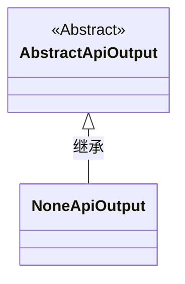
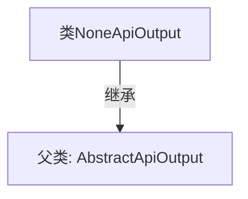

# 基础信息

|      |      |
|------|------|
| 名称 | NoneApiOutput |
| 编码语言 | .java |
| 代码路径 | WeFe/common/java/common-web/src/main/java/com/welab/wefe/common/web/dto/NoneApiOutput.java |
| 包名 | com.welab.wefe.common.web.dto |
| 依赖项 | [] |
| 概述说明 | 类NoneApiOutput继承自AbstractApiOutput，无额外实现。 |

# 说明

这是一个名为NoneApiOutput的Java类，它继承自AbstractApiOutput类。该类没有定义任何额外的字段或方法，仅通过继承父类AbstractApiOutput来获取基础功能。这表明NoneApiOutput可能用于表示某种空或无输出的API响应场景。

# 类列表 Class Summary

| 名称   | 类型  | 说明 |
|-------|------|-------------|
| NoneApiOutput | class | NoneApiOutput类继承自AbstractApiOutput，是一个无具体实现的API输出类。 |

## 类 NoneApiOutput

|      |      |
|------|------|
| 访问范围 | public |
| 类型 | class |
| 名称 | NoneApiOutput |
| 说明 | NoneApiOutput类继承自AbstractApiOutput，是一个无具体实现的API输出类。 |

### UML类图

这段类图展示了NoneApiOutput类继承自抽象类AbstractApiOutput的简单关系。AbstractApiOutput被标记为抽象类（<<Abstract>>），而NoneApiOutput作为其具体实现子类，通过空心三角箭头表示继承关系。这种设计模式常用于API输出处理场景，基础功能由父类提供而子类实现特定行为。

### 内部方法调用关系图

这段代码展示了一个简单的类继承关系。NoneApiOutput类继承自AbstractApiOutput抽象类，表明它是一个没有实现额外API输出的具体类。图中清晰呈现了继承关系，NoneApiOutput作为子类通过实线箭头指向父类AbstractApiOutput，体现了面向对象编程中的继承特性。该设计可能用于表示某种空实现或默认行为的基础输出类型。

### 字段列表 Field List

| 名称  | 类型  | 说明 |
|-------|-------|------|

### 方法列表

| 名称  | 类型  | 说明 |
|-------|-------|------|

