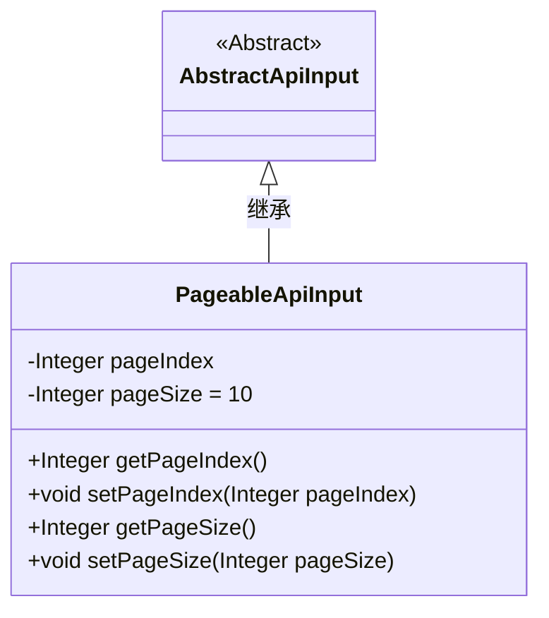
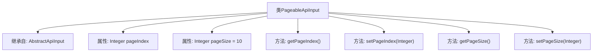

# 基础信息

|      |      |
|------|------|
| 名称 | PageableApiInput |
| 编码语言 | .java |
| 代码路径 | WeFe/common/java/common-web/src/main/java/com/welab/wefe/common/web/dto/PageableApiInput.java |
| 包名 | com.welab.wefe.common.web.dto |
| 依赖项 | [] |
| 概述说明 | 分页API输入类，包含页码和默认每页10条记录，提供getter和setter方法。 |

# 说明

PageableApiInput类继承自AbstractApiInput，用于处理分页请求。包含两个整型属性：pageIndex表示当前页码，pageSize默认值为10表示每页记录数。提供getter和setter方法分别用于获取和设置这两个属性的值。

# 类列表 Class Summary

| 名称   | 类型  | 说明 |
|-------|------|-------------|
| PageableApiInput | class | PageableApiInput类继承AbstractApiInput，包含分页索引pageIndex和默认值为10的pageSize，提供getter和setter方法。 |

## 类 PageableApiInput

|      |      |
|------|------|
| 访问范围 | public |
| 类型 | class |
| 名称 | PageableApiInput |
| 说明 | PageableApiInput类继承AbstractApiInput，包含分页索引pageIndex和默认值为10的pageSize，提供getter和setter方法。 |

### UML类图

这段类图展示了PageableApiInput继承自抽象类AbstractApiInput的结构。PageableApiInput类包含两个私有整型属性pageIndex和pageSize（默认值为10），以及对应的getter和setter方法。作为分页API输入参数的封装类，它通过继承AbstractApiInput获得了基础API输入功能，同时扩展了分页控制能力，典型应用于需要分页查询的后端接口参数封装场景。

### 内部方法调用关系图

这段代码展示了一个分页API输入类PageableApiInput，继承自AbstractApiInput基类。该类包含两个核心分页属性：pageIndex表示当前页码，pageSize默认值为10表示每页记录数。提供了标准的getter和setter方法用于属性访问和修改，符合JavaBean规范。该设计实现了分页参数的封装，便于在API调用中统一管理分页逻辑。

### 字段列表 Field List

| 名称  | 类型  | 说明 |
|-------|-------|------|
| pageIndex | Integer | 私有整型变量pageIndex，用于表示页码索引。 |
| pageSize = 10 | Integer | 定义整型变量pageSize，默认值为10。 |

### 方法列表

| 名称  | 类型  | 说明 |
|-------|-------|------|
| setPageIndex | void | 这是一个Java方法，用于设置当前页码。方法接收一个整数参数pageIndex，并将其赋值给类的成员变量pageIndex。 |
| getPageIndex | Integer | 获取当前页码的整数值。 |
| getPageSize | Integer | 获取pageSize的整数值。 |
| setPageSize | void | 这是一个Java方法，用于设置页面大小。方法接收一个Integer参数pageSize，并将其赋值给类的同名成员变量。 |

