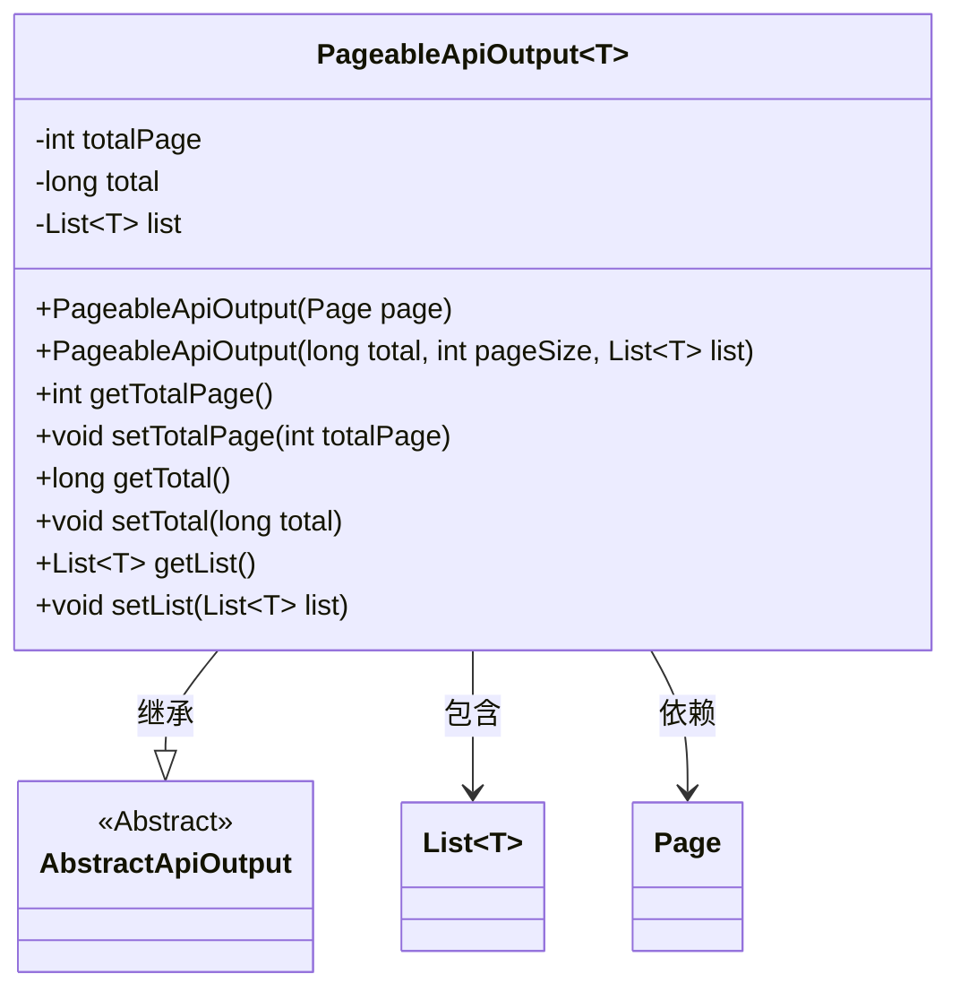
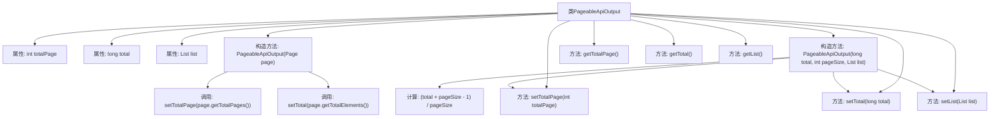

# 基础信息

|      |      |
|------|------|
| 名称 | PageableApiOutput |
| 编码语言 | .java |
| 代码路径 | WeFe/common/java/common-web/src/main/java/com/welab/wefe/common/web/dto/PageableApiOutput.java |
| 包名 | com.welab.wefe.common.web.dto |
| 依赖项 | ['org.springframework.data.domain.Page', 'java.util.List'] |
| 概述说明 | 分页API输出类，包含总页数、总数和数据列表，提供两种构造方法。 |

# 说明

PageableApiOutput是一个泛型类，继承自AbstractApiOutput，用于封装分页数据。它包含三个核心属性：totalPage表示总页数，total表示总记录数，list存储当前页的数据列表。类提供两个构造方法，一个直接接收Page对象自动计算分页信息，另一个通过总记录数、每页大小和数据列表手动计算总页数。同时提供了各属性的getter和setter方法，支持灵活的数据访问与修改。

# 类列表 Class Summary

| 名称   | 类型  | 说明 |
|-------|------|-------------|
| PageableApiOutput | class | 分页API输出类，包含总页数、总数和数据列表，支持通过Page对象或直接参数构造。 |

## 类 PageableApiOutput

|      |      |
|------|------|
| 访问范围 | public |
| 类型 | class |
| 名称 | PageableApiOutput |
| 说明 | 分页API输出类，包含总页数、总数和数据列表，支持通过Page对象或直接参数构造。 |

### UML类图

类图描述：PageableApiOutput是一个泛型类，继承自AbstractApiOutput，用于处理可分页的API输出数据。它包含总页数(totalPage)、总记录数(total)和数据列表(list)三个核心属性，提供两种构造方式：一种直接接收Page对象，另一种通过总记录数、分页大小和数据列表构建。该类通过泛型T确保列表元素类型必须继承自AbstractApiOutput，实现了类型安全的可分页数据封装。

### 内部方法调用关系图

该流程图展示了PageableApiOutput泛型类的完整结构，包含两个构造方法和六个基础方法。第一个构造方法通过Page对象初始化分页数据，第二个构造方法通过直接参数计算总页数。所有属性均通过setter方法进行封装赋值，其中第二个构造方法包含特殊的总页数计算逻辑。类继承自AbstractApiOutput，用于处理带分页的API响应数据封装。

### 字段列表 Field List

| 名称  | 类型  | 说明 |
|-------|-------|------|
| list | List<T> | 私有泛型列表变量list。 |
| total | long | 私有长整型变量total |
| totalPage | int | 私有整型变量，用于存储总页数。 |

### 方法列表

| 名称  | 类型  | 说明 |
|-------|-------|------|
| setList | void | 这是一个Java方法，用于设置类的List类型成员变量list，接受一个泛型List参数并将其赋值给成员变量。 |
| getTotal | long | 获取total值的公开方法。 |
| setTotal | void | 这是一个Java方法，用于设置类成员变量total的值。方法接受一个long类型参数total，并将其赋值给当前对象的total属性。 |
| getTotalPage | int | 方法getTotalPage返回totalPage的值。 |
| setTotalPage | void | 设置总页数的方法，将参数totalPage赋值给类的同名成员变量。 |
| getList | List<T> | 返回列表对象list。 |

