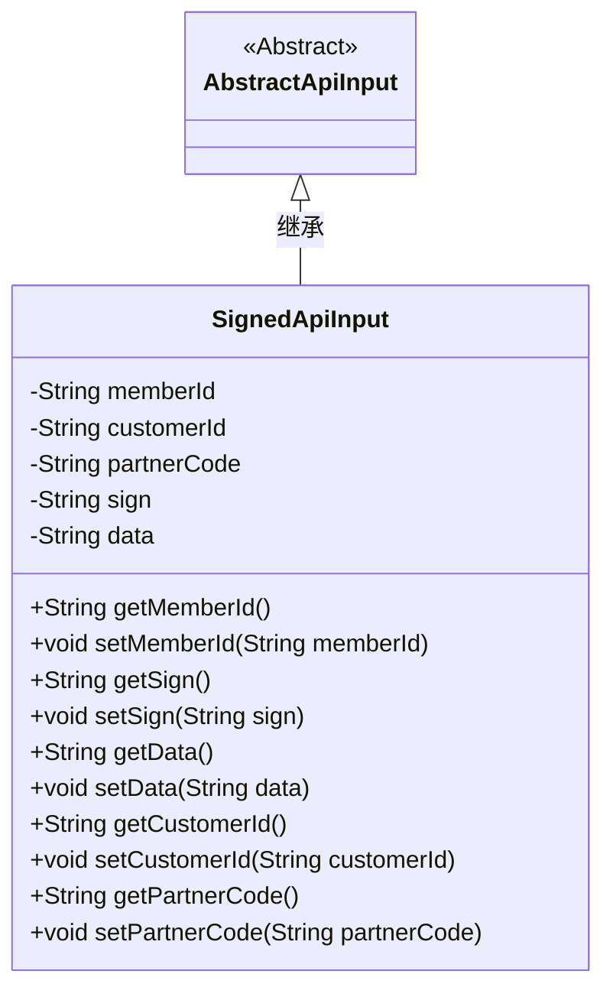
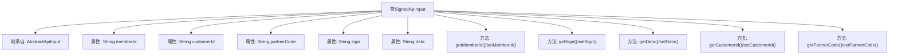

# 基础信息

|      |      |
|------|------|
| 名称 | SignedApiInput |
| 编码语言 | .java |
| 代码路径 | WeFe/common/java/common-web/src/main/java/com/welab/wefe/common/web/dto/SignedApiInput.java |
| 包名 | com.welab.wefe.common.web.dto |
| 依赖项 | [] |
| 概述说明 | SignedApiInput类继承AbstractApiInput，包含memberId、customerId（后续删除）、partnerCode、sign和data字段及其getter/setter方法。 |

# 说明

SignedApiInput类继承自AbstractApiInput，包含五个字段：memberId、customerId、partnerCode、sign和data。其中memberId和customerId标记为待删除字段。每个字段都有对应的getter和setter方法，用于获取和设置字段值。partnerCode表示合作伙伴代码，sign用于存储签名信息，data存储主要数据。

# 类列表 Class Summary

| 名称   | 类型  | 说明 |
|-------|------|-------------|
| SignedApiInput | class | SignedApiInput类继承AbstractApiInput，包含memberId、customerId（标记待删除）、partnerCode、sign和data字段及对应getter/setter方法。 |

## 类 SignedApiInput

|      |      |
|------|------|
| 访问范围 | public |
| 类型 | class |
| 名称 | SignedApiInput |
| 说明 | SignedApiInput类继承AbstractApiInput，包含memberId、customerId（标记待删除）、partnerCode、sign和data字段及对应getter/setter方法。 |

### UML类图

这段代码展示了一个名为SignedApiInput的类，它继承自抽象类AbstractApiInput。SignedApiInput类包含五个私有字符串字段：memberId、customerId（这两个字段标记为待删除）、partnerCode、sign和data，并为每个字段提供了公共的getter和setter方法。该类主要用于处理带有签名的API输入数据，其中sign字段可能用于验证数据完整性，data字段存储实际业务数据，partnerCode标识合作伙伴。类图清晰地展示了继承关系和所有成员方法的访问权限。

### 内部方法调用关系图

这段代码展示了一个名为SignedApiInput的类，它继承自AbstractApiInput类。该类包含5个私有字符串属性：memberId、customerId（这两个属性标记为待删除）、partnerCode、sign和data。为每个属性提供了对应的getter和setter方法，用于属性的读取和修改。类结构清晰，通过继承实现了代码复用，同时通过封装保护了内部数据。所有方法都是简单的属性访问器，没有复杂业务逻辑。

### 字段列表 Field List

| 名称  | 类型  | 说明 |
|-------|-------|------|
| memberId | String | 成员ID字符串变量 |
| customerId | String | 私有字符串类型变量customerId，用于存储客户ID。 |
| data | String | 私有字符串类型变量data。 |
| sign | String | 私有字符串变量sign |
| partnerCode | String | 私有字符串类型变量partnerCode |

### 方法列表

| 名称  | 类型  | 说明 |
|-------|-------|------|
| getPartnerCode | String | 获取合作伙伴代码的方法，返回partnerCode字符串。 |
| getMemberId | String | 获取成员ID的方法，返回字符串类型的memberId。 |
| getSign | String | 获取sign字符串的方法，直接返回sign值。 |
| getData | String | 获取data字符串的方法。 |
| setSign | void | 设置签名属性的方法，将输入参数赋值给对象内部变量。 |
| setMemberId | void | 设置成员ID的方法，将输入参数赋值给类的成员变量memberId。 |
| setPartnerCode | void | 设置合作伙伴代码的方法，将输入参数赋值给类的成员变量partnerCode。 |
| setData | void | 设置字符串类型的数据。 |
| getCustomerId | String | 获取客户ID的方法，返回字符串类型customerId。 |
| setCustomerId | void | 设置客户ID的方法，将传入的字符串参数赋值给类的customerId成员变量。 |

