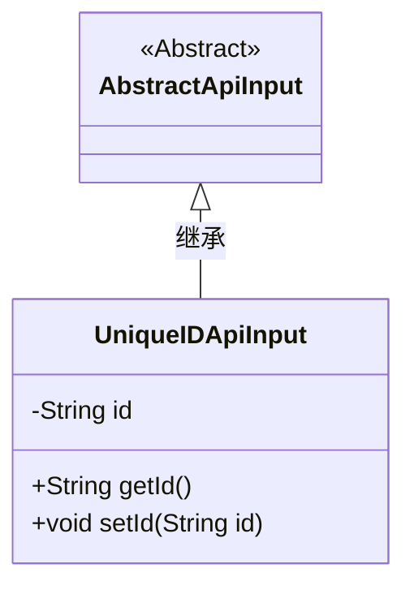
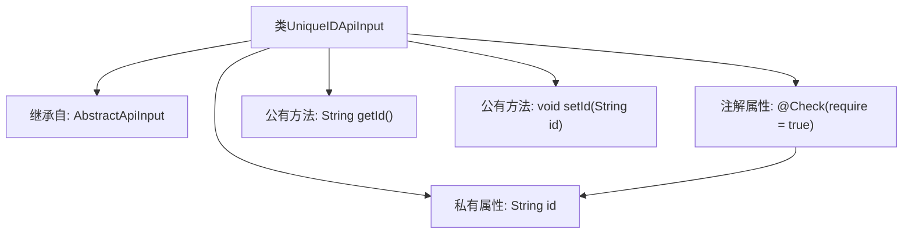

# 基础信息

|      |      |
|------|------|
| 名称 | UniqueIDApiInput |
| 编码语言 | .java |
| 代码路径 | WeFe/common/java/common-web/src/main/java/com/welab/wefe/common/web/dto/UniqueIDApiInput.java |
| 包名 | com.welab.wefe.common.web.dto |
| 依赖项 | ['com.welab.wefe.common.fieldvalidate.annotation.Check'] |
| 概述说明 | UniqueIDApiInput类继承AbstractApiInput，包含必填字段id及其getter和setter方法。 |

# 说明

该内容描述了一个名为UniqueIDApiInput的Java类，它继承自AbstractApiInput类。该类包含一个私有字符串属性id，该属性通过@Check注解标记为必填项。提供了getId和setId两个公共方法，分别用于获取和设置id属性的值。这个类主要用于处理需要唯一标识符输入的API请求。

# 类列表 Class Summary

| 名称   | 类型  | 说明 |
|-------|------|-------------|
| UniqueIDApiInput | class | UniqueIDApiInput类继承AbstractApiInput，包含必须的字符串类型id属性及其getter和setter方法。 |

## 类 UniqueIDApiInput

|      |      |
|------|------|
| 访问范围 | public |
| 类型 | class |
| 名称 | UniqueIDApiInput |
| 说明 | UniqueIDApiInput类继承AbstractApiInput，包含必须的字符串类型id属性及其getter和setter方法。 |

### UML类图

这段类图展示了UniqueIDApiInput类继承自抽象类AbstractApiInput的关系。UniqueIDApiInput包含一个私有字符串类型字段id，以及对应的公有getter和setter方法。类图中明确标注了AbstractApiInput为抽象类（使用<<Abstract>>标记），并通过带空心三角箭头的实线表示继承关系。该设计模式体现了对API输入参数的封装，通过继承实现代码复用，同时支持对唯一ID参数的校验和访问控制。

### 内部方法调用关系图

该流程图展示了UniqueIDApiInput类的结构，该类继承自AbstractApiInput，包含一个带有@Check注解的私有属性id，以及对应的getter和setter方法。注解@Check(require=true)强制约束id属性必须存在，体现了输入验证的设计意图。类结构简洁，符合JavaBean规范，通过方法暴露属性访问权限，同时保持封装性。

### 字段列表 Field List

| 名称  | 类型  | 说明 |
|-------|-------|------|
| id | String | 必填字段：字符串类型id。 |

### 方法列表

| 名称  | 类型  | 说明 |
|-------|-------|------|
| getId | String | 这是一个Java方法，返回字符串类型的id属性值。 |
| setId | void | 设置对象ID的方法，将参数id赋值给对象的id属性。 |

