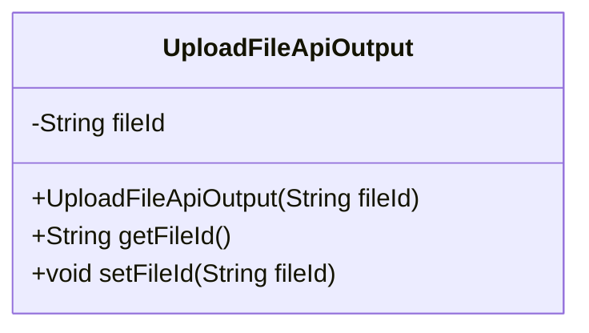
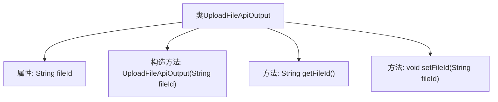

# 基础信息

|      |      |
|------|------|
| 名称 | UploadFileApiOutput |
| 编码语言 | .java |
| 代码路径 | WeFe/common/java/common-web/src/main/java/com/welab/wefe/common/web/dto/UploadFileApiOutput.java |
| 包名 | com.welab.wefe.common.web.dto |
| 依赖项 | [] |
| 概述说明 | UploadFileApiOutput类包含fileId字段及其构造方法、getter和setter方法。 |

# 说明

这是一个名为UploadFileApiOutput的Java类，用于表示文件上传API的输出结果。该类包含一个私有字符串属性fileId，用于存储文件标识符。提供了构造方法初始化fileId，以及getter和setter方法用于访问和修改fileId的值。

# 类列表 Class Summary

| 名称   | 类型  | 说明 |
|-------|------|-------------|
| UploadFileApiOutput | class | 上传文件API输出类，包含文件ID属性及构造方法，提供get和set方法。 |

## 类 UploadFileApiOutput

|      |      |
|------|------|
| 访问范围 | public |
| 类型 | class |
| 名称 | UploadFileApiOutput |
| 说明 | 上传文件API输出类，包含文件ID属性及构造方法，提供get和set方法。 |

### UML类图

这段类图描述了一个简单的文件上传API输出类UploadFileApiOutput，包含一个私有字符串属性fileId用于存储文件标识符。该类提供了构造方法初始化fileId，以及标准的getter和setter方法用于访问和修改该属性。这个类通常用于封装文件上传后服务端返回的响应数据，结构简单但能有效保证数据封装性。

### 内部方法调用关系图

这段代码定义了一个名为UploadFileApiOutput的类，用于封装文件上传API的输出结果。该类包含一个私有属性fileId表示文件标识符，通过构造方法初始化该属性，并提供了getFileId()和setFileId()方法分别用于获取和设置fileId的值。流程图清晰地展示了类结构、属性与方法的从属关系，体现了简单的数据封装模式。

### 字段列表 Field List

| 名称  | 类型  | 说明 |
|-------|-------|------|
| fileId | String | 私有字符串变量fileId，用于存储文件标识符。 |

### 方法列表

| 名称  | 类型  | 说明 |
|-------|-------|------|
| getFileId | String | 这是一个Java方法，返回fileId字符串。 |
| setFileId | void | 设置文件ID的方法，将输入参数fileId赋值给当前对象的fileId属性。 |

