# 基础信息

|      |      |
|------|------|
| 名称 | dto |
| 编码语言 | .java |
| 代码路径 | WeFe/common/java/common-web/src/main/java/com/welab/wefe/common/web/dto |
| 包名 | docs.common.java.common-web.src.main.java.com.welab.wefe.common.web.dto |
| 概述说明 | AbstractWithFilesApiInput处理文件上传；AbstractTimedApiOutput含时间属性；GatewayMemberInfo存储成员信息；Captcha处理验证码；NoneApiOutput表示空响应；UploadFileApiOutput存储文件ID；PageableApiInput处理分页；ApiResult封装API响应；UniqueIDApiInput处理唯一ID；AbstractApiOutput为输出基类；AbstractApiInput处理输入；NoneApiInput表示无输入；PageableApiOutput封装分页数据；AbstractSecureBoostInput和AbstractLRInput处理模型参数；AbstractGridSearchParam处理网格搜索；SignedApiInput处理签名输入。 |

# 说明

## 概述  
该模块核心职责是提供Web服务中API输入输出处理的统一框架，包含基础抽象类、分页处理、文件上传、验证码等功能组件。接口规范遵循分层设计，例如AbstractApiInput/AbstractApiOutput作为基类，派生出PageableApiInput/PageableApiOutput等具体实现。关键数据结构包括MultiValueMap（存储文件）、Date（时间戳）、泛型ApiResult（响应封装）等。外部依赖涉及JSON序列化（如JSONObject）、文件处理（MultipartFile）和校验框架（@Check注解）。例如Captcha类通过of工厂方法创建验证码，类似建造者模式。

## 主要业务场景  
模块支持文件上传（如AbstractWithFilesApiInput处理MultipartFile）、分页查询（PageableApiInput/Output）、参数校验（@Check标记必填字段）等典型场景。交互模式采用链式调用（如ApiResult.success()）和工厂方法（如Captcha.of()）。功能完整性体现在覆盖输入校验、数据封装、异常处理等环节，例如SignedApiInput通过sign字段实现签名验证。典型应用包括网关通信（GatewayMemberInfo存储成员信息）、机器学习参数配置（AbstractSecureBoostInput定义树参数）等。API类型涵盖基础CRUD（UniqueIDApiInput）、文件操作（UploadFileApiOutput）和空参数占位（NoneApiInput/Output）。

### 包内部结构视图

```mermaid
graph TD
    dto --> AbstractWithFilesApiInput.java
    dto --> AbstractTimedApiOutput.java
    dto --> GatewayMemberInfo.java
    dto --> Captcha.java
    dto --> NoneApiOutput.java
    dto --> UploadFileApiOutput.java
    dto --> PageableApiInput.java
    dto --> ApiResult.java
    dto --> UniqueIDApiInput.java
    dto --> AbstractApiOutput.java
    dto --> AbstractApiInput.java
    dto --> NoneApiInput.java
    dto --> PageableApiOutput.java
    dto --> AbstractSecureBoostInput.java
    dto --> AbstractLRInput.java
    dto --> AbstractGridSearchParam.java
    dto --> SignedApiInput.java
```

该流程图展示了WeFe项目中common-web模块下的dto目录结构，包含18个Java类文件，这些文件主要涉及Web服务的输入输出数据传输对象，包括API参数、结果封装、文件上传、分页处理等核心功能组件，形成完整的DTO层结构。所有文件均直接隶属于dto节点，无次级目录层级。

# 文件列表

| 名称   | 类型  | 说明 |
|-------|------|-------------|
| [AbstractWithFilesApiInput.java](AbstractWithFilesApiInput.md) | file | AbstractWithFilesApiInput类继承AbstractApiInput，包含文件映射字段files和获取首个文件的方法getFirstFile。 |
| [AbstractTimedApiOutput.java](AbstractTimedApiOutput.md) | file | AbstractTimedApiOutput类继承AbstractApiOutput，包含创建时间和更新时间属性及其getter和setter方法。 |
| [GatewayMemberInfo.java](GatewayMemberInfo.md) | file | GatewayMemberInfo类包含成员ID、名称和角色属性，提供空构造器和带参构造器，以及对应的getter和setter方法。 |
| [Captcha.java](Captcha.md) | file | Captcha类包含key、code、image属性，提供getter/setter方法和静态工厂方法of用于创建实例。 |
| [NoneApiOutput.java](NoneApiOutput.md) | file | 类NoneApiOutput继承自AbstractApiOutput，无额外实现。 |
| [UploadFileApiOutput.java](UploadFileApiOutput.md) | file | UploadFileApiOutput类包含fileId字段及其构造方法、getter和setter方法。 |
| [PageableApiInput.java](PageableApiInput.md) | file | 分页API输入类，包含页码和默认每页10条记录，提供getter和setter方法。 |
| [ApiResult.java](ApiResult.md) | file | ApiResult是通用API响应类，包含状态码、消息、数据、耗时和HTTP状态码，提供成功/错误构造方法、日志输出和状态判断功能。 |
| [UniqueIDApiInput.java](UniqueIDApiInput.md) | file | UniqueIDApiInput类继承AbstractApiInput，包含必填字段id及其getter和setter方法。 |
| [AbstractApiOutput.java](AbstractApiOutput.md) | file | 抽象API输出基类，无具体实现。 |
| [AbstractApiInput.java](AbstractApiInput.md) | file | AbstractApiInput类继承AbstractCheckModel，包含调试耗时、原始请求参数、请求方法和对象，以及网关调用者信息，提供网关请求判断和克隆方法。 |
| [NoneApiInput.java](NoneApiInput.md) | file | NoneApiInput类继承自AbstractApiInput，表示无API输入。 |
| [PageableApiOutput.java](PageableApiOutput.md) | file | 分页API输出类，包含总页数、总数和数据列表，提供两种构造方法。 |
| [AbstractSecureBoostInput.java](AbstractSecureBoostInput.md) | file | AbstractSecureBoostInput类包含树参数、目标参数、交叉验证参数和网格搜索参数，用于配置安全增强的XGBoost模型训练。 |
| [AbstractLRInput.java](AbstractLRInput.md) | file | AbstractLRInput类继承AbstractCheckModel，包含必填参数initParam、cvParam和gridSearchParam。initParam含初始化方法和偏置系数设置；cvParam定义交叉验证参数；gridSearchParam包含批量大小、迭代次数等网格搜索参数。 |
| [AbstractGridSearchParam.java](AbstractGridSearchParam.md) | file | 抽象类AbstractGridSearchParam继承AbstractCheckModel，包含needGridSearch属性和toKernelParam方法，用于转换为内核所需的JSON结构，移除空值项并保留参数列表。提供getter/setter方法。 |
| [SignedApiInput.java](SignedApiInput.md) | file | SignedApiInput类继承AbstractApiInput，包含memberId、customerId（后续删除）、partnerCode、sign和data字段及其getter/setter方法。 |

