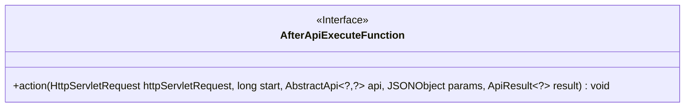
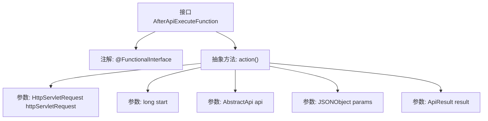

# 基础信息

|      |      |
|------|------|
| 名称 | AfterApiExecuteFunction |
| 编码语言 | .java |
| 代码路径 | WeFe/common/java/common-web/src/main/java/com/welab/wefe/common/web/function/AfterApiExecuteFunction.java |
| 包名 | com.welab.wefe.common.web.function |
| 依赖项 | ['com.alibaba.fastjson.JSONObject', 'com.welab.wefe.common.web.api.base.AbstractApi', 'com.welab.wefe.common.web.dto.ApiResult', 'javax.servlet.http.HttpServletRequest'] |
| 概述说明 | 这是一个函数式接口，定义API执行后的回调方法，参数包括请求对象、起始时间、API实例、参数和结果。 |

# 说明

这是一个名为AfterApiExecuteFunction的函数式接口，使用@FunctionalInterface注解标记。该接口定义了一个action方法，用于在API执行后执行特定操作。方法参数包括HttpServletRequest对象、起始时间戳start、AbstractApi类型的api对象、JSONObject类型的参数params以及ApiResult类型的结果result。该接口主要用于处理API执行后的回调逻辑。

# 类列表 Class Summary

| 名称   | 类型  | 说明 |
|-------|------|-------------|
| AfterApiExecuteFunction | interface | 这是一个函数式接口，定义API执行后的回调方法，接收请求、起始时间、API实例、参数和结果作为参数。 |

## 类 AfterApiExecuteFunction

|      |      |
|------|------|
| 访问范围 | @FunctionalInterface;public |
| 类型 | interface |
| 名称 | AfterApiExecuteFunction |
| 说明 | 这是一个函数式接口，定义API执行后的回调方法，接收请求、起始时间、API实例、参数和结果作为参数。 |

### UML类图

这段代码定义了一个函数式接口`AfterApiExecuteFunction`，该接口包含一个抽象方法`action`，用于在API执行后执行特定操作。方法接收HTTP请求对象、开始时间戳、API实例、参数对象和API结果作为参数。接口使用`@FunctionalInterface`注解标记，表明它是一个函数式接口，可用于Lambda表达式或方法引用。

### 内部方法调用关系图

这段代码定义了一个函数式接口AfterApiExecuteFunction，该接口包含一个抽象方法action，用于在API执行后执行特定操作。方法接收五个参数：HTTP请求对象、开始时间戳、API实例、JSON格式参数和API结果对象。@FunctionalInterface注解表明这是一个函数式接口，只能包含一个抽象方法，适用于Lambda表达式或方法引用场景。

### 字段列表 Field List

| 名称  | 类型  | 说明 |
|-------|-------|------|

### 方法列表

| 名称  | 类型  | 说明 |
|-------|-------|------|
| action | void | 处理HTTP请求的action方法，参数包括请求对象、开始时间、API实例、JSON参数和结果对象。 |

